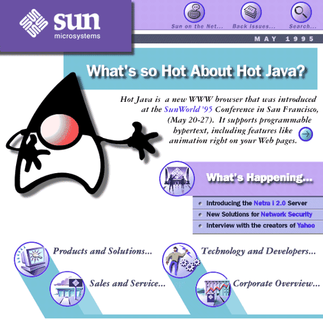
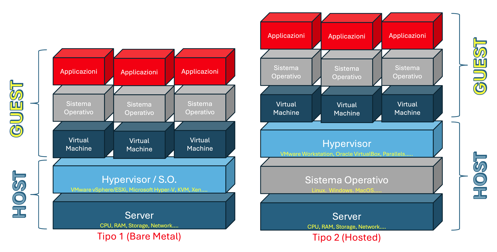
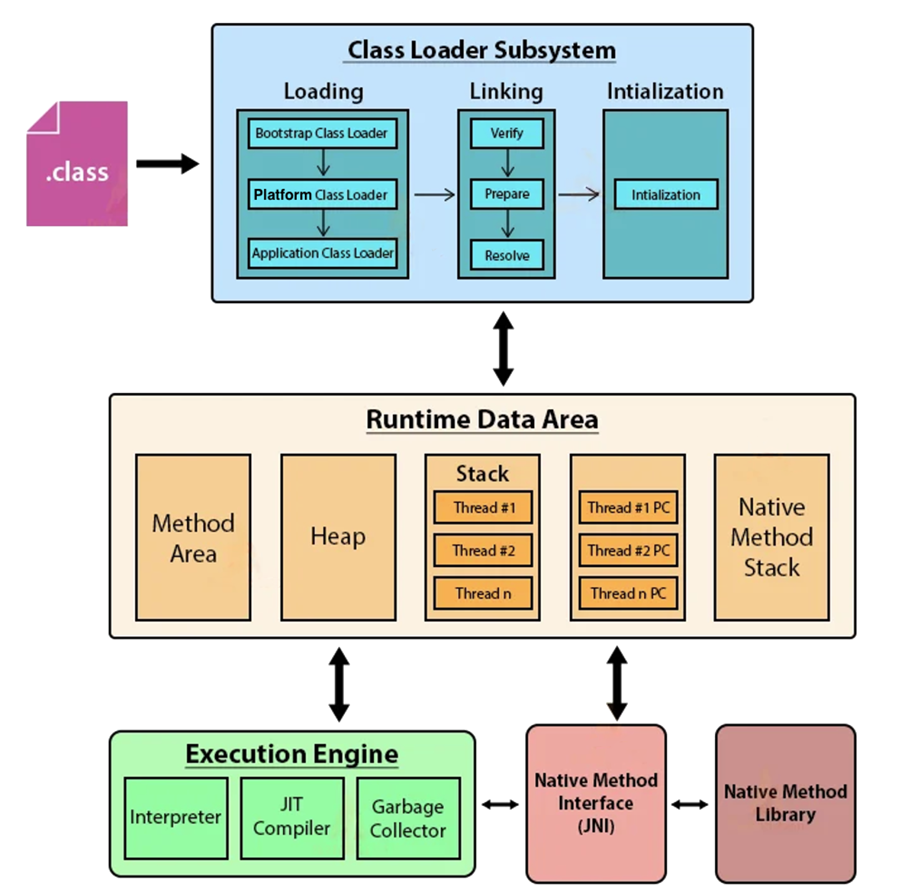

# Java

 

 

## 📚 Storia

Java nasce all’inizio degli anni ’90 in un contesto di rapida evoluzione tecnologica, caratterizzato dalla diffusione di dispositivi elettronici sempre più complessi e dalla necessità di renderli programmabili in modo semplice, sicuro e indipendente dall’hardware.
Nel 1991 presso la Sun Microsystems, James Gosling, Patrick Naughton e Mike Sheridan guidarono un gruppo di lavoro noto come Green Team con l’obiettivo di sviluppare un linguaggio di programmazione ad alto livello destinato al controllo di dispositivi elettronici come elettrodomestici, smart card, robot e sistemi embedded.
Le richieste principali erano ambiziose: il linguaggio doveva essere portabile, cioè eseguibile su architetture hardware differenti, robusto, per ridurre al minimo gli errori a runtime, e semplice da compilare, poiché i produttori dei dispositivi non erano disposti a investire in strumenti di sviluppo complessi.

   

Nel 1992 nasce il linguaggio Oak (in italiano "quercia"), successivamente cambiato con il nome Java per problemi di diritto d’autore (il linguaggio di programmazione Oak esisteva già). Il progetto iniziale non ottenne grande successo commerciale.
Tuttavia, nel 1994, con la rapida diffusione di Internet, James Gosling, assieme a Patrick Naughton e Jonathan Payne colsero una nuova opportunità: utilizzare Java per creare applicazioni capaci di essere distribuite e avviate direttamente attraverso la rete.
Il 23 maggio 1995, durante la conferenza SunWorld, venne presentato il browser HotJava, in grado di scaricare ed eseguire piccoli programmi chiamati Applet, dimostrando per la prima volta il potenziale di Java come linguaggio portabile e orientato alla rete.

   

Le altre importanti tappe furono:

- 1996 - Venne rilasciato il Java Development Kit (JDK) versione 1.0
- 1998 – J2SE 1.2: Introduzione delle "Swing" per le interfacce grafiche e del "Collections Framework". Java viene diviso in tre edizioni: J2SE (Standard), J2EE (Enterprise) e J2ME (Micro).
- 2004 – Java 5 (Tiger): Una pietra miliare che introduce i Generics, le annotazioni, l'autoboxing e il ciclo "for-each".
- 2006 – Open Source: Sun Microsystems rilascia gran parte del codice sorgente di Java sotto licenza GNU GPL, portando alla creazione di OpenJDK.
- 2010 – Acquisizione da parte di Oracle: Oracle Corporation acquisisce Sun Microsystems e assume la gestione del linguaggio.
- 2014 – Java 8: Considerata la versione più rivoluzionaria dell'era moderna, introduce le Espressioni Lambda e le API Stream, portando elementi di programmazione funzionale in Java.
- 2017 – Java 9 e il nuovo ciclo: Viene introdotta la modularità (Progetto Jigsaw) e Oracle annuncia un nuovo ciclo di rilascio ogni 6 mesi per accelerare l'innovazione.
- 2021 – Java 17 (LTS): Viene rilasciata un'importante versione con supporto a lungo termine (Long-Term Support), consolidando funzionalità come i Records e il Pattern Matching.
- 2022 (Marzo) - Java 18 ha introdotto un Simple Web Server predefinito (per test rapidi senza installare server esterni) e ha reso UTF-8 il set di caratteri predefinito ovunque.
- 2022 (Novembre) - Java 19 (Settembre 2022): Una versione storica che ha introdotto in "preview" i Virtual Threads (Progetto Loom), progettati per gestire milioni di thread con pochissime risorse, superando i limiti dei thread classici del sistema operativo.
- 2023 - Java 21 (LTS) Ha reso i Virtual Threads una funzionalità stabile e definitiva. Ha introdotto inoltre:
  - Sequenced Collections: Nuove interfacce per gestire l'ordine degli elementi in modo uniforme (es. getFirst(), getLast()).
  - Record Patterns: Per deostruire i dati in modo rapido e leggibile.
  - Pattern Matching per switch: Finalizzato per permettere controlli complessi sui tipi direttamente nel comando
- 2024 - Java 22 & 23 hanno introdotto miglioramenti alla Foreign Function & Memory API (per comunicare meglio con librerie C/C++) e hanno semplificato l'apprendimento per i principianti con gli Implicitly Declared Classes (permettono di scrivere un programma senza dichiarare esplicitamente una classe public class Main)
- 2025 - Java 24 & 25 portano innovazioni come i Compact Object Headers (per ridurre l'uso della memoria) e potenziamenti specifici per applicazioni basate su Microservizi e AI.

## 🧑‍💻 Modalità di traduzione del codice
I linguaggi di programmazione compilati, come ad esempio C++, Rust, GO, utilizzano un compilatore per tradurre il codice sorgente in codice macchina, specifico per una piattaforma su cui si esegue la compilazione, ed eseguibile direttamente dal processore. Questo processo avviene prima dell'esecuzione del programma, rendendo il codice veloce e efficiente. Gli svantaggio sono:

- Tempo di compilazione: Ogni modifica al codice richiede un processo di ricompilazione dell'intero programma (o di parti di esso) prima di poterlo testare.
- Mancanza di portabilità immediata: Il compilatore genera un file eseguibile specifico per un determinato processore e sistema operativo. Per eseguire lo stesso programma su una piattaforma differente (ad esempio, passare da Windows a Linux o da Intel ad ARM), è necessario ricompilare il codice sorgente per quel target specifico.
- Flessibilità ridotta a runtime: A differenza dei linguaggi interpretati, non è possibile modificare il codice "al volo" mentre il programma è in esecuzione; qualsiasi cambiamento richiede la chiusura del software, la modifica del sorgente e una nuova compilazione.

I linguaggi di programmazione, come ad esempio JavaScript, PHP, Ruby, Perl offrono una grande flessibilità e velocità di sviluppo, ma sacrificano le prestazioni.  
Interpretati. Il codice sorgente può essere eseguito, senza doverlo compilare, su qualsiasi sistema operativo (Windows, macOS, Linux) senza modifiche, a patto che sia installato l'interprete corretto per quella piattaforma. Inoltre, non essendoci una fase di compilazione separata, su può scrivere il codice ed eseguirlo istantaneamente testando velocemente l'eventuali modifiche.
Gli svantaggio sono:

- Minore velocità di esecuzione: Tradurre il codice in linguaggio macchina "al volo" durante l'esecuzione introduce  un sovraccarico (overhead) che rende questi programmi più lenti rispetto a quelli pre-compilati.
- Dipendenza dall'interprete: Per far girare il software, l'utente finale deve avere l'interprete (come Python o Node.js) installato sul proprio computer; non basta un semplice file eseguibile autonomo.
- Mancanza di riservatezza del codice: Poiché viene distribuito il codice sorgente (o un formato molto simile), è molto più difficile proteggere la proprietà intellettuale o nascondere segreti industriali rispetto a un file binario compilato

Java è considerato un linguaggio ibrido, poiché combina i processi di compilazione e interpretazione per bilanciare portabilità e prestazioni. Il codice sorgente Java viene prima compilato in bytecode, mediante il comando javac, per generare un file .class, che viene poi interpretato dalla Java Virtual Machine traducendolo in istruzioni specifiche per il processore su cui sta girando.
Per non essere lento come i linguaggi interpretati, Java utilizza un componente chiamato JIT (Just-In-Time) Compiler all'interno della JVM. In particolare:

- Il JIT analizza il codice durante l'esecuzione,
- Individua le parti di codice eseguite più frequentemente (i cosiddetti "hotspot").
- Compila queste parti direttamente in codice macchina nativo, rendendole veloci quanto un programma scritto in C++.

In breve, Java viene compilato per diventare portabile e interpretato/compilato al volo per essere eseguito velocemente su qualsiasi dispositivo.
La JVM mediante un processo automatico eseguito in background, Garbage Collector (GC), gestisce la memoria dell'applicazione, liberando lo sviluppatore dal compito manuale (e rischioso) di deallocare gli oggetti non più necessari.
Il GC non elimina gli oggetti in base a un timer, ma in base alla loro utilità. Un oggetto viene considerato "spazzatura" quando non è più raggiungibile da nessuna parte attiva del programma (i cosiddetti GC Roots, come variabili locali nello stack o variabili statiche).

## 🧑‍💻 JRE & JDK
Il **JDK** (Java Development Kit) rappresenta l'ambiente di sviluppo integrale necessario per il ciclo di vita completo di un'applicazione Java. Esso fornisce il compilatore (javac), i tool di documentazione (javadoc), strumenti di archiviazione (jar) e utility di debugging e monitoraggio. Al suo interno, il JDK include il JRE (Java Runtime Environment), che costituisce l'ecosistema di esecuzione lato client.  
Il **JRE** agisce come strato di astrazione tra l'applicazione e il sistema operativo, integrando le librerie di classi standard (Java Class Libraries) e la JVM (Java Virtual Machine).

## 🧑‍💻 JVM
La Java Virtual Machine (JVM), componente fondamentale del Java Runtime Environment (JRE), funge da traduttore universale, consente ai programmi scritti in linguaggio Java di essere eseguiti su qualsiasi piattaforma senza modifiche del codice sorgente, in quanto perché esiste una JVM specifica per ogni OS (Windows, Linux o Mac) che "capisce" quel codice.
 

Per comprendere la JVM facciamo un piccolo passo indietro e descriviamo cos'è una Virtual Machine (VM).
Una VM è un "computer dentro un altro computer". Più precisamente è un ambiente software che emula il comportamento di un computer fisico, creando CPU, memoria RAM, disco rigido e scheda di rete virtuali. L'elemento centrale è l'Hypervisor (o VMM - Virtual Machine Monitor), uno strato software che astrae le risorse hardware fisiche e le distribuisce in modo isolato alle diverse macchine virtuali
Le risorse hardware virtuali vengono "estrapolate" dalle risorse hardware fisiche del computer che ospita le VM.
Il computer che ospita il software è detto Host, mentre la macchina virtuale è definita Guest.

   

La JVM è una "macchina virtuale di processo" o "applicativa", progettata specificamente per eseguire un singolo programma.
Non emula un intero computer, ma fornisce un ambiente di runtime che gestisce esclusivamente l'esecuzione del Bytecode Java. Gestisce autonomamente memoria (Garbage Collection) e thread garantendo la portabilità del codice.

   

## 👥 Authors

- **Giuseppe Compagno** - [link](https://www.compagno.cloud) 

## 🤝 Contributi

Disponibile a condividere con chiunque consigli o revisioni di codice per migliore il contenuto di questo repository 

## 🙏 Ringraziamenti

Lista di chi ha contribuito: 

## 📚 References

Claudio De Sio Cesari, "***Il nuovo Java***", 2020 - [link](https://www.nuovojava.it) 
Franco Guidi Polanco, "***GOF's design patterns in Java***", 2002 - [link](http://eii.ucv.cl/pers/guidi/designpatterns.htm) 
Rudolf Pecinovský, "***OOP – Learn Object Oriented Thinking and Programming***", 2013 - [link](https://pub.bruckner.cz/titles/oop) 

## ⚖️ Licenza

Questo progetto è coperto da **licenza MIT** - [link](../LICENSE) 

## 📞 Contact

Per un supporto o aiuto: 
- Crea un issue 
- Invia un pull request 
- Contattami via mail - [mail](mailto:info@compagno.cloud) 

## 🔍 Version History

- 1.0.0: Fase iniziale 

--- ❤️ by Giuseppe ♾️ ---
