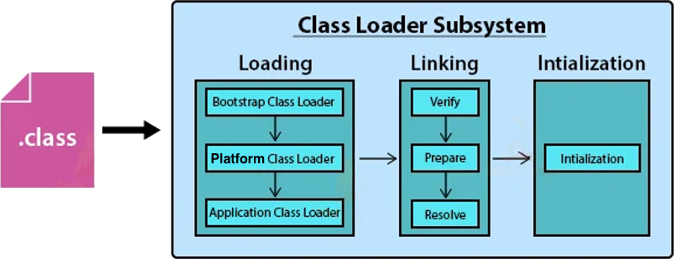
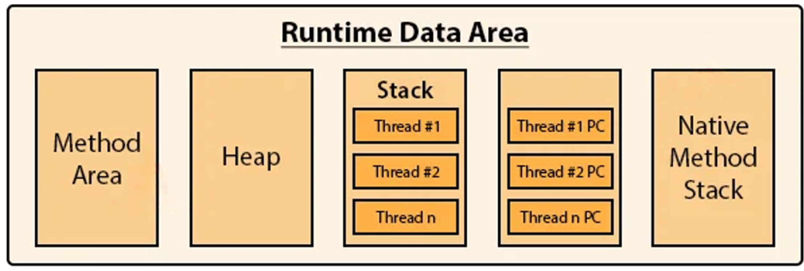
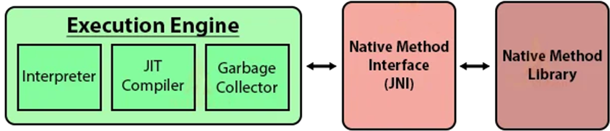

<link rel="stylesheet" href="css/styles.css">

# Appunti di Java

<p align="center">
  <br/>
  
  <br/>
</p>

## 📚 Storia
<div class="text-justify">Java nasce all’inizio degli anni ’90 in un contesto di rapida evoluzione tecnologica, caratterizzato dalla diffusione di dispositivi elettronici sempre più complessi e dalla necessità di renderli programmabili in modo semplice, sicuro e indipendente dall’hardware. Nel 1991 presso la Sun Microsystems, <b>James Gosling, Patrick Naughton</b> e <b>Mike Sheridan</b> guidarono un gruppo di lavoro noto come <b>Green Team</b> con l’obiettivo di sviluppare un linguaggio di programmazione ad alto livello destinato al controllo di dispositivi elettronici come elettrodomestici, smart card, robot e sistemi embedded. Le richieste principali erano ambiziose: il linguaggio doveva essere portabile, cioè eseguibile su architetture hardware differenti, robusto, per ridurre al minimo gli errori a runtime, e semplice da compilare, poiché i produttori dei dispositivi non erano disposti a investire in strumenti di sviluppo complessi.</div>
<br/>
<p align="center">
  <br/>
</p>
<br/>
<div class="text-justify">Nel 1992 nasce il linguaggio <b>Oak</b> (in italiano "quercia"), successivamente cambiato con il nome <b>Java</b> per problemi di diritto d’autore (il linguaggio di programmazione Oak esisteva già). Il progetto iniziale non ottenne grande successo commerciale.
Tuttavia, nel 1994, con la rapida diffusione di Internet, <b>James Gosling</b>, assieme a <b>Patrick Naughton</b> e <b>Jonathan Payne</b> colsero una nuova opportunità: utilizzare Java per creare applicazioni capaci di essere distribuite e avviate direttamente attraverso la rete.
Il 23 maggio 1995, durante la conferenza SunWorld, venne presentato il browser <b>HotJava</b>, in grado di scaricare ed eseguire piccoli programmi chiamati Applet, dimostrando per la prima volta il potenziale di Java come linguaggio portabile e orientato alla rete.</div>
<br/>
<p align="center">
  <br/>
</p>
<br/>
Le altre importanti tappe furono:

- 1996 - Venne rilasciato il <b>Java Development Kit</b> (JDK) versione 1.0
- 1998 – Furono introdotte le classi <b>Swing</b>, per le interfacce grafiche, e <b>Java Collections Framework (JCF)</b>, strutture dati e algoritmi per gestire gruppi di oggetti in modo efficiente. Java viene diviso in tre edizioni: <b>Java Standard Edition (J2SE), Java Enterprise Edition (J2EE)</b> e <b>Java Micro Edition (J2ME)</b>.
- 2004 – <b>Java 5 (Tiger)</b>, una pietra miliare che introduce i Generics, le annotazioni, l'autoboxing e il ciclo "for-each".
- 2006 – Sun Microsystems rilascia gran parte del codice sorgente di <b>Java</b> sotto licenza GNU GPL, portando alla creazione di <b>OpenJDK</b>, implementazione di riferimento open source e gratuita della piattaforma Java Standard Edition (Java SE).
- 2010 – Oracle Corporation acquisisce Sun Microsystems e assume la gestione del linguaggio Java.
- 2014 – <b>Java 8 (Project Spider)</b>, considerata la versione più rivoluzionaria dell'era moderna, introduce le Espressioni Lambda e le API Stream, portando elementi di programmazione funzionale in Java.
- 2017 – <b>Java 9</b>, viene introdotta la modularità (Progetto Jigsaw) e Oracle annuncia un nuovo ciclo di rilascio ogni 6 mesi per accelerare l'innovazione.
- 2021 – <b>Java 17 (LTS)</b>, un'importante versione con supporto a lungo termine (Long-Term Support), consolidando funzionalità come i Records e il Pattern Matching.
- 2022 (Marzo) - <b>Java 18</b> ha introdotto un Simple Web Server predefinito (per test rapidi senza installare server esterni) e ha reso UTF-8 il set di caratteri predefinito ovunque.
- 2022 (Novembre) - <b>Java 19</b>, versione storica che ha introdotto in "preview" i Virtual Threads (Progetto Loom), per gestire milioni di thread con pochissime risorse, superando i limiti dei thread classici del sistema operativo.
- 2023 - <b>Java 21 (LTS)</b>, ha reso i Virtual Threads una funzionalità stabile e definitiva. Ha introdotto inoltre:
  - <b>Sequenced Collections:</b> Nuove interfacce per gestire l'ordine degli elementi in modo uniforme (es. getFirst(), getLast()).
  - <b>Record Patterns:</b> Per deostruire i dati in modo rapido e leggibile.
  - <b>Pattern Matching per switch:</b> Finalizzato per permettere controlli complessi sui tipi direttamente nel comando
- 2024 - <b>Java 22 & 23</b> hanno introdotto miglioramenti alla Foreign Function & Memory API (per comunicare meglio con librerie C/C++) e hanno semplificato l'apprendimento per i principianti con gli Implicitly Declared Classes (permettono di scrivere un programma senza dichiarare esplicitamente una classe public class Main)
- 2025 - <b>Java 24 & 25</b> portano innovazioni come i Compact Object Headers (per ridurre l'uso della memoria) e potenziamenti specifici per applicazioni basate su Microservizi e AI.

## 🧑‍💻 Modalità di traduzione del codice
I <b>linguaggi di programmazione compilati</b>, come ad esempio C++, Rust, GO, etc.. utilizzano un compilatore per tradurre il codice sorgente in codice macchina, specifico per la piattaforma hardware su cui si esegue la compilazione. Pertanto il file eseguibile creato, funziona solo per il processore (Intel, Risc, Arm64, etc..) e sistama operativo con cui è stato compilato /Windows, Linux, MacOS, etc..). Questo processo rende il codice veloce ed efficiente. Gli svantaggio sono:

- <b>Tempo di compilazione:</b> Ogni modifica al codice richiede un processo di ricompilazione dell'intero programma (o di parti di esso) prima di poterlo testare.
- <b>Mancanza di portabilità immediata:</b> Il compilatore genera un file eseguibile specifico per un determinato processore e sistema operativo. Per eseguire lo stesso programma su una piattaforma differente (ad esempio, passare da Windows a Linux o da Intel ad ARM), è necessario ricompilare il codice sorgente per quel target specifico.
- <b>Flessibilità ridotta a runtime:</b> A differenza dei linguaggi interpretati, non è possibile modificare il codice "al volo" mentre il programma è in esecuzione; qualsiasi cambiamento richiede la chiusura del software, la modifica del sorgente e una nuova compilazione.

I <b>linguaggi di programmazione interpretati</b>, come ad esempio JavaScript, PHP, Ruby, Perl, etc.. offrono una grande flessibilità e velocità di sviluppo, ma sacrificano le prestazioni. Il codice sorgente può essere eseguito, senza doverlo compilare, su qualsiasi sistema operativo (Windows, MacOS, Linux), a patto che sia installato l'interprete corretto per quella piattaforma. Inoltre, non essendoci una fase di compilazione separata, su può scrivere il codice ed eseguirlo istantaneamente testando velocemente l'eventuali modifiche.
Gli svantaggio sono:

- <b>Minore velocità di esecuzione:</b> Tradurre il codice in linguaggio macchina "al volo" durante l'esecuzione introduce un sovraccarico (overhead) che rende questi programmi più lenti rispetto a quelli pre-compilati.
- <b>Dipendenza dall'interprete:</b> Per far girare il software, l'utente finale deve avere l'interprete (come ad esempio un browser) installato sul proprio computer; non basta un semplice file eseguibile autonomo.
- <b>Mancanza di riservatezza del codice:</b> Poiché viene distribuito il codice sorgente (o un formato simile), è molto più difficile proteggere la proprietà intellettuale o nascondere segreti industriali rispetto a un file binario compilato

<b>Java</b> è considerato un <b>linguaggio ibrido</b>, poiché combina i processi di compilazione e interpretazione per bilanciare portabilità e prestazioni. Il codice sorgente Java (file con estensione .java) viene compilato in un linguaggio intermedio, chiamato <b>bytecode</b>, mediante il comando _javac_. Esso genera un file con estensione .class che, mediante il comando _java (nome file .class)_, viene interpretato dalla <b>Java Virtual Machine (JVM)</b> traducendolo in istruzioni specifiche per il processore su cui è stata eseguito la JVM.
Per velocizzare l'esecuzione dell'applicativo, Java utilizza un componente chiamato <b>Just-In-Time Compiler(JIT)</b> all'interno della JVM. Esso effettua:

- L'analisi del codice durante l'esecuzione,
- Individua le parti di codice eseguite più frequentemente (i cosiddetti "hotspot").
- Compila queste parti direttamente in codice macchina nativo, rendendole veloci quanto un programma scritto in C++.

In breve, un applicativo scritto in linguaggio Java viene compilato per diventare portabile e interpretato/eseguito velocemente su qualsiasi dispositivo con installato un JVM.

## 🧑‍💻 JRE & JDK
Il successo globale di Java, fin dal suo debutto nel 1995, è strettamente legato al superamento di uno dei limiti storici dell'informatica: la dipendenza del software dall'hardware sottostante.
Per aggevolare gli svilippatori o gli utenti che utilizzano un applicativo scritto in linguaggio Java è stata introdotta un'architettura stratificata che separa lo sviluppo dall'esecuzione attraverso tre componenti fondamentali: JDK, JRE e JVM. 

Il **Java Development Kit (JDK)** rappresenta l'ambiente di sviluppo integrale necessario per il ciclo di vita completo di un'applicazione Java. Esso fornisce il compilatore (javac), i tool di documentazione (javadoc), strumenti di archiviazione (jar) e utility di debugging e monitoraggio. Al suo interno, il JDK include il JRE (Java Runtime Environment), che costituisce l'ecosistema di esecuzione lato client.</br> 

Il **Java Runtime Environment (JRE)** agisce come strato di astrazione tra l'applicazione e il sistema operativo, integrando le librerie di classi standard (Java Class Libraries) e la JVM (Java Virtual Machine) necessari affinché il codice possa prendere vita su qualsiasi dispositivo, garantendo portabilità, sicurezza e gestione efficiente delle risorse

## 🧑‍💻 JVM
La **Java Virtual Machine (JVM)**, componente fondamentale del Java Runtime Environment (JRE), funge da traduttore universale, consente ai programmi scritti in linguaggio Java di essere eseguiti su qualsiasi piattaforma senza modifiche del codice sorgente, in quanto esiste una JVM specifica per ogni Sistema Operativo (Windows, Linux o Mac) che "capisce" quel codice.
</br>

Per comprendere la JVM facciamo un piccolo passo indietro e descriviamo cos'è una Virtual Machine (VM).
Una VM è un "computer dentro un altro computer". Più precisamente è un ambiente software che emula il comportamento di un computer fisico, creando CPU, memoria RAM, disco rigido e scheda di rete virtuali. L'elemento centrale è l'**Hypervisor (o VMM - Virtual Machine Monitor)**, uno strato software che astrae le risorse hardware fisiche e le distribuisce in modo isolato alle diverse macchine virtuali. 
Le risorse hardware virtuali vengono "estrapolate" dalle risorse hardware fisiche del computer che ospita le VM.
Il computer che ospita il software è detto Host, mentre la macchina virtuale è definita Guest.
<br/>
<p align="center">
  <br/>
</p>
<br/>
L'Hypervisor agisce come un "vigile urbano" delle risorse informatiche, distribuendo potenza di calcolo (CPU), memoria (RAM) e archiviazione tra più sistemi operativi indipendenti che girano contemporaneamente sulla stessa macchina fisica.
Esistono due categorie fondamentali di hypervisor, distinte dal modo in cui interagiscono con l'hardware:

- **Tipo 1 (Bare Metal):** Viene installato direttamente sull'hardware fisico del computer (senza un sistema operativo sottostante). È il tipo più efficiente e sicuro, ideale per i data center aziendali. 
  - Esempi: VMware ESXi, Microsoft Hyper-V, KVM, Xen
- **Tipo 2 (Hosted):** Viene installato come un'applicazione sopra un sistema operativo esistente (esempio Windows, MacOS o Linux). È perfetto per usi individuali o di test sul proprio PC.
  - Esempi: Oracle VM VirtualBox, VMware Workstation, Parallels Desktop

La **JVM** è una "macchina virtuale di processo" o "applicativa", progettata specificamente per eseguire un singolo programma.
Non emula un intero computer, ma fornisce un ambiente di runtime che gestisce esclusivamente l'esecuzione del bytecode Java. Gestisce autonomamente memoria (Garbage Collection) e thread garantendo la portabilità del codice.
<br/>
<p align="center">
  <br/>
</p>
<br/>
Se creiamo un file sorgente .java e lo compiliamo verrà tradotto in formato bytecode in un nuovo file .class

Esempio: Saluto.java
```java
class Saluto { 
    static void main(String[] args) {
      String nome = "Giuseppe";
      System.out.println("Ciao " + nome + "!!");
  }
}
```
con il comando

```console
javac Saluto.java
```

Il file sorgente _Saluto.java_ viene compilato e generato il file bytecode _Saluto.class_
Il file in bytecode non contiene il codice macchina nativo per il sistema hardware dove è stato compilato, ma è un formato universale che JVM è in grado di eseguire.
Con il comando _java_ si inizializza la JVM che carica il bytecode della classe specificata e carica in memoria il metodo main() per eseguire l'applicazione.

```console
java Saluto  
```

La prima attività che effettua la JVM è l'utilizzo delle Class Loader:

<p align="center">
  <br/>
</p>

- **Bootstrap Class Loader** (conosciuto anche come **Primordial Class Loader**) è il componente fondamentale della JVM ed è il punto di partenza dell'intero processo di caricamento delle classi in Java. Non è una classe Java, é codice nativo integrato nel nucleo della JVM. Il suo compito è caricare le librerie software fondamentali necessarie al funzionamento stesso dell'ambiente Java (java.lang, java.net, java.util, java.io, etc..)<br/>
- **Platform Class Loader** (Extension Class Loader fino alla versione Java 8) carica i moduli Java "di piattaforma" che non sono strettamente necessari per l'avvio del cuore della JVM (caricato dal Bootstrap), ma che fanno comunque parte delle specifiche Java SE (come java.sql, java.xml o java.desktop). Il Platform Class Loader segue rigorosamente il **Delegation Model**:
  1. Quando riceve una richiesta per caricare una classe, interroga prima il Bootstrap Class Loader.
  2. Se il Bootstrap non trova la classe, il Platform Class Loader prova a caricarla dai propri moduli.
  3. Se fallisce anche lui, passa la palla all'Application Class Loader.

  A differenza del Bootstrap loader (che restituisce null), il Platform Class Loader è un oggetto Java.<br/>
- **Application Class Loader** (conosciuto anche come **System Class Loader**) è l'ultimo anello della catena ed è quello con cui interagisce di più lo sviluppatore. E' responsabile del caricamento delle classi scritte e delle librerie di terze parti (come file JAR esterni) incluse nel progetto.<br/>

  Seguendo il modello Delegation:
  1. L'Application Class Loader riceve la richiesta di caricare una classe (ad esempio, la tua classe Saluto). 
  2. Chiede al Platform Class Loader di caricarla. 
  3. Se nessuno dei genitori (Bootstrap o Platform) la trova, allora l'Application Class Loader tenta di caricarla dai percorsi del tuo progetto. Se non la trova, viene lanciata la famosa eccezione ClassNotFoundException o NoClassDefFoundError.

Riassumendo:

	- Bootstrap: Cuore di Java (java.base).
	- Platform: Moduli opzionali di sistema (java.sql, java.xml).
	- Application: Il codice creato dallo sviluppatore e l'eventuali dipendenze.

Il **Linking** è la seconda fase del ciclo di vita di una classe nella JVM. È il processo che prende il bytecode appena caricato e lo rende "pronto all'uso", integrandolo nell'ambiente di runtime.
Si divide in tre sotto-fasi fondamentali:

- **Verify** è la fase più importante per la sicurezza. La JVM controlla che il bytecode sia valido e non violi le regole del linguaggio:
  * Controlla che non ci siano tentativi di accedere a zone di memoria vietate.
  * Verifica che i tipi di dati siano coerenti (es. non sommare un intero a un oggetto).
  * Assicura che il codice non causi l'overflow dello stack.
- **Prepare** in questa fase, la JVM alloca la memoria necessaria per i campi statici (le variabili _static_) della classe. Qui le variabili non vengono impostate ai valori indicati nel file sorgente, ma ai loro valori predefiniti (es. 0 per il tipo _int_, false per il tipo _boolean_, null per gli oggetti).
- **Resolve** questa è la fase "di collegamento" vera e propria. La JVM sostituisce i riferimenti simbolici nel file con riferimenti diretti (indirizzi di memoria reali).
  Se la classe usa una variabile di un'altra classe chiamata _Persona_, JVM cerca la classe _Persona_ in memoria e crea un puntatore diretto a essa.

L'**Initialization** (Inizializzazione) è la fase finale del caricamento di una classe nella JVM. È il momento in cui il codice Java che hai scritto viene effettivamente eseguito per la prima volta.
La JVM genera internamente un metodo speciale chiamato _clinit_ (**Class Initialization**). Questo metodo raccoglie:
- Tutti gli assegnamenti delle variabili statiche (es: static _int x = 50_;).
- Tutti i blocchi definiti _static_ { ... }<br>
- Viene garantita l'esecuzione in ordine di apparizione nel file sorgente. Prima di inizializzare una classe, la JVM si assicura che la sua Superclasse (la classe madre) sia già stata inizializzata. È un processo ricorsivo che risale fino alla classe _Object_. 

L'inizializzazione non avviene appena il programma parte, ma solo al primo utilizzo attivo della classe, ovvero quando:
- Viene creata un'istanza della classe (new Saluto()).
- Viene chiamato un metodo statico.
- Viene assegnata o usata una variabile statica (non final costante).
- Viene avviata la classe come punto di ingresso (main).

Riassumendo (con esempio una Biblioteca):

	- Il Loading porta il libro (la classe) in biblioteca, 
    - Il Linking controlla che le pagine siano scritte correttamente (Verification), 
      prepara lo scaffale dove appoggiarlo (Preparation) 
      e crea l'indice che collega i capitoli tra loro (Resolution). 
    - L'Initialization "Apre la biblioteca" prepara l'ambiente per eseguire il codice 
      statico partendo dal metodo main().

<p align="center">
  <br/>
</p>

La **Runtime Data Area** è l'intera memoria allocata dalla JVM sul sistema operativo per permettere l'esecuzione del programma. Si divide in cinque aree, classificate in base alla loro visibilità (condivise da tutti i thread o private del singolo thread).

1. **Aree condivise - Shared Data Areas (Tutti i thread vedono questi dati)**
   Queste aree nascono all'avvio della JVM e muoiono quando si chiude.
   * **Method Area**: Qui la JVM conserva le informazioni (la struttura / metadati) delle classi caricate. Include il bytecode dei metodi, i nomi dei campi, le variabili statiche e la **Runtime Constant Pool** (tabella delle costanti e dei riferimenti simbolici). Nelle versioni moderne (Java 8+) risiede nel Metaspace (memoria nativa).
   * **Heap**: È l'area più grande e importante. Qui finiscono tutti gli oggetti (istanze di classe) e gli array creati con la parola chiave _new_. È l'area di memoria dove il **Garbage Collector** libera spazio cancellando gli oggetti non più referenziati.

2. **Aree private - Per-Thread Data Areas (Ogni Thread ha la sua)**
   Queste aree servono a gestire l'esecuzione parallela; ogni thread ha il suo spazio isolato.
  * **JVM Stack**: Ogni volta che chiami un metodo, viene creato, nello stack, un **Frame** (un blocco di memoria) che contiene:
    - **Variabili locali:** I parametri del metodo e le variabili dichiarate al suo interno.
    - **Operand Stack:** Uno spazio temporaneo per i calcoli intermedi.
    - **Frame Data:** Riferimenti alla **Constant Pool** per la risoluzione dei simboli e la gestione delle eccezioni. Quando il metodo finisce, il frame viene rimosso.
    - **PC Register (Program Counter):** È un piccolo puntatore che tiene traccia di quale riga di istruzione sta eseguendo il thread in quel preciso momento.
  - **Native Method Stack**: Funziona come lo **JVM Stack**, ma serve per gestire i metodi scritti in altri linguaggi (come C o C++) chiamati tramite **Java Native Interface (JNI)**.

Riassumendo (con esempio una Ristorante):

    - La Method Area è il ricettario (le classi).
	- L'Heap è il magazzino degli ingredienti (oggetti).
    - Lo Stack è il piano di lavoro del singolo cuoco (il thread) dove tiene gli 
      strumenti per il piatto che sta cucinando in quel momento.

<p align="center">
  <br/>
</p>

L'**Execution Engine** è il "motore" vero e proprio della JVM. Mentre la Runtime Data Area si occupa di dove memorizzare i dati, l'Execution Engine si occupa di come eseguire il bytecode caricato in memoria, trasformandolo in istruzioni comprensibili dal processore (codice macchina).
Si compone di tre moduli principali che lavorano in sinergia:

1. **Interpreter (Interprete)**
   È il primo componente a entrare in azione. Legge il bytecode riga per riga e lo esegue immediatamente.
  - Vantaggio: Avvio rapidissimo dell'applicazione.
  - Svantaggio: È relativamente lento nell'esecuzione ripetuta, poiché deve reinterpretare la stessa istruzione ogni volta che incontra un ciclo (loop).

2. **JIT Compiler (Just-In-Time Compiler)**
   Per rimediare alla lentezza dell'interprete, interviene il JIT. Il suo compito è compilare intere sezioni di bytecode in codice macchina nativo durante l'esecuzione.
  - Profilazione (Hotspots): Il JIT monitora quali parti del codice vengono eseguite più spesso (i cosiddetti "punti caldi").
  - Compilazione nativa: Una volta identificato un metodo frequente, il JIT lo compila e lo salva in una cache (Code Cache). La volta successiva, la JVM eseguirà direttamente il codice nativo saltando l'interpretazione.
  - Ottimizzazione: Include tecniche avanzate come l' Inlining (sostituzione della chiamata a un metodo con il suo corpo) e la rimozione di codice morto.

3. **Garbage Collector (GC)**
   Anche se spesso visto come un'entità a sé, il GC fa parte dell'Execution Engine poiché gestisce attivamente le risorse durante l'esecuzione.
  - Automazione: Identifica gli oggetti nell'Heap che non hanno più riferimenti attivi e libera la memoria.
  - Algoritmi: Utilizza diverse strategie (come Mark-and-Sweep) per minimizzare le pause del programma (Stop-the-world).

Riassumendo:

    - Execution Engine è un sistema dinamico.
    - Interprete garantisce la partenza immediata.
    - JIT accelera il programma man mano che gira.
    - Garbage Collector mantiene pulita la memoria.

La **Java Native Interface (JNI)** è il "ponte di comunicazione" ufficiale che permette al codice Java, in esecuzione nella JVM, di interagire con applicazioni e librerie scritte in altri linguaggi (come C, C++ o Assembly).
Poiché Java gira in una "bolla" isolata (la sandbox), ha bisogno della JNI per "uscire" e toccare direttamente l'hardware o il sistema operativo.
Esistono tre motivi principali per cui uno sviluppatore decide di usarla:
- Prestazioni critiche: Per algoritmi matematici o grafici estremamente complessi che beneficiano dell'ottimizzazione manuale del C++.
- Accesso all'Hardware: Per gestire driver di periferiche (stampanti, sensori, GPU) che non hanno API Java native.
- Codice Legacy: Per riutilizzare vecchie librerie aziendali scritte decenni fa in C senza doverle riscrivere interamente in Java.

Per far comunicare i due mondi, si segue un iter preciso:
1. Dichiarazione Java: Crei un metodo usando la parola chiave native.  Esempio: public native void salutaNativo();
2. Generazione Header: Usi il comando javac -h per generare un file di intestazione C (.h) che contiene la firma del metodo "tradotta".
3. Implementazione C/C++: Scrivi il codice reale nel linguaggio nativo importando l'header generato.
4. Compilazione Libreria: Trasformi il codice C in una libreria dinamica (.dll su Windows, .so su Linux).
5. Caricamento: In Java, carichi la libreria all'avvio con System.loadLibrary("nome");

Usare la JNI rompe alcune delle promesse fondamentali di Java:
- Perdita di Portabilità: Se scrivi una libreria in C per Windows, il tuo programma Java non girerà più su Linux finché non ricompilerai la parte nativa per quel sistema.
- Sicurezza e Crash: Un errore nel codice C (come un puntatore errato) può far crashare l'intera JVM, non solo il tuo programma. Il Garbage Collector non può gestire la memoria allocata dal lato nativo.
- Overhead: Passare dati tra Java e C non è gratis; c'è un piccolo rallentamento dovuto alla conversione dei dati tra i due formati.

Riassumendo:

    - Java Native Interface è l'interprete bilingue della JVM: permette a Java di parlare con il mondo 
      esterno, ma richiede molta attenzione perché espone il programma ai pericoli dei 
      linguaggi di basso livello.

Il **Native Method Library** è un insieme di librerie scritte in linguaggi di "basso livello" (solitamente C o C++) che vengono caricate dalla JVM per eseguire operazioni che il linguaggio Java, da solo, non può compiere direttamente sull'hardware o sul sistema operativo
Quando Java incontra un metodo dichiarato con la parola chiave native (es. public native void calcola();), non cerca il bytecode, ma cerca l'implementazione corrispondente all'interno di queste librerie esterne (file .dll su Windows o .so su Linux)
Per gestire queste chiamate, la JVM riserva un'area di memoria specifica chiamata Native Method Stack. Ogni volta che il thread passa dal codice Java a un metodo nativo, lo "stack Java" si ferma e i dati vengono gestiti in questo stack separato dedicato al codice C/C++.

Riassumendo:

    - Native Method Library è il "ponte" fisico che permette a Java di toccare l'hardware, usando librerie 
      pre-compilate esterne per compiti che richiedono massima velocità o accesso diretto alle risorse di sistema


## 👥 Authors

- **Giuseppe Compagno** - [link](https://www.compagno.cloud)<br/>


## 🤝 Contributi

Disponibile a condividere con chiunque consigli o revisioni di codice per migliore il contenuto di questo repository<br/>


## 🙏 Ringraziamenti

Lista di chi ha contribuito:<br/>


## 📚 References

Claudio De Sio Cesari, "***Il nuovo Java***", 2020 - [link](https://www.nuovojava.it)<br/>
Franco Guidi Polanco, "***GOF's design patterns in Java***", 2002 - [link](http://eii.ucv.cl/pers/guidi/designpatterns.htm)<br/>
Rudolf Pecinovský, "***OOP – Learn Object-Oriented Thinking and Programming***", 2013 - [link](https://pub.bruckner.cz/titles/oop)<br/>


## ⚖️ Licenza

Questo progetto è coperto da **licenza MIT** - [link](../LICENSE)<br/>


## 📞 Contact

Per un supporto o aiuto:<br/>
- Crea un issue<br/>
- Invia un pull request<br/>
- Contattami via mail - [mail](mailto:info@compagno.cloud)<br/>


## 🔍 Version History

- 1.0.0: Fase iniziale<br/>


--- ❤️ by Giuseppe ♾️ ---
