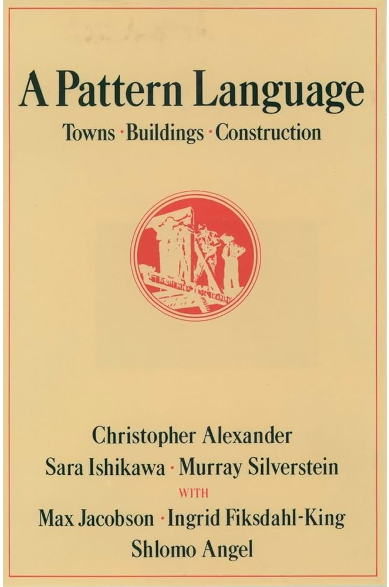
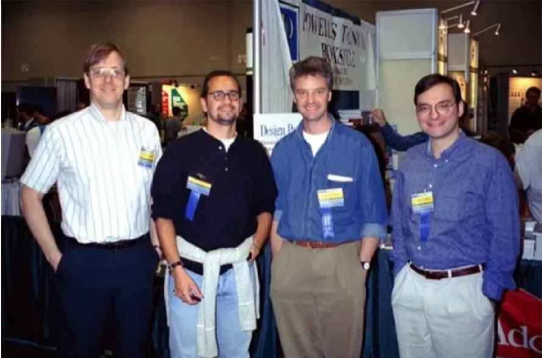

<link rel="stylesheet" href="../Appunti/css/styles.css">

# Design Patterns

     
    
     

## 📚 Storia

Il termine <b>design pattern</b> non ha origine nel settore informatico, Fu inizialmente introdotto in architettura dal celebre saggio “A Pattern Language: Towns, Buildings, Construction” di Christopher Alexander, Sara Ishikawa e Murray Silverstein del Center for Environmental Structure di Berkeley California, pubblicato nel 1977.

   

In questo libro si descrive un “linguaggio” per la progettazione di un centro urbano. Le unità di questo linguaggio vengono definite patterns (o modelli). Quest’ultimi possono descrivere quanto dovrebbero essere alte le finestre, quanti piani una costruzione dovrebbe avere, quanto debbono essere ampie le aree verdi nelle vicinanze. Come citato nel libro (con riferimento a edifici e città): “Un pattern descrive un problema che ricorre nell’ambiente e l’essenza della soluzione del problema, in modo tale che si possa riusare questa soluzione milioni di volte senza mai ripeterla in maniera identica due volte”. Lo studio fu realizzato analizzando diverse città medioevali europee e ricercando gli elementi comuni che avessero lo stesso concetto di soluzione ricorrente ad un problema altrettanto ricorrente. Pertanto, furono illustrati 253 pattern che permettono di codificare e standardizzare una possibile soluzione, lasciando, a chiunque, ampi margini di personalizzazione per realizzare la propria costruzione. Ciò rende potente l’uso di questo nuovo approccio nell’architettura. Un’altro vantaggio è la modularità in quanto essendo, i pattern, specifici su alcuni problemi e generici su altri rende possibile combinare due o più per realizzare un unico progetto.

Negli anni 80, dopo un lungo periodo di ricerca condotta da un team di informatici tra cui spiccano **Adele Goldberg, Alan Kay, Dan Ingalls** e **Ted Kaehler**, venne sviluppato il sistema **Smalltalk-80**, il quale può senz’altro essere riconosciuto, insieme al linguaggio Simula, il capostipite dei linguaggi orientati agli oggetti e dell'ambiente grafico interattivo (GUI), influenzando profondamente le moderne interfacce utente.

   

Nel mondo dell’informatica la prima traccia dell’uso dei pattern risale al <b>1987</b> quando <b>Kent Beck</b> di Apple Computer, Inc. e <b>Ward Cunningham</b> di Tektronix, Inc, nella seconda edizione della conferenza OOPSLA presentano “Using Pattern Languages for Object-Oriented Programs”, lavoro in cui identificano cinque pattern che utilizzano in Smalltalk per la progettazione di interfacce grafiche.

   

Ma solo nel <b>1994</b> grazie al saggio “Design Patterns: Elements of Reusable Object-Oriented Software” di <b>Erich Gamma, Richard Helm, Ralph Johnson</b>, e <b>John Vlissides</b> (detti <b>Gang of Four</b>) i pattern ricevono maggiore attenzione tanto da iniziare a dare vita anche a correnti filosofiche basati su questa nuova metodologia di progettazione dei software.
I 23 design pattern presentati nel libro rappresentano soluzioni ai problemi comuni nell’ambito dell’object-oriented design e della programmazione. Questi pattern sono stati catalogati, analizzati e documentati in modo che i programmatori potessero capirli, implementarli e applicarli alle loro attività di sviluppo.

   

| Categoria          | Design Pattern              | Descrizione                                                                                                          |
|:-------------------|:----------------------------|:---------------------------------------------------------------------------------------------------------------------|
| **Creazionali**    | **Abstract Factory**        | Fornisce un'interfaccia per creare famiglie di oggetti correlati senza specificarne le classi concrete.              |
|                    | **Builder**                 | Separa la costruzione di un oggetto complesso dalla sua rappresentazione.                                            |
|                    | **Factory Method**          | Definisce un'interfaccia per creare un oggetto, lasciando alle sottoclassi la scelta della classe da istanziare.     |
|                    | **Prototype**               | Crea nuovi oggetti copiando un'istanza esistente (prototipo).                                                        |
|                    | **Singleton**               | Garantisce che una classe abbia una sola istanza e fornisce un punto di accesso globale ad essa.                     |
| **Strutturali**    | **Adapter**                 | Converte l'interfaccia di una classe in un'altra interfaccia attesa dai client.                                      |
|                    | **Bridge**                  | Disaccoppia un'astrazione dalla sua implementazione in modo che le due possano variare indipendentemente.            |
|                    | **Composite**               | Struttura gli oggetti in composizioni a albero per rappresentare gerarchie parte-tutto.                              |
|                    | **Decorator**               | Aggiunge dinamicamente responsabilità aggiuntive a un oggetto.                                                       |
|                    | **Facade**                  | Fornisce un'interfaccia unificata e semplificata per un insieme di interfacce in un sottosistema.                    |
|                    | **Flyweight**               | Utilizza la condivisione per supportare grandi quantità di oggetti a grana fine in modo efficiente.                  |
|                    | **Proxy**                   | Fornisce un surrogato o segnaposto di un altro oggetto per controllarne l'accesso.                                   |
| **Comportamentali**| **Chain of Responsibility** | Disaccoppia il mittente di una richiesta dal destinatario, dando a più oggetti la possibilità di gestirla.           |
|                    | **Command**                 | Incapsula una richiesta come un oggetto, permettendo di parametrizzare i client con code o log.                      |
|                    | **Interpreter**             | Definisce una rappresentazione della grammatica per un linguaggio e un interprete per le frasi del linguaggio.       |
|                    | **Iterator**                | Fornisce un modo per accedere sequenzialmente agli elementi di un aggregato senza esporne la struttura.              |
|                    | **Mediator**                | Definisce un oggetto che incapsula come un insieme di oggetti interagiscono tra loro.                                |
|                    | **Memento**                 | Cattura e rende esterno lo stato interno di un oggetto per ripristinarlo in seguito senza violare l'incapsulamento.  |
|                    | **Observer**                | Definisce una dipendenza uno-a-molti tra oggetti: se uno cambia stato, gli altri vengono notificati.                 |
|                    | **State**                   | Permette a un oggetto di cambiare il suo comportamento quando il suo stato interno cambia.                           |
|                    | **Strategy**                | Definisce una famiglia di algoritmi, li incapsula e li rende intercambiabili a runtime.                              |
|                    | **Template Method**         | Definisce lo scheletro di un algoritmo in un'operazione, lasciando alcuni passi alle sottoclassi.                    |
|                    | **Visitor**                 | Permette di definire una nuova operazione su una struttura di oggetti senza cambiare le classi degli oggetti stessi. |

In generale, i design pattern sono strumenti potenti per migliorare la qualità, la manutenibilità e la riusabilità del codice. Tuttavia, è importante utilizzarli con discernimento e adattarli alle esigenze specifiche di ogni progetto, evitando l’eccessiva complessità o la sovrapplicazione di pattern.
I design pattern sono spesso presentati come modelli di comunicazione tra i membri di un team di sviluppo. Essi possono aiutare a comunicare idee complesse in modo più chiaro e consentire a un team di adottare un approccio comune alla risoluzione dei problemi.
Esistono molti tipi diversi di design pattern, che possono essere raggruppati in diverse categorie. Ecco alcune categorie di design pattern comuni:

* **Creational Patterns (Pattern Creazionali):** Questi pattern si concentrano sul processo di creazione delle istanze degli oggetti. Esempi includono Singleton, Factory Method, Abstract Factory, Builder e Prototype. 
* **Structural Patterns (Pattern Strutturali):** Questi pattern riguardano la composizione delle classi e degli oggetti in strutture più grandi. Esempi includono Adapter, Bridge, Composite, Decorator, Facade e Proxy. 
* **Behavioral Patterns (Pattern Comportamentali):** Questi pattern gestiscono le interazioni tra oggetti e il flusso di controllo. Esempi includono Observer, Strategy, Command, State, Template Method e Visitor. 
* **Concurrency Patterns (Pattern di Concorrenza):** Questi pattern affrontano problemi legati alla gestione della concorrenza e della parallelizzazione nel software. Esempi includono Mutex, Semaphore, Reader-Writer Lock, e altri pattern legati alla programmazione concorrente. 
* **Architectural Patterns (Pattern Architetturali):** Questi pattern riguardano l’organizzazione generale di un’applicazione e delle sue componenti. Esempi includono MVC (Model-View-Controller), MVVM (Model-View-ViewModel), e altri pattern architetturali.

Il tema dei pattern viene oggi considerato una delle linee principali di sviluppo dell'ingegneria del software. Esso trova applicazioni in tutta una serie di contesti di grande interesse per l'industria del software, dallo sviluppo di software basato su componenti, ai sistemi aperti, ai framework e così via. La maggior parte dei linguaggi di programmazione moderni e delle tecnologie correlate, sono stati progettati (o modificati) tenendo conto anche dell'obiettivo di essere coerenti con questo approccio emergente allo sviluppo del software.
I design pattern hanno una serie di utilizzi e utilità all’interno dello sviluppo software:

1. **Soluzioni Testate:** I design pattern rappresentano soluzioni che sono state utilizzate e testate in molteplici scenari. Questo riduce il rischio di introdurre errori comuni e consente di beneficiare dell’esperienza accumulata da altri sviluppatori.
2. **Comunicazione:** I design pattern offrono un linguaggio comune per descrivere soluzioni architetturali complesse. Ciò semplifica la comunicazione all’interno dei team di sviluppo e tra i membri di diverse discipline.
3. **Struttura Chiara:** L’uso dei design pattern promuove una struttura chiara e organizzata all’interno del codice. Questo facilita la manutenzione, l’aggiornamento e l’espansione del software nel tempo.
4. **Riusabilità:** I design pattern promuovono la riusabilità del codice. Una volta che hai implementato un design pattern in un progetto, puoi riutilizzarlo in altri progetti simili per risparmiare tempo e sforzi.
5. **Scalabilità:** I design pattern aiutano a creare architetture software flessibili e scalabili. Le soluzioni modulari e ben progettate consentono di adattarsi facilmente ai cambiamenti nei requisiti e nell’ambiente circostante.
6. **Documentazione Implicita:** L’uso di design pattern nel codice può fungere da documentazione implicita. Quando un programmatore esperto vede un design pattern, capisce immediatamente l’intento e la struttura del codice.
7. **Sviluppo Collaborativo:** L’adozione di design pattern promuove un approccio collaborativo allo sviluppo. I membri del team possono contribuire in modo coerente e costruttivo, poiché seguono uno schema ben definito.
8. **Migliori Pratiche:** I design pattern incorporano best practice nell’ambito del design e dello sviluppo del software. Questo aiuta i programmatori a evitare errori comuni e a creare codice di alta qualità.

I design pattern non sono codice completo da copiare e incollare, ma piuttosto linee guida e concetti che possono essere adattati alle esigenze specifiche di un progetto. L’uso dei design pattern può migliorare l’organizzazione del codice, promuovere la riusabilità e semplificare la manutenzione nel lungo termine.

