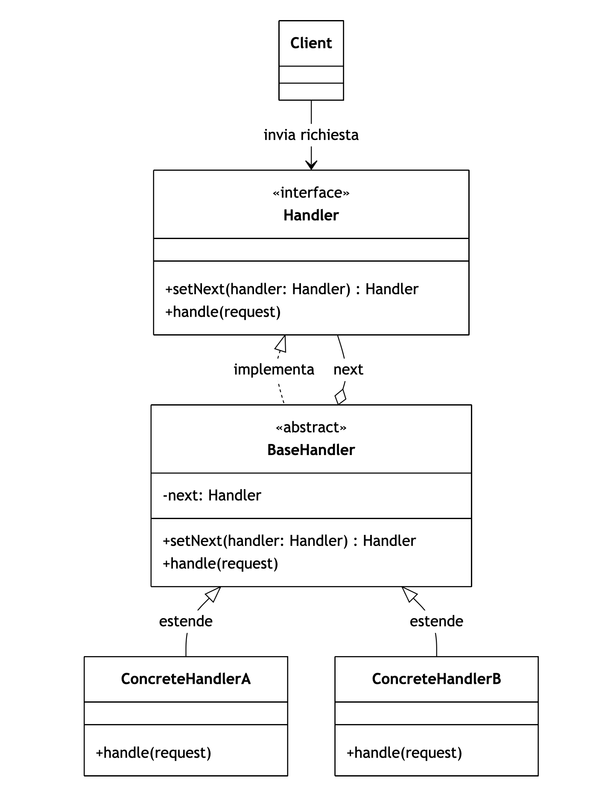

## [Design Patterns](../..)
### [Comportamentali](..)
# Chain of Responsibility

----

[](https://openjdk.org/projects/jdk/25/)
[](https://github.com/GiuCom/Design_Patterns/blob/main/LICENSE)<br>
<br>

## 🚀 Introduzione
Il pattern **Chain of Responsibility**  (Catena di Responsabilità) è un pattern di design comportamentale che permette di passare una richiesta lungo una catena di potenziali gestori finché uno di essi non la elabora. Questo approccio disaccoppia il mittente della richiesta dai suoi destinatari, permettendo a più oggetti di avere la possibilità di gestire la richiesta in modo indipendente.

## 🏭 Caratteristiche
Il pattern **Chain of Responsibility** Il pattern Chain of Responsibility si basa sul principio di delegazione sequenziale. 
<br>Ecco le sue caratteristiche principali e lo schema strutturale.
- Disaccoppiamento: Il mittente della richiesta non sa quale oggetto specifico la gestirà. Conosce solo il primo anello della catena.
- Flessibilità Dinamica: È possibile modificare la catena (aggiungere, rimuovere o riordinare i gestori) a runtime senza modificare il codice del client.
- Single Responsibility Principle: Ogni classe gestore si occupa di una specifica condizione o tipo di elaborazione, delegando il resto.
- Gerarchia di Intervento: La richiesta viaggia dal basso verso l'alto (es. da un impiegato a un dirigente) finché non trova l'autorità competente.
- Rischio di mancata gestione: Se la catena non è configurata correttamente o non prevede un "gestore finale" di default, una richiesta potrebbe arrivare alla fine senza essere mai elaborata.

Relazioni UML

In UML, è rappresentato:
- Handler (Interfaccia): Definisce il metodo per gestire le richieste e, opzionalmente, quello per impostare il successore.
- BaseHandler (Classe Astratta): Implementa la logica di memorizzazione del puntatore al "prossimo" (next) e il comportamento di default (passare la richiesta se non gestita).
- ConcreteHandlers: Contengono la logica decisionale reale. Se possono gestire la Request, lo fanno; altrimenti chiamano super.handle() per passare la palla al successore.
- Client: Compone la catena (collega gli oggetti tra loro) e innesca il processo inviando la richiesta al primo anello.


<p align="center">
  <br/>
</p>

-----

### ESEMPIO


**xxx.java** (xxxx) [Interfaccia]<br>

```java

```


Il pattern **Chain of Responsibility** 

**Pro (Vantaggi)**

**Contro (Svantaggi)**

**Quando usarlo**

----

## Test


```java

```
