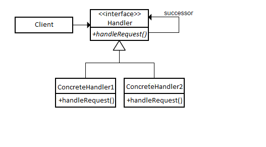

## [Design Patterns](../..)
### [Comportamentali](..)
# Chain of Responsibility

----

[](https://openjdk.org/projects/jdk/25/)
[](https://github.com/GiuCom/Design_Patterns/blob/main/LICENSE)<br>
<br>

## 🚀 Introduzione
Il pattern **Chain of Responsibility** (Catena di Responsabilità) è un design pattern di tipo comportamentale che ha, come scopo principale, evitare l'accoppiamento diretto tra il mittente di una richiesta e il suo destinatario, dando a più oggetti la possibilità di gestire la richiesta stessa. Gli oggetti ricevitori vengono concatenati e la richiesta viaggia lungo questa catena finché un oggetto non la prende in carico.

## 🏭 Caratteristiche
Il pattern propone un’architettura in cui una richiesta viene passata attraverso una catena di handler indipendenti. Ogni handler decide se elaborare la richiesta o passarla al successivo.

I componenti principali sono:

- **Handler (Interfaccia/Classe Astratta):** Definisce un'interfaccia per la gestione delle richieste e, opzionalmente, implementa il link al successore.
- **ConcreteHandler:** Gestisce le richieste di cui è responsabile. Se non può gestirle, le inoltra al successore.
- **Client:** Inizializza la richiesta e la inoltra al primo elemento della catena.

Tra le caratteristiche principali possiamo annotare:

1. **Disaccoppiamento (Decoupling)**
   È il cuore del pattern. Il mittente della richiesta non sa — e non deve sapere — quale oggetto la gestirà.
   Il Client conosce solo l'interfaccia astratta del primo anello.
   Gli Handler non conoscono l'intera struttura della catena, ma solo il loro successore immediato.
2. **Concatenazione degli Oggetti**
   Gli oggetti che possono gestire la richiesta sono legati tra loro come anelli di una catena.
   Ogni anello mantiene un riferimento al successivo.
   La richiesta fluisce sequenzialmente finché non trova un gestore compatibile o raggiunge la fine.
3. **Principio di Singola Responsabilità (SRP)**
   Ogni classe nella catena ha un unico compito specifico:
   Verifica se può gestire la richiesta.
   Esegue la logica interna.
   Oppure delega il lavoro.
   Questo evita di creare un unico oggetto "monolitico" con troppi blocchi if-else o switch.
4. **Flessibilità Dinamica**
   A differenza di una struttura rigida, la catena può essere modificata a runtime:
   Puoi aggiungere o rimuovere handler senza modificare il codice del client.
   Puoi cambiare l'ordine degli anelli per dare priorità a certe gestioni rispetto ad altre.
5. **Meccanismo di Propagazione**
   Esistono due modi principali in cui la richiesta si muove:
   Gestione esclusiva: Solo un oggetto gestisce la richiesta e la catena si interrompe (es. un sistema di autorizzazioni).
   Gestione cumulativa: Ogni anello esegue una parte del lavoro e poi passa comunque la richiesta al successivo (es. i filtri di una richiesta HTTP/Servlet).
6. **Gestione del Fallimento (Fall-through)**
   Se nessun anello della catena è in grado di gestire la richiesta:
   La richiesta può andare "persa" (silenziosamente).
   Può essere previsto un Handler di Default (un anello finale che logga l'errore o lancia un'eccezione).

Il pattern non garantisce che la richiesta venga effettivamente gestita. Se la catena non è configurata correttamente, la richiesta potrebbe arrivare alla fine senza che succeda nulla.


Il pattern **Chain of Responsibility** si rappresenta in UML attraverso un diagramma delle classi che evidenzia l'identità di interfaccia tra il **Proxy** e l'Oggetto Reale.
Ecco i componenti chiave del diagramma:

Relazioni UML

In UML, è rappresentato:

<p align="center">
  <br/>
</p>

-----

### ESEMPIO


**RichiestaSupporto.java** (Request) [Record]<br>
Il punto di partenza implementato come un Java Record.

- **Immutabilità:** Essendo un record, i dati (tipo e priorità) non possono essere modificati una volta creati. Questo è fondamentale in una "catena", perché garantisce che ogni anello riceva esattamente la stessa richiesta senza alterazioni.
- **Discriminante:** Il campo priorita funge da criterio decisionale. Gli handler lo useranno per capire se sono competenti per quella specifica richiesta.

```java
/**
 * Rappresenta una richiesta di assistenza.
 * @param tipo Descrizione del problema
 * @param priorita Valore numerico (1 = Bassa, 2+ = Alta)
 */

public record RichiestaSupporto(String tipo, int priorita) { }
```


**GestoreSupporto.java** & **BaseGestore.java** (Handler) [Interfaccia]<br>
L'architettura utilizza una combinazione di interfaccia e classe astratta:
- **L'Interfaccia (GestoreSupporto):** Definisce il comportamento pubblico. Ogni oggetto nella catena deve saper "gestire" e deve poter avere un "successore".
- **La Classe Astratta (BaseGestore):** Questo è il "motore" della catena. Implementa la variabile successivo e il metodo per impostarla.
  - **Il metodo `passaAlSuccessivo`:** È un metodo protetto che incapsula la logica di controllo. Se esiste un successore, passa la palla; se la catena è finita, fornisce una risposta di default (evitando l'errore di una richiesta "dispersa").

```java
public interface GestoreSupporto {

   void gestisci(RichiestaSupporto richiesta);
   void setSuccessivo(GestoreSupporto successivo);

}
```

```java
public abstract class BaseGestore implements GestoreSupporto {
   protected GestoreSupporto successivo;

   @Override
   public void setSuccessivo(GestoreSupporto successivo) {
      this.successivo = successivo;
   }

   // Metodo di utilità per far scorrere la catena
   protected void passaAlSuccessivo(RichiestaSupporto richiesta) {
      if (successivo != null) {
         successivo.gestisci(richiesta);
      } else {
         System.out.println("Fine della catena: nessuna gestione possibile per " + richiesta.tipo());
      }
   }
}
```


**SupportoBase.java** & **SupportoAvanzato.java** (Handler Concreti)<br>
Ogni classe concreta rappresenta un ufficio o un livello di competenza:
- **SupportoBase:**
Agisce come filtro d'ingresso.
Controlla se la priorità è bassa (<= 1).
Se sì, consuma la richiesta e la catena termina.
Se no, delega esplicitamente al livello successivo.
- **SupportoAvanzato:**
Rappresenta l'anello finale (o uno superiore).
Gestisce tutto ciò che ha priorità elevata (> 1).
Se non potesse gestire nemmeno lui la richiesta, userebbe la logica di BaseGestore per passare oltre.

```java
public final class SupportoBase extends BaseGestore {

   @Override
   public void gestisci(RichiestaSupporto richiesta) {
      if (richiesta.priorita() <= 1) {
         System.out.println("Supporto Base: Gestito -> " + richiesta.tipo());
      } else {
         System.out.println("Supporto Base: Inoltro...");
         passaAlSuccessivo(richiesta);
      }
   }
}
```

```java
public final class SupportoAvanzato extends BaseGestore {

   @Override
   public void gestisci(RichiestaSupporto richiesta) {
      if (richiesta.priorita() > 1) {
         System.out.println("Supporto Avanzato: Risolto -> " + richiesta.tipo());
      } else {
         passaAlSuccessivo(richiesta);
      }
   }
}
```


**ChainOfResponsibilityMain.java** (Client)<br>
Non è solo il punto di avvio, ma è l'architetto della catena:
- **Istanziazione:** Crea gli oggetti indipendenti.
- **Collegamento:** Qui avviene la magia del pattern. Tramite `setSuccessivo`, gli oggetti vengono concatenati. È qui che definiamo che il **SupportoBase** punta al **SupportoAvanzato**.
- **Iniezione:** Il Client invia la richiesta solo al primo anello (`supportoBase`). Non sa nulla dell'esistenza del supporto avanzato.

```java
public final class SupportoBase extends BaseGestore {

   @Override
   public void gestisci(RichiestaSupporto richiesta) {
      if (richiesta.priorita() <= 1) {
         System.out.println("Supporto Base: Gestito -> " + richiesta.tipo());
      } else {
         System.out.println("Supporto Base: Inoltro...");
         passaAlSuccessivo(richiesta);
      }
   }
}
```

Immaginiamo una richiesta con Priorità 5:
1. Il Client chiama supportoBase.gestisci(richiesta).
2. SupportoBase riceve la richiesta, controlla la priorità (5 > 1) e decide di non poterla gestire.
3. SupportoBase chiama internamente passaAlSuccessivo(richiesta).
4. L'esecuzione passa a **SupportoAvanzato.gestisci(richiesta)`.
5. SupportoAvanzato riconosce la priorità elevata e stampa il messaggio di risoluzione.


Il pattern **Chain of Responsibility** 

**Pro (Vantaggi)**
1. Disaccoppiamento Elevato
   Il vantaggio principale è la separazione tra chi invia la richiesta e chi la esegue. Il client deve conoscere solo il primo anello della catena, riducendo drasticamente le dipendenze nel codice.
2. Rispetto del Principio "Open/Closed"
   È possibile introdurre nuovi gestori (Handler) o modificare l'ordine della catena senza dover modificare il codice esistente degli altri gestori o del client.
3. Flessibilità e Dinamismo
   A differenza di un blocco switch o if-else cablato nel codice, la catena può essere configurata, estesa o riconfigurata a tempo di esecuzione (runtime) in base a file di configurazione o logica di business.
4. Principio di Singola Responsabilità (SRP)
   Ogni classe gestore si occupa esclusivamente di una logica specifica. Questo rende il codice molto più leggibile, testabile e facile da manutenere rispetto a un unico metodo "monolitico" di gestione.

   
**Contro (Svantaggi)**
1. Nessuna Garanzia di Gestione
   Poiché la richiesta passa di mano in mano, esiste il rischio che arrivi alla fine della catena senza che nessun handler l'abbia presa in carico. Se non viene previsto un "gestore di default", la richiesta potrebbe cadere nel vuoto ("drop") senza generare errori.
2. Difficoltà nel Debugging
   Seguire il flusso di esecuzione può diventare complesso, specialmente in catene molto lunghe. Poiché il passaggio tra un oggetto e l'altro avviene internamente, non è sempre immediato capire dal debugger quale anello stia effettivamente elaborando o scartando la richiesta.
3. Impatto sulle Prestazioni
   In catene estremamente profonde, il tempo di latenza aumenta poiché ogni richiesta deve attraversare diversi anelli prima di trovare quello corretto. Inoltre, ogni passaggio comporta una chiamata a metodo aggiuntiva sullo stack.
4. Rischio di Cicli Infiniti
   Se la catena non è configurata correttamente (ad esempio, se l'ultimo anello punta accidentalmente al primo), si può generare un ciclo infinito che porta al crash dell'applicazione per StackOverflowError.

**Quando usarlo**
1. Più oggetti possono gestire la stessa richiesta
   Usalo quando hai diverse componenti che potrebbero occuparsi di un compito, ma il "chi" deve farlo dipende dal contenuto della richiesta stessa o dallo stato attuale del sistema.
   Esempio: Un sistema di gestione permessi dove la richiesta passa dal "Manager", poi dal "Direttore" e infine dal "CEO" in base all'importo della spesa.
2. Il destinatario non è noto a priori
   Se il Client non sa (e non deve sapere) quale oggetto specifico risolverà il problema. Il Client lancia la richiesta nella "rete" e si aspetta che qualcuno la gestisca.
   Esempio: Un sistema di filtraggio delle e-mail (Antispam -> Antivirus -> Filtro Aziendale).
3. Ordine di esecuzione dinamico
   Quando vuoi essere in grado di cambiare l'ordine dei controlli o aggiungere nuovi passaggi senza riscrivere la logica principale.
   Esempio: In una pipeline di elaborazione immagini, dove puoi decidere a runtime se applicare prima il filtro "Bianco e Nero" e poi il "Ridimensionamento", o viceversa.
4. Evitare una struttura monumentale di if-else
   Se ti trovi davanti a una classe con uno switch o una serie di if lunghissimi che controllano diverse condizioni per decidere cosa fare. Il pattern permette di "spezzettare" quel blocco in tante piccole classi indipendenti.


----

## Test
Il test unitario ha l'obiettivo di verificare che la catena di responsabilità si comporti esattamente come previsto: ovvero che le richieste vengano bloccate al primo livello se di bassa priorità o inoltrate correttamente se di priorità superiore.
<br>Ecco l'analisi dettagliata dei componenti del test:
1. La fase di Configurazione (@BeforeEach)
   Prima di ogni singolo test, il metodo inizializzazione() prepara l'ambiente:
   Istanziazione: Vengono creati gli oggetti SupportoBase e SupportoAvanzato.
   Assemblaggio: Viene stabilito il collegamento (livelloBase.setSuccessivo(livelloAvanzato)).
   Isolamento: JUnit assicura che per ogni test la catena venga ricostruita da zero, evitando che i test si influenzino a vicenda (test "stateless").
2. Caso di Test 1: Gestione Locale (testRichiestaPrioritaBassa)
   Questo test verifica lo scenario più semplice.
   Input: Una RichiestaSupporto con priorità 1.
   Aspettativa: Il SupportoBase deve gestire la richiesta internamente.
   Verifica (assertDoesNotThrow): Ci assicuriamo che l'esecuzione termini senza errori. In un ambiente di produzione, potremmo usare un "Mock" per verificare che il metodo del SupportoAvanzato non sia mai stato chiamato, confermando che la catena si è interrotta correttamente.
3. Caso di Test 2: Inoltro nella Catena (testRichiestaPrioritaAlta)
   Questo è il test fondamentale per il pattern.
   Input: Una richiesta con priorità 5.
   Logica: Il SupportoBase riconosce di non avere la competenza necessaria e delega al SupportoAvanzato.
   Obiettivo: Confermare che l'oggetto iniziale sia in grado di comunicare con il successo senza generare NullPointerException (errore comune se il successore non è impostato).
4. Cosa stiamo verificando tecnicamente?
   Attraverso questi test, validiamo tre aspetti critici del codice:
   Correttezza della Logica Condizionale: Verifichiamo che gli if (priorita <= 1) funzionino come previsto.
   Integrità dei Puntatori: Verifichiamo che il riferimento successivo all'interno della classe astratta BaseGestore sia correttamente utilizzato e non sia nullo.
   Comportamento Polimorfico: Il test interagisce con il tipo GestoreSupporto. Non gli interessa quale classe specifica risolva il problema, ma solo che il sistema lo faccia.

```java
public class ChainOfResponsibilityTest {
    private SupportoBase livelloBase;
    private SupportoAvanzato livelloAvanzato;

    @BeforeEach
    void inizializzazione() {
        livelloBase = new SupportoBase();
        livelloAvanzato = new SupportoAvanzato();

        // Costruzione della catena: Base -> Avanzato
        livelloBase.setSuccessivo(livelloAvanzato);
    }

    @Test
    void testRichiestaPrioritaBassa() {
        RichiestaSupporto richiesta = new RichiestaSupporto("Cambio Password", 1);
        // Verifica che il supporto base gestisca senza errori
        assertDoesNotThrow(() -> livelloBase.gestisci(richiesta));
    }

    @Test
    void testRichiestaPrioritaAlta() {
        RichiestaSupporto richiesta = new RichiestaSupporto("Database Offline", 5);
        // Verifica il passaggio della richiesta lungo la catena
        assertDoesNotThrow(() -> livelloBase.gestisci(richiesta));
    }
}
```
