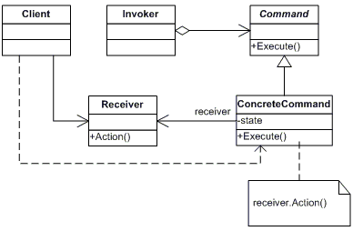

## [Design Patterns](../..)
### [Comportamentali](..)
# Command

----

[](https://openjdk.org/projects/jdk/25/)
[](https://github.com/GiuCom/Design_Patterns/blob/main/LICENSE)<br>
<br>

## 🚀 Introduzione
Il pattern **Command** è un design pattern comportamentale che ha l'obiettivo di incapsulare una richiesta come un oggetto. Questa astrazione permette di parametrizzare i client con diverse richieste, accodare o registrare le operazioni e supportare operazioni annullabili (undo)

## 🏭 Caratteristiche
Il pattern si articola su cinque componenti principali:

- Command (Interfaccia): Definisce l'interfaccia astratta per l'esecuzione di un'operazione, solitamente tramite un metodo execute().
- ConcreteCommand: Implementa execute() invocando le operazioni corrispondenti sul Receiver. Mantiene il legame tra un'azione e il destinatario.
- Receiver (Ricevitore): La classe che contiene la logica di business reale e sa come eseguire il lavoro richiesto.
- Invoker (Invocatore): Chiede al comando di eseguire la richiesta. Non sa nulla della logica interna o del Ricevitore; conosce solo l'interfaccia Command.
- Client: Crea l'oggetto ConcreteCommand e imposta il suo Receiver

In UML, è rappresentato:

<p align="center">
  <br/>
</p>

-----

### ESEMPIO
Simula un sistema di domotica intelligente focalizzato sulla gestione di un condizionatore d'aria. La scelta di questo scenario permette di evidenziare il vantaggio principale del pattern: la capacità di gestire uno stato storico (Undo) in modo pulito e strutturato.
<br>L'obiettivo non è solo cambiare la temperatura, ma poter tornare esattamente alla temperatura precedente senza che il condizionatore debba memorizzare i propri stati passati.
- **Problema:** Se il condizionatore dovesse gestire l'annullamento, diventerebbe troppo complesso.
- **Soluzione:** Ogni "cambio di temperatura" diventa un oggetto autonomo che "si ricorda" come tornare indietro.


**Comando.java** (Command) [Interfaccia]<br>
È il cuore del pattern. Definisce il contratto astratto che tutti i comandi concreti devono rispettare.
<br>Espone i metodi `esegui()` e `annulla()`. La sua esistenza permette all'Invocatore di ignorare completamente la logica specifica delle classi che implementano l'azione, garantendo il polimorfismo.

```java
public interface Comando {
    void esegui();
    void annulla();
}
```

<br>**ComandoTemperatura.java** (ConcreteCommand) [Record]<br>
Rappresenta l'implementazione specifica di un'azione (cambiare la temperatura).
Utilizza un Java Record (funzionalità consolidata in Java 25) per memorizzare lo stato necessario:
- Il riferimento al Receiver (Condizionatore).
- I dati della richiesta (nuovaTemp).
- Lo stato precedente per il rollback (vecchiaTemp).
Quando viene chiamato `esegui()`, delega il lavoro al Receiver.

```java
public record ComandoTemperatura(Condizionatore condizionatore, int nuovaTemp, int vecchiaTemp)
        implements Comando {

    @Override
    public void esegui() {
        condizionatore.impostaTemperatura(nuovaTemp);
    }

    @Override
    public void annulla() {
        condizionatore.impostaTemperatura(vecchiaTemp);
    }
}
```

<br>**Condizionatore.java** (Receiver) [Classe]<br>
È l'oggetto che possiede la logica di business e le conoscenze tecniche per eseguire effettivamente l'operazione.
Non sa nulla del pattern **Command** o del **Telecomando**. Si limita a fornire metodi pubblici (`accendi()`, `impostaTemperatura()`) che modificano il suo stato interno. È il componente che subisce l'azione.

```java
public class Condizionatore {
    private int temperatura = 22;

    public void accendi() { System.out.println("Condizionatore ACCESO"); }
    public void spegni() { System.out.println("Condizionatore SPENTO"); }

    public void impostaTemperatura(int t) {
        this.temperatura = t;
        System.out.println("Temperatura impostata a: " + t + "°C");
    }

    public int getTemperatura() { return temperatura; }
}
```

<br>**Telecomando.java** (Invoker) [Classe]<br>
È il responsabile del trigger dell'esecuzione dei comandi.
Contiene un riferimento a un oggetto di tipo **Comando**. Non conosce la classe concreta (es. non sa che è un **ComandoTemperatura**), sa solo che può chiamare `esegui()`.
Mantiene uno `Stack<Comando>` (cronologia) per supportare l'operazione di annullamento multiplo (Undo).

```java
public class Telecomando {
    private final Stack<Comando> cronologia = new Stack<>();

    public void inviaPressione(Comando comando) {
        comando.esegui();
        cronologia.push(comando);
    }

    public void premiAnnulla() {
        if (!cronologia.isEmpty()) {
            cronologia.pop().annulla();
        }
    }
}
```

<br>**CommandMain.java** (Client) [Classe]<br>
È l'assemblatore del sistema, ha tre compiti fondamentali:
- Istanziare il Receiver (Condizionatore).
- Creare i ConcreteCommand associandoli al Receiver.
- Consegnare i comandi all'Invoker affinché vengano eseguiti in un secondo momento.

```java
public class CommandMain {
    static void main() {
        // 1. Inizializzazione del Ricevitore (Receiver)
        // Il condizionatore contiene la logica di business reale
        Condizionatore ariaCondizionata = new Condizionatore();

        // 2. Inizializzazione dell'Invocatore (Invoker)
        // Il telecomando gestisce l'invio dei comandi e la cronologia per l'undo
        Telecomando telecomando = new Telecomando();

        System.out.println("--- Inizio Operazioni Domotiche ---");
        System.out.println("Stato iniziale: " + ariaCondizionata.getTemperatura() + "°C");

        // 3. Creazione e invio del primo comando
        // Passiamo la temperatura corrente (22) come 'vecchiaTemp' per permettere il ripristino
        Comando impostaEstate = new ComandoTemperatura(
                ariaCondizionata,
                18,
                ariaCondizionata.getTemperatura()
        );

        System.out.println("\nEsecuzione: Impostazione modalità estate...");
        telecomando.inviaPressione(impostaEstate);

        // 4. Creazione e invio del secondo comando
        Comando impostaNotte = new ComandoTemperatura(
                ariaCondizionata,
                24,
                ariaCondizionata.getTemperatura()
        );

        System.out.println("\nEsecuzione: Impostazione modalità notte...");
        telecomando.inviaPressione(impostaNotte);

        // 5. Test della funzionalità Undo (Annulla)
        System.out.println("\n--- Test Funzione Annulla (Undo) ---");

        System.out.println("Annullamento ultimo comando (Notte -> Estate)...");
        telecomando.premiAnnulla();
        System.out.println("Temperatura attuale: " + ariaCondizionata.getTemperatura() + "°C");

        System.out.println("\nAnnullamento comando precedente (Estate -> Iniziale)...");
        telecomando.premiAnnulla();
        System.out.println("Temperatura attuale: " + ariaCondizionata.getTemperatura() + "°C");

        System.out.println("\nTentativo di annullamento extra...");
        telecomando.premiAnnulla(); // Questo testerà la modifica "isEmpty" appena fatta

        System.out.println("\n--- Fine Simulazione ---");
    }
}
```
<br>L'adozione del pattern **Command** in un'architettura software comporta una serie di compromessi ingegneristici.

**Pro (Vantaggi)**
1. **Disaccoppiamento Elevato (Decoupling)**
   Il vantaggio principale è la separazione netta tra l'oggetto che invoca l'operazione (Invoker) e l'oggetto che sa come eseguirla (Receiver). Questo permette di modificare o sostituire i componenti senza impattare gli uni sugli altri.
2. **Estensibilità (Open/Closed Principle)**
   È possibile aggiungere nuovi comandi (nuove classi che implementano l'interfaccia Comando) senza modificare il codice esistente dell'Invocatore o del Client. Il sistema è "aperto" all'estensione ma "chiuso" alla modifica.
3. **Supporto nativo per Undo/Redo**
   Poiché ogni richiesta è un oggetto, è facile memorizzare questi oggetti in una struttura dati (come uno Stack). Questo permette di implementare funzionalità di annullamento (Undo) e ripristino (Redo) in modo sistematico, salvando lo stato precedente all'interno del comando stesso.
4. **Composizione di Comandi (Macro Commands)**
   Il pattern permette di raggruppare più comandi in un unico "Macro Comando". Invocando un singolo execute(), è possibile innescare una sequenza complessa di operazioni, trattando il gruppo come se fosse un singolo comando (isomorfismo).
5. **Scheduling e Code di Lavoro**
   Gli oggetti comando possono essere serializzati, memorizzati in una coda e inviati per l'esecuzione in un momento successivo o su un thread diverso, facilitando la programmazione asincrona e distribuita.


**Contro (Svantaggi)**
1. **Proliferazione delle Classi**
   Ogni singola operazione richiede una nuova classe ConcreteCommand. In sistemi con molte azioni diverse, il numero di classi può aumentare vertiginosamente, rendendo il progetto più difficile da navigare e manutenere ("Class Explosion").
2. **Aumento della Complessità**
   Per operazioni molto semplici (es. un banale setter), l'introduzione di Interfacce, Invocatori e Ricevitori può risultare un over-engineering. Il codice diventa più astratto e meno diretto, richiedendo una curva di apprendimento maggiore per chi legge il sistema per la prima volta.
3. **Gestione dello Stato per l'Undo**
   Per supportare l'annullamento, ogni comando deve memorizzare lo stato precedente del Ricevitore. Se il Ricevitore è un oggetto molto grande o complesso, questo può portare a un consumo elevato di memoria, specialmente se la cronologia dei comandi (lo stack) è molto profonda.
4. **Accoppiamento Command-Receiver**
   Sebbene l'Invocatore sia disaccoppiato, il ConcreteCommand è strettamente legato a un Receiver specifico. Ogni modifica alla firma dei metodi del Ricevitore richiederà modifiche a tutti i comandi che lo utilizzano.


**Quando usarlo**
Il pattern Command è altamente raccomandato quando:
- È necessario supportare operazioni di Undo/Redo.
- Si devono programmare azioni in momenti diversi (es. Code di messaggi).
- Si vuole implementare un sistema di Callback orientato agli oggetti.
È invece sconsigliato quando:
- L'applicazione è semplice e le azioni sono dirette.
- Si ha un vincolo stringente sulla memoria (e non si può gestire uno stack di stati).

----

## Test
Il test si divide in tre fasi canoniche (pattern AAA: Arrange, Act, Assert).
1. **Fase di Setup (@BeforeEach)**<br>
   Prima di ogni singolo test, istanziamo i componenti:
   - **Receiver:** Il Condizionatore parte da uno stato noto (es. 22°C).
   - **Invoker:** Il Telecomando parte con la cronologia vuota.
   - **Obiettivo:** Garantire l'isolamento dei test (ogni test parte da "zero").
2. **Test di Esecuzione (testEsecuzioneComando)**<br>
   Verifica che il comando trasporti correttamente l'ordine dall'invocatore al ricevitore.
   - **Act:** Si invia il comando di impostare la temperatura a 30°C.
   - **Assert:** Si interroga il Condizionatore (Receiver) per verificare che la sua temperatura interna sia effettivamente cambiata.
   - **Significato:** Conferma che il metodo execute() del ConcreteCommand ha chiamato correttamente il metodo del Receiver.
3. **Test di Annullamento (testUndoComando)**<br>
   È il test più critico per questo pattern. Valida la gestione della memoria storica.
   - **Arrange:** Si esegue un comando (es. da 22°C a 18°C).
   - **Act:** Si preme il tasto annulla() sul telecomando.
   - **Assert:** Si verifica che la temperatura sia tornata a 22°C.
   - **Significato:** Dimostra che il comando ha salvato correttamente lo stato precedente e che l'invocatore ha gestito correttamente lo Stack della cronologia.
4. **Edge Case (caso limite) o Negative Test**<br>
La fase testPressioneTastoVuoto serve a dimostrare la robustezza del codice: ovvero come il programma reagisce a input o azioni non previste ma possibili.

**@DisplayName:** Utilizzato per rendere i report dei test leggibili anche a non programmatori (es. "Annullamento (Undo) del comando").
**Asserzioni Fluent:** L'uso di assertEquals(atteso, attuale, messaggio) permette di ricevere messaggi d'errore precisi se il pattern fallisce.
**Lifecycle Management:** JUnit 6 ottimizza l'uso della memoria tra un test e l'altro, fondamentale se testiamo lunghe sequenze di comandi.

```java
@DisplayName("Test Pattern Command - Sistema Domotico")
public class CommandTest {
    private Condizionatore receiver;
    private Telecomando invoker;

    @BeforeEach
    void setUp() {
        receiver = new Condizionatore();
        invoker = new Telecomando();
    }

    @Test
    @DisplayName("Esecuzione comando temperatura")
    void testEsecuzioneComando() {
        int tempIniziale = receiver.getTemperatura();
        Comando imposta30 = new ComandoTemperatura(receiver, 30, tempIniziale);

        invoker.inviaPressione(imposta30);

        assertEquals(30, receiver.getTemperatura(), "La temperatura dovrebbe essere 30");
    }

    @Test
    @DisplayName("Annullamento (Undo) del comando")
    void testUndoComando() {
        int tempIniziale = receiver.getTemperatura(); // 22
        Comando imposta18 = new ComandoTemperatura(receiver, 18, tempIniziale);

        invoker.inviaPressione(imposta18);
        invoker.premiAnnulla();

        assertEquals(22, receiver.getTemperatura(), "Il sistema dovrebbe tornare a 22°C");
    }

    @Test
    @DisplayName("Test pressione tasto vuoto")
    void testPressioneTastoVuoto() {
        // Arrange: lo stato è già inizializzato con cronologia vuota nel setUp()

        // Act & Assert: verifichiamo che non venga lanciata alcuna eccezione
        // In JUnit 6 assertDoesNotThrow assicura che il codice sia robusto
        assertDoesNotThrow(() -> invoker.premiAnnulla(),
                "Il sistema non deve crashare se la cronologia è vuota");

        // Verifichiamo che la temperatura sia rimasta quella di default (22)
        assertEquals(22, receiver.getTemperatura(),
                "La temperatura non dovrebbe cambiare");
    }
}
```
