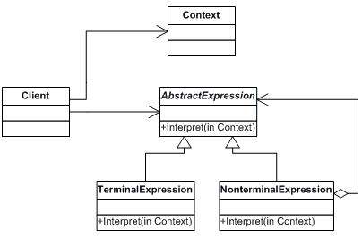

## [Design Patterns](../..)
### [Comportamentali](..)
# Interpreter

----

[](https://openjdk.org/projects/jdk/25/)
[](https://github.com/GiuCom/Design_Patterns/blob/main/LICENSE)<br>
<br>

## 🚀 Introduzione
Il pattern **Interpreter** è un design pattern comportamentale che definisce una rappresentazione per la grammatica di un linguaggio e un interprete che utilizza tale rappresentazione per interpretare frasi nel linguaggio stesso.
<br>Il pattern mappa ogni regola grammaticale in una classe, permettendo di valutare espressioni complesse (strutturate come alberi sintattici) attraverso il meccanismo della ricorsione.

## 🏭 Caratteristiche
La caratteristica distintiva del pattern **Interpreter** è la sua capacità di trasformare una grammatica formale in una gerarchia di classi, permettendo di valutare espressioni complesse trattandole come un Albero Sintattico Astratto (AST).
<br>Le sue proprietà fondamentali sono:
1. **Struttura Ricorsiva (Composizione)**<br>
   Il pattern si basa pesantemente sul concetto di ricorsione. Le espressioni "Non-Terminali" (come la Somma) non calcolano direttamente un risultato, ma delegano il calcolo ai propri figli, i quali possono essere altre operazioni o valori atomici (Terminali).
2. **Mappatura 1:1 tra Grammatica e Codice**<br>
   Ogni regola della grammatica (es. <numero>, <somma>, <variabile>) corrisponde esattamente a una classe Java. Questo rende il pattern estremamente leggibile per chi conosce la grammatica del linguaggio che si sta implementando.
3. **Utilizzo del "Context" (Contesto)**<br>
   A differenza di altri pattern, l'Interpreter richiede quasi sempre un oggetto Context che attraversa l'intero albero durante la valutazione. Questo oggetto funge da memoria condivisa (per salvare i valori delle variabili o lo stato globale), permettendo di risolvere simboli che altrimenti non avrebbero valore.
4. **Estensibilità Grammaticale**<br>
   È conforme al principio Open/Closed: se vuoi aggiungere una nuova operazione (ad esempio la Moltiplicazione), non devi modificare le classi esistenti. Ti basta creare una nuova classe che implementa l'interfaccia Espressione.

<br>Il pattern si basa sulla scomposizione di un linguaggio in simboli terminali e non terminali:
1. **AbstractExpression (Interfaccia):**<br> Dichiara il metodo astratto interpreta(Context). Ogni nodo dell'albero sintattico deve implementare questa interfaccia.
2. **TerminalExpression (Espressione Terminale):**<br> Implementa l'interpretazione per i simboli elementari della grammatica (es. un numero o una variabile). È la "foglia" dell'albero.
3. **NonTerminalExpression (Espressione Non Terminale):**<br> Rappresenta le regole grammaticali composte (es. addizione, sottrazione). Contiene riferimenti ad altre AbstractExpression e combina i loro risultati.
4. **Context (Contesto):**<br> Contiene le informazioni globali all'interprete, come i valori delle variabili (spesso implementato tramite una Map).
5. **Client:**<br> Costruisce l'Albero Sintattico Astratto (AST) e invoca l'interpretazione sulla radice.

<br>In UML, è rappresentato:

<p align="center">
  <br/>
</p>

-----

### ESEMPIO


**Espressione.java** (AbstractExpression) [Interfaccia]<br>
Rappresenta l'astrazione di un nodo dell'albero sintattico.
Definisce il contratto `interpreta(Contesto c)`. Tutti i nodi, siano essi operazioni o valori semplici, devono implementare questo metodo. È ciò che permette la ricorsione polimorfica: un operatore non ha bisogno di sapere se i suoi figli sono numeri o altre operazioni, gli basta sapere che rispondono a interpreta.

```java
public interface Espressione {
    int interpreta(Contesto contesto);
}
```

<br>**Numero.java** (TerminalExpression) [Record]<br>
Rappresenta una costante numerica, ovvero una "foglia" dell'albero.
Essendo un simbolo terminale, la sua interpretazione non dipende da altri nodi. Restituisce semplicemente il valore intero che contiene. L'uso del Record in Java 25 garantisce che il valore sia immutabile e facilita la gestione della memoria durante il parsing.

```java
public record Numero(int valore) implements Espressione {
   @Override public int interpreta(Contesto c) { return valore; }
}
```

<br>**Variabile.java** (TerminalExpression) [Record]<br>
Rappresenta un segnaposto per un valore dinamico (es. "x").
Come Numero, è un nodo foglia. Tuttavia, a differenza del numero, la sua interpretazione richiede l'accesso al Contesto. Il metodo interpreta effettua una ricerca (lookup) nel contesto usando il nome della variabile come chiave.

```java
public record Variabile(String nome) implements Espressione {
   @Override public int interpreta(Contesto c) { return c.get(nome); }
}
```

<br>**Somma.java** (NonTerminalExpression) [Record]<br>
Rappresenta una regola grammaticale composta da altri simboli.
È un nodo interno dell'albero che contiene due riferimenti ad altri oggetti di tipo Espressione.
Il suo metodo `interpreta` chiama ricorsivamente `interpreta` sul figlio sinistro e sul figlio destro, sommando poi i risultati ottenuti. Questa classe è la prova di come il pattern possa gestire espressioni annidate all'infinito.

```java
public record Somma(Espressione sinistra, Espressione destra) implements Espressione {
   @Override
   public int interpreta(Contesto c) {
      return sinistra.interpreta(c) + destra.interpreta(c);
   }
}
```

<br>**Contesto.java** (Context) [Record]<br>
Agisce come un deposito globale di informazioni necessarie per la valutazione.
In questo esempio, incapsula una Map<String, Integer>. Senza questa classe, le espressioni sarebbero statiche; grazie al contesto, l'interpretazione diventa dinamica e dipendente dallo stato esterno (es. il valore attuale di "x").

```java
public record Somma(Espressione sinistra, Espressione destra) implements Espressione {
   @Override
   public int interpreta(Contesto c) {
      return sinistra.interpreta(c) + destra.interpreta(c);
   }
}
```

<br>**InterpreterMain.java** (Client) [Classe]<br>
È il responsabile della costruzione dell'**AST (Abstract Syntax Tree)**.
Decide la struttura dell'espressione (la grammatica specifica) istanziando e collegando tra loro i vari nodi. Una volta costruito l'albero, chiama il metodo interpreta sulla radice per avviare il processo a cascata.

```java
public class InterpreterMain {
   static void main() {
      // 1. Definizione del Contesto
      // Carichiamo i valori per le variabili 'x' e 'y'
      Contesto contesto = new Contesto();
      contesto.assegna("x", 5);
      contesto.assegna("y", 20);

      System.out.println("--- Interprete Grammaticale Moderno ---");
      System.out.println("Variabili definite: x=5, y=20");

      // 2. Costruzione dell'Albero Sintattico (AST)
      // Rappresenta l'espressione: y + (x + 10)

      // Sotto-albero: (x + 10)
      Espressione sottoEspressione = new Somma(
              new Variabile("x"),
              new Numero(10)
      );

      // Radice dell'albero: y + (sotto-albero)
      Espressione espressioneFinale = new Somma(
              new Variabile("y"),
              sottoEspressione
      );

      // 3. Esecuzione dell'Interpretazione
      // Il metodo interpreta attraversa l'albero ricorsivamente
      int risultato = espressioneFinale.interpreta(contesto);

      // 4. Output dei risultati
      System.out.println("\nCalcolo dell'espressione: y + (x + 10)");
      System.out.println("Risultato finale: " + risultato);

      // 5. Cambio dinamico del contesto
      System.out.println("\n--- Cambio valore di x a 10 ---");
      contesto.assegna("x", 10);
      risultato = espressioneFinale.interpreta(contesto);
      System.out.println("Nuovo risultato: " + risultato);
   }
}
```

Il pattern **Interpreter** 

**Pro (Vantaggi)**
1. Facilità di Estensione della Grammatica
   Poiché ogni regola grammaticale è rappresentata da una classe, aggiungere una nuova operazione (es. una Moltiplicazione) è estremamente semplice: basta creare una nuova classe che implementa l'interfaccia Espressione senza toccare il codice esistente.
2. Implementazione Diretta e Leggibile
   Il codice riflette quasi letteralmente le produzioni della grammatica (es. la regola Somma := Espressione + Espressione diventa la classe Somma). Questo rende il sistema molto intuitivo per chi deve manutenere la logica del linguaggio.
3. Separazione delle Responsabilità (SRP)
   Ogni nodo dell'albero si occupa solo di interpretare se stesso. Il Numero gestisce costanti, la Variabile gestisce il lookup nel contesto, e le operazioni gestiscono la logica matematica.
4. Facilità di Modifica della Valutazione
   Cambiando semplicemente il modo in cui i nodi percorrono l'albero o modificando il Contesto, è possibile cambiare il comportamento dell'intero linguaggio senza modificare la struttura dell'espressione.

**Contro (Svantaggi)**
1. Esplosione delle Classi (Class Inflation)
   Per grammatiche complesse, il numero di classi necessarie diventa enorme. Ogni singola regola, operatore o simbolo richiede una classe dedicata, rendendo il progetto difficile da navigare.
2. Inefficienza per Grammatiche Complesse
   L'Interpreter non è progettato per la velocità. La costruzione di un grande albero sintattico composto da migliaia di piccoli oggetti (come Numero o Somma) consuma molta memoria e il processo di valutazione ricorsiva è più lento rispetto a un automa a stati o a un bytecode compilato.
3. Difficoltà nel Parsing
   Il pattern Interpreter si occupa di valutare l'albero, ma non spiega come costruirlo. Scrivere un "Parser" che trasformi una stringa (es. "5 + x") in una struttura di oggetti new Somma(new Numero(5), ...) può essere molto più complesso del pattern stesso.
4. Manutenibilità Rigida
   Se la grammatica cambia radicalmente (ad esempio si passa da una notazione prefissa a una infissa complessa), è necessario rifattorizzare l'intera gerarchia di classi, il che può essere oneroso.

**Quando usarlo**
1. Quando hai una Grammatica Semplice e Stabile
   Il caso d'uso ideale è un linguaggio le cui regole non cambiano quasi mai.
   Esempio: Un motore di ricerca interno che accetta query come autore: "Manzoni" AND anno > 1820.
   Perché: Puoi mappare AND, OR, : e > direttamente in classi senza che il sistema diventi ingestibile.
2. Espressioni Matematiche o Logiche Configurabili
   Se la tua applicazione deve permettere all'utente (o a un file di configurazione) di definire formule che devono essere calcolate a runtime.
   Esempio: Un software di buste paga dove il calcolo delle tasse varia ogni anno e viene descritto tramite formule testuali.
   Perché: L'utente può comporre l'albero sintattico per riflettere la formula corrente.
3. Parsing di Formati Dati Custom
   Quando devi leggere file di configurazione o protocolli di comunicazione proprietari che hanno una struttura gerarchica.
   Esempio: Un parser per un formato di file simile a JSON o YAML creato appositamente per un dispositivo hardware specifico.
4. Quando l'Efficienza non è la Priorità
   L'Interpreter è perfetto se la priorità è la leggibilità e la manutenibilità del codice, piuttosto che la velocità pura di esecuzione.
   Perché: Se devi valutare poche migliaia di espressioni al secondo, l'overhead degli oggetti è trascurabile. Se ne devi valutare milioni al millisecondo, questo pattern è sconsigliato.

----

## Test
Il test per il pattern Interpreter ha l'obiettivo di validare che l'Albero Sintattico Astratto (AST) computi il valore corretto seguendo le regole della grammatica definita. In ambito universitario, questo test serve a dimostrare la correttezza della ricorsione polimorfica.
Nel nostro caso verifica un numero, ma controlla come i diversi componenti (Terminali e Non-Terminali) interagiscono con il Contesto.

1. Fase di Setup
   In questo pattern, il setup si concentra sulla preparazione del Contesto:
   Si istanzia l'oggetto Contesto.
   Si "popolano" le variabili (es. x = 5, y = 20).
   Perché? Senza un contesto popolato, le classi Variabile non avrebbero dati da leggere durante l'interpretazione.
2. Fase di Esecuzione (L'AST)
   Il test costruisce manualmente l'albero. Ad esempio, per testare (x + 10):
   Si crea un nodo Variabile("x").
   Si crea un nodo Numero(10).
   Si avvolgono entrambi in un nodo Somma.
   Nota tecnica: Il test valida che l'ordine delle chiamate ricorsive sia corretto.
3. Fase di Assert (Verifica)
   Si confronta il risultato del metodo interpreta() con il valore atteso.
   assertEquals(15, risultato): Se il test passa, significa che la Somma ha interrogato correttamente i suoi figli e che la Variabile ha interrogato correttamente il Contesto.

Con questo test abbiamo coperto i seguenti scenari:

1. **Il "Percorso Felice" (Happy Path)**<br>
Verifica una formula standard dove tutto è definito.
- Esempio: Somma(Variabile("x"), Numero(10)) con x=5.
- Risultato atteso: 15.
2. **Gestione delle Variabili Mancanti (Edge Case)**<br>
Cosa succede se l'espressione chiede una variabile "z" che non è nel contesto?
- Il test verifica: Che il sistema non crashi (es. restituisca 0 o lanci un'eccezione controllata).
- Importanza: Valida la robustezza della classe Variabile.
3. **Composizione Ricorsiva (Deep Tree)**<br>
Verifica che il pattern regga l'annidamento.
- Esempio: Somma(Somma(1, 2), Somma(3, 4)).
- Risultato atteso: 10.
- Importanza: Conferma che il tipo Espressione sia correttamente implementato come interfaccia per permettere nodi che contengono altri nodi.

```java
@DisplayName("Test Pattern Interpreter - Calcolatrice Grammaticale")
public class InterpreterTest {
    @Test
    @DisplayName("Interpretazione somma con variabile")
    void testSomma() {
        Contesto contesto = new Contesto();
        contesto.assegna("x", 5);

        // Costruzione AST: x + 10
        Espressione espressione = new Somma(new Variabile("x"), new Numero(10));

        int risultato = espressione.interpreta(contesto);

        assertEquals(15, risultato, "5 + 10 dovrebbe fare 15");
    }

    @Test
    @DisplayName("Test variabile inesistente (valore default)")
    void testVariabileVuota() {
        Contesto contesto = new Contesto(); // x non definita
        Espressione v = new Variabile("x");

        assertEquals(0, v.interpreta(contesto), "Una variabile non definita deve restituire 0");
    }

    @Test
    @DisplayName("Valutazione espressione nidificata")
    void testEspressioneNidificata() {
        // Arrange
        Contesto contesto = new Contesto();
        contesto.assegna("x", 5);
        contesto.assegna("y", 20);

        // Costruiamo: (5 + 10) + (x + y)
        // Primo blocco: 5 + 10
        Espressione bloccoCostanti = new Somma(new Numero(5), new Numero(10));

        // Secondo blocco: x + y
        Espressione bloccoVariabili = new Somma(new Variabile("x"), new Variabile("y"));

        // Radice: blocco1 + blocco2
        Espressione alberoComplesso = new Somma(bloccoCostanti, bloccoVariabili);

        // Act
        int risultato = alberoComplesso.interpreta(contesto);

        // Assert
        // (5 + 10) + (5 + 20) = 15 + 25 = 40
        assertEquals(40, risultato, "L'espressione nidificata (5+10)+(x+y) dovrebbe restituire 40");
    }
}
```
