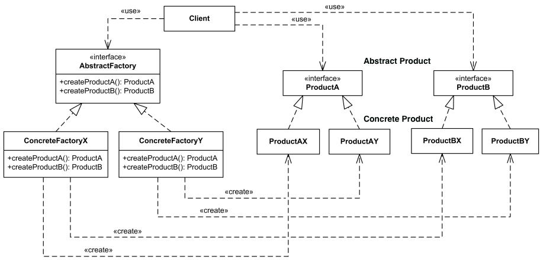

## [Design Patterns](../..)
### [Creazionali](..)
# Abstract Factory

----

[](https://openjdk.org/projects/jdk/25/)
[](https://github.com/GiuCom/Design_Patterns/blob/main/LICENSE)<br>
<br>

## 🚀 Introduzione
L'**Abstract Factory** è un pattern creazionale che fornisce un'interfaccia per creare famiglie di oggetti correlati o dipendenti, senza specificare le loro classi concrete. È spesso definito come una "_fabbrica di fabbriche_".
<br>Le sue principali funzionalità e caratteristiche:

1. **Disaccoppiamento e Astrazione:** Il pattern separa il codice che utilizza gli oggetti (il client) dalla logica della loro creazione, infatti:
   - Il client interagisce solo con interfacce astratte, ignorando quali classi specifiche (concrete) vengano effettivamente istanziate.
   - Questo meccanismo permette di cambiare l'intera famiglia di prodotti (ad esempio, passare da un tema grafico "Light" a uno "Dark") semplicemente sostituendo la factory utilizzata, senza modificare il codice del client.
   
2. **Creazione di Famiglie di Prodotti:** A differenza del pattern **Factory Method** (che crea un solo tipo di oggetto), l'**Abstract Factory** gestisce gruppi di oggetti che devono lavorare insieme, permettendo la coerenza tra i prodotti. Infatti, se una factory crea un pulsante in stile Windows, creerà anche una barra di scorrimento in stile Windows, evitando che vengano mescolati componenti incompatibili.

## 🏭 Caratteristiche
La struttura del pattern è composta dalle seguenti classi e interfacce:

- **Abstract Factory:** Interfaccia che dichiara i metodi per creare i prodotti astratti.
- **Concrete Factory:** Implementa i metodi per creare prodotti di una specifica variante.
- **Abstract Product:** Interfaccia per una tipologia di oggetto.
- **Concrete Product:** Implementazione specifica del prodotto

In UML, è rappresentato:

<p align="center">
  <br/>
</p>

-----

### [ESEMPIO](src/main/java/cloud/compagno/designpatterns/crazionali/singleton/esempio)
Una UI multi-piattaforma illustra come l'**Abstract Factory** permetta di gestire intere "famiglie" di oggetti (bottoni, checkbox, scrollbar) garantendo che siano sempre compatibili tra loro (es. non mescolare mai un bottone Windows con una checkbox Mac).
<br>Vediamo le classi e interfacce da compilare:

<br>Interfaccia **Abstract Factory**
<br>Desfinisce cosa deve saper fare ogni componente, indipendentemente dal sistema operativo.

- **Button:** Definisce il comportamento comune a tutti i bottoni (es. il metodo `paint()`).
- **Checkbox:** Definisce il comportamento comune a tutte le checkbox


```java
// Interfaccia Prodotto A
interface Button {
    void paint();
}
```

```java
// Interfaccia Prodotto B
interface Checkbox {
    void paint();
}
```

<br>Classe **Concrete Factory**
<br>Contiene il codice specifico per ogni piattaforma. Si avranno, quindi, classi come **WindowsButton** e **MacButton** che implementano l'interfaccia **Button**, ognuna con la propria logica di rendering

```java
// Prodotto Concreto A1
class WindowsButton implements Button {
    public void paint() { System.out.println("Rendering Windows Button"); }
}
```

```java
// Prodotto Concreto A2
class MacButton implements Button {
    public void paint() { System.out.println("Rendering Mac Button"); }
}
```

```java
// Prodotto Concreto B1
class WindowsCheckbox implements Checkbox {
    public void paint() { System.out.println("Rendering Windows Checkbox"); }
}
```

```java
// Prodotto Concreto B2
class MacCheckbox implements Checkbox {
    public void paint() { System.out.println("Rendering Mac Checkbox"); }
}
```

<br>Interfaccia **Abstract Product**
<br>**GUIFactory** è l'interfaccia che agisce come un "contratto". Dichiara i metodi per creare ogni tipo di prodotto della famiglia

```java
interface GUIFactory {
    Button createButton();
    Checkbox createCheckbox();
}
```

<br>Classe **Concrete Product**
<br>È responsabile della creazione di una variante specifica della famiglia di prodotti:

- **WindowsFactory:** Restituirà sempre nuovi oggetti **WindowsButton** e **WindowsCheckbox**.
- **MacFactory:** Restituirà sempre nuovi oggetti **MacButton** e **MacCheckbox**.

```java
class WindowsFactory implements GUIFactory {
    public Button createButton() { return new WindowsButton(); }
    public Checkbox createCheckbox() { return new WindowsCheckbox(); }
}
```

```java
class MacFactory implements GUIFactory {
    public Button createButton() { return new MacButton(); }
    public Checkbox createCheckbox() { return new MacCheckbox(); }
}
```

<br>La classe **Applicazione** (Client)
<br>L'applicazione non sa (e non deve sapere) quale factory stia usando. Riceve un oggetto di tipo GUIFactory nel costruttore e lo usa per popolare la sua interfaccia.

- **Vantaggio:** Per cambiare l'intero stile dell'app da Windows a Mac, basta cambiare l'istanza della factory passata all'inizio, senza toccare una singola riga di codice della logica UI.

```java
/**
 * Classe Client: Application
 * Rappresenta la logica di business che utilizza i componenti della Factory.
 */
class Application {
    private final Button button;
    private final Checkbox checkbox;

    // Dependency Injection: la factory viene passata dall'esterno
    public Application(GUIFactory factory) {
        this.button = factory.createButton();
        this.checkbox = factory.createCheckbox();
    }

    public void render() {
        button.paint();
        checkbox.paint();
    }
}
```

<br>La classe **AbstractFactoryMain** (Client)
<br>n questo scenario, il main funge da orchestratore: configura il sistema in base a una variabile (simulando una scelta di configurazione) e istruisce l'applicazione.
```java
public class AbstractFactoryMain {
    /**
     * Il metodo main funge da configuratore iniziale.
     * Decide quale Factory usare e la "inietta" nel Client.
     */
    static void main() {
        Application app;
        GUIFactory factory;

        // 1. Logica di configurazione (Simuliamo la lettura del SO)
        String osName = System.getProperty("os.name").toLowerCase();
        System.out.println("Sistema rilevato: " + osName);

        if (osName.contains("win")) {
            factory = new WindowsFactory();
        } else {
            // Default per altri sistemi (es. Mac)
            factory = new MacFactory();
        }

        // 2. Inizializzazione del Client (Application)
        // Il Client non sa QUALE factory sta usando, sa solo che implementa GUIFactory
        app = new Application(factory);

        // 3. Esecuzione del Client
        System.out.println("--- Avvio Interfaccia Grafica ---");
        app.render();
    }
}
```

Durante l'esecuzione del codice si ottiene:

- **Configurazione:** Il `main` legge una proprietà di sistema (o un file config).
- **Istanziazione:** Se sei su Windows, crea una **WindowsFactory**. Se sei su Mac crea una **MacFactory**.
- **Iniezione:** La factory scelta viene passata al costruttore di **Application**.
- **Esecuzione:** Quando chiami app.render(), il client userà i metodi `paint()` degli oggetti concreti creati dalla factory specifica, senza mai aver nominato classi come **WindowsButton** nel suo codice interno.

Vantaggi e Svantaggi:

 - **Vantaggi:** Promuove il principio Open/Closed (puoi aggiungere nuove famiglie di prodotti senza rompere il codice esistente) e isola le responsabilità della creazione.
 - **Svantaggi:** Può rendere il codice più complesso e difficile da manutenere se si devono aggiungere nuovi tipi di prodotti all'interfaccia astratta, poiché ciò richiede la modifica di tutte le factory concrete già esistenti.

----

## Test
I test verificano che la factory restituisca le istanze corrette della famiglia di prodotti.
Usiamo l'operatore `instanceof` per validare i tipi concreti.
<br>Il test dell'**Application** è fondamentale perché dimostra che il client è agnostico rispetto alle classi concrete. Qui verifichiamo che, iniettando una factory, il client "monti" correttamente i pezzi.


```java
class AbstractFactoryTest {
   @Test
   @DisplayName("WindowsFactory deve creare solo componenti Windows")
   void testWindowsFactoryFamily() {
      GUIFactory factory = new WindowsFactory();

      Button button = factory.createButton();
      Checkbox checkbox = factory.createCheckbox();

      // Verifichiamo che i prodotti siano quelli attesi
      assertTrue(button instanceof WindowsButton, "Il bottone deve essere WindowsButton");
      assertTrue(checkbox instanceof WindowsCheckbox, "La checkbox deve essere WindowsCheckbox");

      // Verifichiamo che NON siano prodotti di altre famiglie
      assertFalse(button instanceof MacButton);
   }

   @Test
   @DisplayName("MacFactory deve creare solo componenti Mac")
   void testMacFactoryFamily() {
      GUIFactory factory = new MacFactory();

      Button button = factory.createButton();
      Checkbox checkbox = factory.createCheckbox();

      assertTrue(button instanceof MacButton);
      assertTrue(checkbox instanceof MacCheckbox);
   }

   // Test della classe Application

   @Test
   @DisplayName("Application deve inizializzarsi correttamente con qualsiasi Factory")
   void testApplicationInitialization() {
      // Setup con WindowsFactory
      GUIFactory winFactory = new WindowsFactory();
      Application winApp = new Application(winFactory);

      // Usiamo la Reflection o dei getter (se presenti) per verificare lo stato interno
      // In un test reale, potremmo verificare se il metodo render() produce l'output atteso
      assertNotNull(winApp, "L'applicazione dovrebbe essere istanziata");
   }

   @Test
   @DisplayName("Verifica che il Client non lanci eccezioni durante il rendering")
   void testApplicationRender() {
      Application app = new Application(new MacFactory());

      // Verifichiamo che il ciclo di vita (creazione -> rendering) sia fluido
      assertDoesNotThrow(() -> app.render(), "Il rendering non deve fallire");
   }
}
```

Si verifica:

- **Correttezza dei Tipi:** Che `createButton()` non restituisca _null_ e che l'oggetto ritornato implementi l'interfaccia **Button**.
- **Isolamento delle Famiglie:** Che una factory non mescoli componenti di famiglie diverse (es. **MacFactory** che restituisce un **WindowsButton** per errore di distrazione nel codice).
- **Disaccoppiamento del Client:** Il test della classe **Application** conferma che essa può lavorare con qualsiasi implementazione di **GUIFactory** passata nel costruttore, rispettando il principio di inversione delle dipendenze (**Dependency Inversion**).
