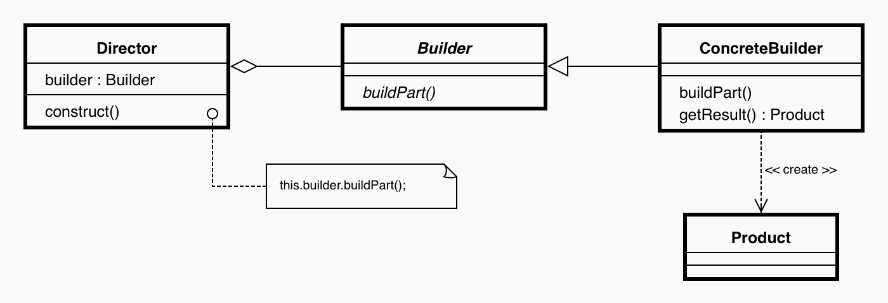

## [Design Patterns](../..)
### [Creazionali](..)
# Builder

----

[](https://openjdk.org/projects/jdk/25/)
[](https://github.com/GiuCom/Design_Patterns/blob/main/LICENSE)<br>
<br>

## 🚀 Introduzione
Il **Builder** è un design pattern creazionale che separa la costruzione di un oggetto complesso dalla sua rappresentazione. 

Questo disaccoppiamento consente al medesimo processo di costruzione di creare rappresentazioni diverse dello stesso oggetto.

A differenza di altri pattern creazionali che creano l'oggetto in un singolo passaggio (come il **Factory Method**), il Builder costruisce l'oggetto passo dopo passo sotto il controllo di un "direttore" o direttamente tramite un'interfaccia fluente (**fluent interface**).

## 🏭 Caratteristiche
Il pattern **Builder** nasce principalmente per risolvere l'anti-pattern del **Telescoping Constructor** (costruttore telescopico). Questo si verifica quando un oggetto richiede numerosi parametri di inizializzazione, molti dei quali opzionali.

Senza il Builder, siamo costretti a creare:

- Una moltitudine di costruttori in sovraccarico (**overloading**), uno per ogni possibile combinazione di parametri.
- Un singolo costruttore gigantesco in cui i parametri opzionali vengono passati come null o con valori di default, compromettendo la leggibilità e la sicurezza del tipo a compile-time.

L'implementazione classica del pattern prevede quattro attori principali:

- **Product:** La classe che definisce l'oggetto complesso da costruire. Solitamente include diverse parti e non ha un'interfaccia standardizzata se i prodotti generati dai vari builder differiscono significativamente.
- **Builder (Interfaccia/Classe Astratta):** Specifica i metodi astratti per creare le varie parti del **Product**.
- **ConcreteBuilder:** Implementa l'interfaccia **Builder**. Costruisce e assembla le parti del prodotto, mantenendone lo stato durante l'assemblaggio. Fornisce un metodo finale (es. `getResult()`) per restituire l'oggetto completato.
- **Director:** Una classe che riceve un riferimento a un oggetto **Builder** e invoca i suoi passi di costruzione in un ordine specifico. Il **Director** maschera la complessità dell'algoritmo di costruzione al Client.

In UML, è rappresentato:

<p align="center">
  <br/>
</p>

-----

### ESEMPIO

Simuliamo l'assemblaggio di un Computer.<br> A seconda del Builder che utilizzeremo (es. Computer da ufficio vs. Computer da gaming), otterremo prodotti con caratteristiche radicalmente diverse, pur utilizzando le stesse istruzioni di assemblaggio.

Le classi che utilizzeremo sono:

- **Computer (Product):** L'oggetto complesso finale. Ha diverse parti (CPU, RAM, Storage, GPU).
- **ComputerBuilder (Builder):** Un'interfaccia che dichiara i passi di costruzione.
- **ComputerGamingBuilder, ComputerOfficeBuilder (Concrete Builders):** Forniscono le implementazioni specifiche per ogni passo di costruzione e mantengono lo stato del prodotto in via di assemblaggio.
- **ComputerDirector (Director):** Definisce l'ordine esatto in cui eseguire i passi di costruzione.

Un dettaglio architetturale cruciale del pattern è che il **Director** non restituisce mai il prodotto. Il Client istanzia il **Builder**, lo passa al **Director**, dice al **Director** di eseguire il lavoro, e infine estrae il prodotto finito dal **Builder**.
<br>Flusso di esecuzione:

1. Il Client sceglie il tipo specifico di costruzione instanziando **ComputerGamingBuilder**.
2. Il Client passa questo builder al **Director**.
3. Il Client invoca un metodo sul **Director** (es. `constructFullComputer()`).
4. Il **Director** chiama iterativamente i metodi `build...()` sul **Builder**.
5. Il Client chiama `getResult()` sul **Builder** per ottenere l'oggetto **Computer** appena assemblato.

Il codice sorgente:

- **Computer.java**<br>
Contiene le parti che verranno assemblate.
```java
public class Computer {
    private String cpu;
    private String ram;
    private String gpu;

    public void setCpu(String cpu) { this.cpu = cpu; }
    public void setRam(String ram) { this.ram = ram; }
    public void setGpu(String gpu) { this.gpu = gpu; }

    public String getCpu() { return cpu; }
    public String getRam() { return ram; }
    public String getGpu() { return gpu; }
    
    public void mostraConfigurazione() {
        System.out.println("PC con: " + cpu + ", " + ram + ", " + gpu);
    }
}
```

- **ComputerBuilder.java**<br>
  Dichiara i metodi per costruire le parti del prodotto Computer.
```java
abstract class ComputerBuilder {
    protected Computer computer;

    public Computer getComputer() { return computer; }
    public void creaNuovoComputer() { computer = new Computer(); }

    public abstract void buildCpu();
    public abstract void buildRam();
    public abstract void buildGpu();
}
```

- **ComputerGamingBuilder.java**<br>
  Definisce come costruire un PC dedicato al Gaming.
```java
public class ComputerGamingBuilder extends ComputerBuilder {
    public void buildCpu() { computer.setCpu("Intel i9"); }
    public void buildRam() { computer.setRam("32GB DDR5"); }
    public void buildGpu() { computer.setGpu("NVIDIA RTX 4090"); }
}
```

- **ComputerOfficeBuilder.java**<br>
  Definisce come costruire un PC dedicato all'Office.
```java
public class ComputerOfficeBuilder extends ComputerBuilder {
    public void buildCpu() { computer.setCpu("Intel i5"); }
    public void buildRam() { computer.setRam("16GB DDR5"); }
    public void buildGpu() { computer.setGpu("NVIDIA GeForce GT 1030"); }
}
```

- **ComputerDirector.java**<br>
  Controlla l'ordine della costruzione. Non sa quali pezzi vengono usati, sa solo quando vanno montati.
```java
public class ComputerDirector {
    private ComputerBuilder builder;

    void setBuilder(ComputerBuilder b) { builder = b; }

    public void assembla() {
        builder.creaNuovoComputer();
        builder.buildCpu();
        builder.buildRam();
        builder.buildGpu();
    }
}
```

- **BuilderMain.java**<br>
  Il cliente non interagisce direttamente con i componenti del PC, ma delega tutto all'ingegnere (**ComputerDirector**).
```java
public class BuilderMain {
    // Client
    static void main() {
        ComputerDirector ingegnere = new ComputerDirector();
        ComputerBuilder gamingBuilder = new ComputerGamingBuilder();

        // L'ingegnere usa il manuale del PC da Gaming
        ingegnere.setBuilder(gamingBuilder);
        ingegnere.assembla();

        // Otteniamo il prodotto finale
        Computer mioPC = gamingBuilder.getComputer();
        mioPC.mostraConfigurazione();
    }
}
```

Caratteristiche:

- **Isolamento:** Se necessario produrre un nuovo tipo di computer (es. **ComputerServerBuilder**), basta creare una nuova classer senza toccare il codice della classe **ComputerBuilder** o della classe **Computer**.
- **Controllo:** La classe **ComputerDirector** garantisce che la RAM non venga montata prima della scheda madre (ordine logico).

----

## Test

In questo test verificheremo tre aspetti fondamentali:

1. **ComputerDirector** (l'Ingegnere) coordini correttamente il Builder
2. L'oggetto **Computer** risultante abbia i componenti attesi

```java
public class BuilderTest {

    private ComputerDirector ingegnere;

    @BeforeEach
    void setUp() {
        // Arrange: Inizializziamo il Director prima di ogni test
        ingegnere = new ComputerDirector();
    }

    @Test
    void testCostruzioneGamingPC() {
        // Arrange: Scegliamo il builder specifico
        ComputerBuilder gamingBuilder = new ComputerGamingBuilder();
        ingegnere.setBuilder(gamingBuilder);

        // Act: Eseguiamo l'assemblaggio
        ingegnere.assembla();
        Computer pcRisultante = gamingBuilder.getComputer();

        // Assert: Verifichiamo che i componenti siano quelli del GamingPCBuilder
        assertNotNull(pcRisultante, "Il computer non dovrebbe essere null");
        assertEquals("Intel i9", pcRisultante.getCpu(), "La CPU dovrebbe essere Intel i9");
        assertEquals("32GB DDR5", pcRisultante.getRam(), "La RAM dovrebbe essere 32GB DDR5");
        assertEquals("NVIDIA RTX 4090", pcRisultante.getGpu(), "La GPU dovrebbe essere RTX 4040");
    }

    @Test
    void testCambioBuilderInCorsa() {
        // Verifichiamo che l'ingegnere possa cambiare configurazione facilmente
        ComputerBuilder officeBuilder = new ComputerOfficeBuilder(); // Supponendo esista
        ingegnere.setBuilder(officeBuilder);
        ingegnere.assembla();

        Computer pcOffice = officeBuilder.getComputer();
        assertNotNull(pcOffice.getCpu());
    }
}
```

Abbiamo utilizzato:

- **@BeforeEach:** Per resettare lo stato dell'ingegnere, garantendo che ogni test sia isolato e indipendente.
- **assertEquals:** Per confrontare il valore atteso (es. "Intel i9") con quello effettivamente impostato nel prodotto finale.
- **Validazione della Struttura:** Il test conferma che la separazione tra la logica di costruzione (Ingegnere) e i dati (Builder) funzioni correttamente.

----

Nello sviluppo software moderno (specialmente in linguaggi come Java), è molto diffusa la variante descritta da **Joshua Bloch** nel libro _Effective Java_. Questa variante elimina la classe **Director** e utilizza una classe statica interna (**Inner Builder**) combinata con una **fluent interface** per concatenare le chiamate ai metodi di costruzione.

Questa versione del pattern è particolarmente apprezzata nel moderno sviluppo Java perché garantisce l'immutabilità dell'oggetto finale, permette di inserire logiche di validazione

In questo esempio, vedrai come il **Builder** possa gestire la complessità di un PC moderno, dove alcuni componenti sono obbligatori (CPU, RAM) e altri sono opzionali o multipli (Dischi, Periferiche).

La nuova classe **Computer** (con **Inner Static Builder**) rende i campi final e il costruttore private. La costruzione dell'oggetto viene delegata interamente alla classe statica interna **Builder**.

```java
public class ComputerInnerStaticBuilder {
  // Campi final per garantire l'immutabilità
  private final String cpu;
  private final String ram;
  private final String gpu;

  // Costruttore private: può essere chiamato solo dal Builder
  private ComputerInnerStaticBuilder(Builder builder) {
    this.cpu = builder.cpu;
    this.ram = builder.ram;
    this.gpu = builder.gpu;
  }

  // Metodi getter (niente setter per l'immutabilità)
  public String getCpu() { return cpu; }
  public String getRam() { return ram; }
  public String getGpu() { return gpu; }

  public void mostraConfigurazione() {
    System.out.println("PC con: " + cpu + ", " + ram + ", " + gpu);
  }

  // --- INNER STATIC BUILDER ---
  public static class Builder {
    private String cpu;
    private String ram;
    private String gpu;

    // Metodi fluenti che ritornano l'istanza del Builder stesso
    public Builder cpu(String cpu) {
      this.cpu = cpu;
      return this;
    }

    public Builder ram(String ram) {
      this.ram = ram;
      return this;
    }

    public Builder gpu(String gpu) {
      this.gpu = gpu;
      return this;
    }

    // Metodo build finale che istanzia l'oggetto Computer
    public ComputerInnerStaticBuilder build() {
      return new ComputerInnerStaticBuilder(this);
    }
  }
}
```

La classe **BuilderMain** viene modificata (dal commento `// Versione con InnerStaticBuilder` in poi) con l'interfaccia "fluente" (chaining dei metodi) che rende estremamente chiara la creazione degli oggetti, senza bisogno di usare classi diverse (**ComputerGamingBuilder, ComputerOfficeBuilder**) o il **ComputerDirector**.

```java
public class BuilderMain {
    static void main() {
      System.out.println("// -------------------------------");
      System.out.println("// Versione standard");
      System.out.println("// -------------------------------");
      ComputerDirector ingegnere = new ComputerDirector();
      ComputerBuilder gamingBuilder = new ComputerGamingBuilder();

      // L'ingegnere usa il manuale del PC da Gaming
      ingegnere.setBuilder(gamingBuilder);
      ingegnere.assembla();

      // Otteniamo il prodotto finale
      Computer mioPC = gamingBuilder.getComputer();
      mioPC.mostraConfigurazione();

      System.out.println();
      System.out.println("// -------------------------------");
      System.out.println("// Versione con InnerStaticBuilder");
      System.out.println("// -------------------------------");
      // Creazione di un PC da Gaming
      ComputerInnerStaticBuilder gamingPc = new ComputerInnerStaticBuilder.Builder()
              .cpu("Intel i9")
              .ram("32GB DDR5")
              .gpu("NVIDIA RTX 4090")
              .build();

      // Creazione di un PC da Ufficio
      ComputerInnerStaticBuilder officePc = new ComputerInnerStaticBuilder.Builder()
              .cpu("Intel i5")
              .ram("16GB DDR5")
              .gpu("NVIDIA GeForce GT 1030")
              .build();

      // Creazione di un PC Server omettendone la GPU (flessibilità del Builder)
      ComputerInnerStaticBuilder serverPc = new ComputerInnerStaticBuilder.Builder()
              .cpu("AMD EPYC")
              .ram("128GB ECC")
              .build();

      System.out.println("Configurazione Gaming:");
      gamingPc.mostraConfigurazione();

      System.out.println("\nConfigurazione Ufficio:");
      officePc.mostraConfigurazione();

      System.out.println("\nConfigurazione Server:");
      serverPc.mostraConfigurazione();
    }
}
```

----

## Test
Per garantire la solidità del codice, ecco una classe di test che verifica le singole configurazioni. Mostra chiaramente come testare i valori assegnati e i casi con attributi mancanti.

Le Annotazioni e Asserzioni utilizzate sono:

- **`@Test`** Questa annotazione dice a JUnit che il metodo che la segue è un caso di test autonomo e deve essere eseguito dal framework.
- **Le Asserzioni (`Assertions.*`)** Sono il cuore del test. Sono metodi che verificano se il risultato ottenuto (Actual) combacia con quello atteso (Expected). Se l'asserzione fallisce, il test fallisce.
- **`assertNotNull(oggetto)`** Verifica che l'oggetto sia stato effettivamente creato in memoria e non sia _null_.
- **`assertEquals(atteso, reale)`** Verifica che due valori siano identici.
- **`assertNull(oggetto)`** Verifica esplicitamente che un valore sia _null_.

I Test creati sono:

1. **`testGamingComputerBuilder()`** Questo metodo verifica il "percorso ideale" per una configurazione completa.
   - Istanzia un Computer utilizzando il **Builder** e valorizzando tutti i parametri disponibili (CPU, RAM, GPU).
   - Questo metodo è importante in quanto assicura che i metodi "fluenti" (`.cpu()`, `.ram()`, `.gpu()`) salvino correttamente i dati nello stato interno del **Builder** e che il metodo `.build()` li trasferisca fedelmente all'oggetto finale **ComputerInnerStaticBuilder**.
   - Inoltre, dopo aver verificato che l'oggetto esista (`assertNotNull`), controlla singolarmente che la stringa "Intel i9" sia finita esattamente nel campo cpu, e così via.

2. **testOfficeComputerBuilder()** Sembra una ripetizione del test precedente, ma ha uno scopo strutturale.
   - Crea un'altra configurazione completa, ma con valori diversi.
   - Dimostra che il **Builder** può essere riutilizzato per creare configurazioni completamente diverse senza che ci siano "interferenze". Creando una nuova istanza di `new ComputerInnerStaticBuilder.Builder()`, abbiamo la garanzia di partire da uno stato pulito.

3. **testPartialComputerBuilder()** Questo è il test più interessante perché esalta il vero vantaggio del pattern **Builder**.
   - Crea un **ComputerInnerStaticBuilder** impostando solo la CPU e ignorando intenzionalmente RAM e GPU.
   - Non utilizzando il pattern Builder, avremmo dovuto passare _null_ nei costruttori (es. `new ComputerInnerStaticBuilder("AMD Ryzen 7", null, null)`), rendendo il codice illeggibile. Il **Builder** ci permette semplicemente di omettere la chiamata ai metodi che non ci interessano (es. `new ComputerInnerStaticBuilder.Builder().cpu("AMD Ryzen 7").build();`).
   - Verifica che la CPU sia stata impostata correttamente, utilizzando `assertNull()` per verificare che RAM e GPU, non essendo state chiamate nel builder, siano rimaste al loro valore di default per gli oggetti in Java (cioè _null_). Il test passa solo se questi campi sono effettivamente vuoti, confermando che il **Builder** gestisce perfettamente i parametri opzionali.

In alcune asserzioni è stato inserito un parametro stringa opzionale, ad esempio:
`assertNull(customPc.getRam(), "La RAM non è stata impostata, dovrebbe essere null");`<br>
Se quel test dovesse fallire (magari perché modificata la **Builder** inserendo una RAM di default di "8GB"), JUnit stamperà esattamente quella frase nel report di errore. Questo rende il debugging più veloce, perché comunica subito cosa è andato storto e perché.

```java
@Test
public void testGamingComputerBuilder() {
  ComputerInnerStaticBuilder gamingPc = new ComputerInnerStaticBuilder.Builder()
          .cpu("Intel i9")
          .ram("32GB DDR5")
          .gpu("NVIDIA RTX 4090")
          .build();

  assertNotNull(gamingPc, "L'oggetto Computer non dovrebbe essere nullo");
  assertEquals("Intel i9", gamingPc.getCpu());
  assertEquals("32GB DDR5", gamingPc.getRam());
  assertEquals("NVIDIA RTX 4090", gamingPc.getGpu());
}

@Test
public void testOfficeComputerBuilder() {
  ComputerInnerStaticBuilder officePc = new ComputerInnerStaticBuilder.Builder()
          .cpu("Intel i5")
          .ram("16GB DDR5")
          .gpu("NVIDIA GeForce GT 1030")
          .build();

  assertNotNull(officePc);
  assertEquals("Intel i5", officePc.getCpu());
  assertEquals("16GB DDR5", officePc.getRam());
  assertEquals("NVIDIA GeForce GT 1030", officePc.getGpu());
}

@Test
public void testPartialComputerBuilder() {
  // Test per dimostrare la flessibilità nell'omettere parametri
  ComputerInnerStaticBuilder customPc = new ComputerInnerStaticBuilder.Builder()
          .cpu("AMD Ryzen 7")
          .build();

  assertNotNull(customPc);
  assertEquals("AMD Ryzen 7", customPc.getCpu());
  assertNull(customPc.getRam(), "La RAM non è stata impostata, dovrebbe essere null");
  assertNull(customPc.getGpu(), "La GPU non è stata impostata, dovrebbe essere null");
}
```

Vantaggi di questa rifattorizzazione:

- **Riduzione delle classi:** Siamo passati da 5 file (**Computer, Builder astratto, Director** e 2 **Builder concreti**) a un solo file (**ComputerInnerStaticBuilder.java**).
- **Immutabilità:** Gli oggetti creati non possono essere alterati post-costruzione, rendendoli molto sicuri da utilizzare.
- **Flessibilità parametrica:** Se ci sono parametri opzionali, non devi creare costruttori telescopici o chiamare mille metodi setter.