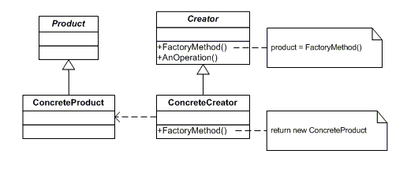

## [Design Patterns](../..)
### [Creazionali](..)
# Factory Method

----

[](https://openjdk.org/projects/jdk/25/)
[](https://github.com/GiuCom/Design_Patterns/blob/main/LICENSE)<br>
<br>

## 🚀 Introduzione
Il **Factory Method** è un pattern creazionale che definisce un'interfaccia per creare un oggetto, ma lascia alle sottoclassi la decisione su quale classe istanziare. È perfetto quando una classe non può anticipare il tipo esatto di oggetti che deve creare.
<br>Invece di chiamare direttamente il costruttore (es. `new Classe()`), il client delega questa responsabilità a un metodo specifico (il **"Factory Method"**), che le sottoclassi possono sovrascrivere per cambiare il tipo di oggetto restituito.

## 🏭 Caratteristiche
Il pattern si basa su quattro elementi chiave:

- **Product (Interfaccia):** Definisce l'interfaccia degli oggetti che il metodo creerà.
- **Concrete Product:** L'implementazione specifica dell'interfaccia.
- **Creator (Classe Astratta):** Dichiara il metodo `FactoryMethod()` (**astratto**) e può contenere logica di business che utilizza il prodotto creato.
- **Concrete Creator:** Sovrascrive il metodo `FactoryMethod()` per restituire un'istanza di un prodotto specifico.

In UML, è rappresentato:

<p align="center">
  <br/>
</p>

-----

### ESEMPIO
Immaginiamo un'app di logistica che inizialmente gestisce solo trasporti su strada, ma che deve essere pronta a gestire trasporti marittimi.
<br>Vediamo le classi e interfacce da implementare:

**Trasporto.java** (Product)<br>
È il contratto comune. Definisce le operazioni che tutti i tipi di trasporto devono compiere (es. `consegna()`). Il codice client interagirà solo con questa interfaccia, ignorando se il mezzo è un camion o una nave.

```java
// Product
public interface Trasporto {
    String consegna();
}
```

**Camion.java** e **Nave.java** (Concrete Product)<br>
Implementano la classe **Trasporto**. Contiene la logica specifica per la consegna via terra e via nave.

```java
// Concrete Product A
public class Camion implements Trasporto {
    @Override
    public String consegna() {
        return "Consegna via terra in un box di cartone.";
    }
}
```

```java
// Concrete Product B
public class Nave implements Trasporto {
    @Override
    public String consegna() {
        return "Consegna via mare in un container.";
    }
}
```

**Logistica.java** (Creator)<br>
È il cuore del pattern:

- Contiene il **Factory Method** `creaTrasporto()`, che è **astratto**: non sa quale oggetto creare, sa solo che deve restituire un tipo **Trasporto**.
- Contiene il metodo `pianificaConsegna()` con la logica di business "reale" che invoca il _factory method_ per ottenere un oggetto e usarlo.

```java
// Creator
public abstract class Logistica {
    // Il Factory Method
    public abstract Trasporto creaTrasporto();

    // Logica di business che usa il prodotto
    public String pianificaConsegna() {
        Trasporto t = creaTrasporto();
        return "Logistica: " + t.consegna();
    }
}
```

**LogisticaTerra.java** e **LogisticaMare.java** (Concrete Creator)<br>
Estende la classe **Logistica**. Sovrascrive il factory method `creaTrasporto()` per restituire l'oggetto `return new Camion()` oppure `return new Nave()`.

```java
// Concrete Creator A
public class LogisticaTerra extends Logistica {
    @Override
    public Trasporto creaTrasporto() {
        return new Camion();
    }
}
```

```java
// Concrete Creator B
public class LogisticaMare extends Logistica {
    @Override
    public Trasporto creaTrasporto() {
        return new Nave();
    }
}
```

**FactoryMethodMain.java** (Client)<br>
Questa classe simula un client che decide quale tipo di logistica utilizzare (terra o mare) e avvia il processo di consegna senza preoccuparsi di come vengano creati i mezzi di trasporto.

```java
public class FactoryMethodMain {
    static void main() {
        System.out.println("--- Test Sistema Logistica ---");

        // 1. Vogliamo gestire una consegna via TERRA
        // Creiamo la factory specifica per la terra
        Logistica logisticaTerra = new LogisticaTerra();
        // Avviamo la pianificazione: internamente verrà creato un Camion
        System.out.println("Richiesta 1: " + logisticaTerra.pianificaConsegna());

        System.out.println("-------------------------------");

        // 2. Vogliamo gestire una consegna via MARE
        // Creiamo la factory specifica per il mare
        Logistica logisticaMare = new LogisticaMare();
        // Avviamo la pianificazione: internamente verrà creata una Nave
        System.out.println("Richiesta 2: " + logisticaMare.pianificaConsegna());

        System.out.println("-------------------------------");

        // 3. Esempio di Polimorfismo: il client non sa quale factory usa
        inviaPacco(new LogisticaTerra());
        inviaPacco(new LogisticaMare());
    }

    /**
     * Metodo helper che accetta la classe astratta Logistica.
     * Dimostra che il codice client è totalmente slegato dalle classi concrete.
     */
    public static void inviaPacco(Logistica logistica) {
        System.out.println("Esecuzione generica: " + logistica.pianificaConsegna());
    }
}
```

I passaggi chiave nella classe **FactoryMethodMain**:

- **Istanziazione della Factory:** Scegliamo quale sottoclasse di **Logistica** usare.
- **Invocazione del Business:** Viene invocato il metodo `pianificaConsegna()`. Non viene utilizzato il codice `new Camion()` o `new Nave()` nel `main`.
- **Iniezione (`inviaPacco()`):** Questo metodo dimostra la potenza del pattern, accetta un oggetto di tipo **Logistica** (l'astrazione) e funziona correttamente con qualsiasi nuova factory aggiungerai in futuro, rispettando il principio Open/Closed.

<br>
Riepilogo del Funzionamento:<br>

Il funzionamento del **Factory Method **si può riassumere come una "delega della responsabilità" basata sul polimorfismo. 
<br>Ecco i passaggi chiave:

- **Definizione del Prodotto:** Si crea un'interfaccia comune **Trasporto** che dichiara cosa sanno fare gli oggetti creati (es. `consegna()`).
- **Astrazione della Creazione:** La classe base **Logistica** non crea direttamente l'oggetto con `new`. Al suo posto, dichiara un metodo astratto `creaTrasporto()` (**Factory Method**) che promette di restituire un oggetto di tipo **Trasporto**.
- **Logica Generica:** La classe base contiene la logica di business (es. `pianificaConsegna()`). Questa logica usa il prodotto restituito dal **Factory Method** senza sapere se sia un camion o una nave.
- **Specializzazione:** Le sottoclassi concrete **LogisticaTerra** e **LogisticaMare** decidono finalmente quale oggetto specifico istanziare, implementando il **Factory Method**.

Il codice client interagisce solo con l'astrazione **Logistica**. Se domani volessi aggiungere il trasporto aereo, basterebbe creare la classe **Aereo** e la factory **LogisticaAerea**, senza toccare una singola riga del codice esistente.
In breve, la classe madre stabilisce quando e come usare l'oggetto, mentre le classi figlie stabiliscono quale oggetto creare.

**Vantaggi (Pro)**

- **Flessibilità:** Il codice è slegato dalle classi concrete. Puoi aggiungere nuovi trasporti (es. Aereo) senza modificare il codice esistente.	
- **Single Responsibility:** La logica di creazione è separata dalla logica di utilizzo.	
- **Open/Closed Principle:** Il sistema è aperto all'estensione ma chiuso alle modifiche.

**Svantaggi (Contro)**

- **Proliferazione di classi:** Per ogni nuovo prodotto devi creare sia la classe del prodotto che la classe della **Factory**.
- **Complessità:** Il codice diventa più stratificato (più interfacce e classi astratte).

----

## Test
Il test di un **Factory Method** non serve solo a verificare che un oggetto venga creato, ma a garantire che la logica di business rimanga corretta indipendentemente dal tipo di oggetto prodotto.

```java
public class FactoryMethodTest {
    @Test
    void testLogisticaTerra() {
        // PASSAGGIO 1: Istanzio la factory specifica per la terra
        Logistica logistica = new LogisticaTerra();

        // PASSAGGIO 2: Eseguo il metodo che internamente usa il Factory Method
        String risultato = logistica.pianificaConsegna();

        // PASSAGGIO 3: Verifico che il prodotto creato sia un Camion tramite il messaggio
        assertTrue(risultato.contains("via terra"));
    }

    @Test
    void testLogisticaMare() {
        Logistica logistica = new LogisticaMare();
        String risultato = logistica.pianificaConsegna();

        // Verifica che il Factory Method abbia istanziato una Nave
        assertTrue(risultato.contains("via mare"));
    }
}
```

I passaggi logici eseguiti nel test JUnit:

1. **Fase di Setup (Preparazione):**
   In questa fase, il test istanzia il **Concrete Creator** (**LogisticaTerra**).
   - Non viene testata direttamente la classe **Camion**, ma la capacità della factory **LogisticaTerra** di fornire l'oggetto giusto quando richiesto (`Logistica logistica = new LogisticaTerra();`)
2. **Fase di Execution (Esecuzione del Factory Method):** 
   Il test invoca il metodo che contiene la logica di business `pianificaConsegna()` che chiama il Factory Method astratto `creaTrasporto()`. È qui che avviene il "miracolo" del pattern, la classe base **Logistica** esegue un metodo che non ha ancora implementato, delegando l'esecuzione alla sottoclasse istanziata nel setup.
   `String risultato = logistica.pianificaConsegna();`
3. **Fase di Assertion (Verifica dei Risultati):** Questa è la parte più critica e si divide in due controlli:
   - **Verifica del Tipo (Identità):** Si controlla che l'oggetto creato sia effettivamente quello atteso (es. che **LogisticaTerra** abbia prodotto un **Camion** e non una **Nave**). In JUnit si usa `assertTrue(oggetto instanceof ClasseAttesa)`.
   - **Verifica del Comportamento (Output):** Si controlla che l'azione eseguita dal prodotto sia corretta. Nel nostro esempio, verifichiamo che la stringa restituita contenga le parole chiave **"via terra"** o **"box di cartone"**.
     `assertTrue(risultato.contains("via terra"));`
   
Questi passaggi sono importanti in quanto si può verificare:

- **L'isolamento:** Il test conferma che se aggiungi una nuova factory (es. **LogisticaAerea**), non si deve modificare i test delle altre factory. 
- **Il polimorfismo:** Dimostra che il codice client (il test stesso) può trattare tutte le factory allo stesso modo, usando l'interfaccia comune **Logistica**. 
- **Il contratto:** Assicura che ogni "Prodotto Concreto" rispetti il contratto definito dall'interfaccia **Trasporto**.
 