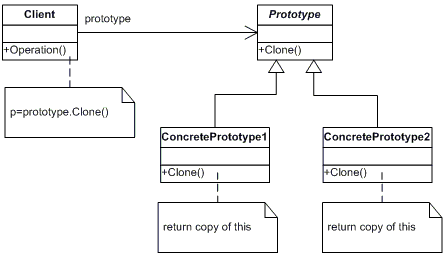

## [Design Patterns](../..)
### [Creazionali](..)
# Prototype

----

[](https://openjdk.org/projects/jdk/25/)
[](https://github.com/GiuCom/Design_Patterns/blob/main/LICENSE)<br>
<br>

## 🚀 Introduzione
Il pattern **Prototype** è un design pattern creazionale che permette di creare nuovi oggetti clonando un'istanza esistente, chiamata appunto "prototipo".<br>
Invece di istanziare classi da zero (magari con processi di inizializzazione costosi), il sistema richiede a un oggetto di produrre una copia di se stesso

## 🏭 Caratteristiche
La struttura del Pattern è composta dalle seguenti classi e interfacce:

- **Prototype Interface:** Interfaccia che dichiara il metodo per la clonazione (es. `clone()` o `copy()`).
- **Concrete Prototype:** Implementa l'operazione di clonazione restituendo una copia dell'oggetto stesso.
- **Client:** Crea un nuovo oggetto chiedendo al prototipo di clonarsi.

In UML, è rappresentato:

<p align="center">
  <br/>
</p>    

-----

### ESEMPIO
Per utilizzare il pattern **Prototype**, l'approccio standard prevede l'implementazione dell'interfaccia Cloneable e l'override del metodo `clone()`.
Nel nostro esempio, creiamo le seguenti classi:

**Figura.java** (Prototype Interface)<br>
È la classe base che definisce il contratto per tutti i prototipi.

- **Ruolo:** Implementa l'interfaccia Cloneable di Java.
- **Dettaglio:** Contiene il metodo `clone()`. In Java, `super.clone()` esegue una Shallow Copy (copia bit a bit dei campi). Se la classe ha campi primitivi (int, double) o Stringhe, la copia è sicura.
- **Responsabilità:** Fornire una base comune (ID e Tipo) e permettere la duplicazione senza che il client conosca la classe concreta.

```java
public abstract class Figura implements Cloneable{
    private String id;
    protected String nomeFigura;

    abstract void disegna();

    public String getNomeFigura() { return nomeFigura; }

    public String getId() { return id; }
    public void setId(String id) { this.id = id; }

    @Override
    public Object clone() {
        Object clone = null;
        try {
            clone = super.clone();
        } catch (CloneNotSupportedException e) {
            e.printStackTrace();
        }
        return clone;
    }
}
```

**Cerchio.java** e **Rettangolo.java** (Concrete Prototype)<br>
Rappresentano gli oggetti specifici che vogliamo duplicare.

- **Ruolo:** Estendono la classe Figura.
- **Dettaglio:** Nel costruttore impostano il nome della figura (variabile `type`). Non devono necessariamente implementare di nuovo `clone()` a meno che non abbiano oggetti complessi all'interno che richiedono una **Deep Copy**.
- **Utilità:** Sono i modelli reali. Se creare un Cerchio richiedesse molto tempo (es. caricamento di coordinate complesse), clonarne uno esistente rende il processo molto più veloce.

```java
public class Cerchio extends Figura {
    public Cerchio() {
        nomeFigura = "Cerchio";
    }

    @Override
    public void disegna() {
        System.out.println("Disegno un Cerchio.");
    }
}

public class Rettangolo extends Figura {
    public Rettangolo() {
        nomeFigura = "Rettangolo";
    }

    @Override
    public void disegna() {
        System.out.println("Disegno un Rettangolo.");
    }
}
```

**PrototypeMain.java** (Client)<br>
È il punto di ingresso che utilizza il sistema.

- **Flusso:** Invece di scrivere `new Cerchio()`, invoca il metodo di clonazione.
- **Verifica:** Il Main dimostra che l'oggetto clonato ha lo stesso stato (stesso tipo e dati) dell'originale, ma un'identità diversa (risiede in un indirizzo di memoria differente).

```java
public class PrototypeMain {
    static void main() {

        System.out.println("// -------------------------------------------");
        System.out.println("// Versione con l'utilizzo della classe Figura");
        System.out.println("// -------------------------------------------");

        
        // 1. Creazione delle istanze "Prototipo" (oggetti base)
        Cerchio cerchio = new Cerchio();
        cerchio.setId("101");

        Rettangolo rettangolo = new Rettangolo();
        rettangolo.setId("202");

        // 2. Clonazione degli oggetti anziché usare 'new'
        // Questo è il cuore del pattern: chiediamo all'oggetto di duplicarsi
        Cerchio clonedCerchio = (Cerchio) cerchio.clone();
        Rettangolo clonedRettangolo = (Rettangolo) rettangolo.clone();

        // 3. Personalizzazione dei cloni
        // I cloni partono con lo stato dell'originale, ma sono oggetti distinti
        clonedCerchio.setId("102");

        // 4. Verifica dei risultati
        System.out.println("\nVerifica oggetti Cerchio clonati:");
        System.out.println("Originale (ID): " + cerchio.getId() + " | Tipo: " + cerchio.getNomeFigura());
        System.out.println("Clonato (ID): " + clonedCerchio.getId() + " | Tipo: " + clonedCerchio.getNomeFigura());

        System.out.println("\nEsecuzione metodi sui cloni:");
        clonedCerchio.disegna();
        clonedRettangolo.disegna();

        // Verifica identità di memoria
        System.out.println("\nVerifica identità oggetti Cerchio clonati:");
        System.out.println("Sono lo stesso oggetto in memoria? " + (cerchio == clonedCerchio ? "Sì" : "No"));
    }
}
```

Riepilogo del Funzionamento<br>

- **Registrazione:** Si crea un'istanza "master" di ogni oggetto necessario.
- **Richiesta:** Il client dice: "Ho bisogno di un oggetto identico a questo master".
- **Clonazione:** Il metodo `clone()` crea una copia esatta istantaneamente.
- **Uso:** Il client riceve la copia e la modifica (es. cambia l'ID o la posizione) senza rovinare l'oggetto master originale.

A questo esempio possiamo aggiungere la classe **FiguraCache** (PrototypeRegistry) che funge da catalogo centrale. Invece di creare manualmente ogni prototipo nel main, il PrototypeRegistry memorizza un set di oggetti pre-configurati in una `Map`

L'uso del PrototypeRegistry permette:

- **Centralizzazione:** Tutti i prototipi "master" sono conservati in un unico posto.
- **Astrazione Totale:** Il client non usa più l'operatore `new` e non deve nemmeno conoscere le classi concrete (Cerchio e Rettangolo); chiede gli oggetti tramite una stringa o un ID.
- **Performance:** Gli oggetti "costosi" da creare vengono generati una sola volta all'avvio e poi clonati all'infinito.

**FiguraCache.java**
```java
public class FiguraCache {
    // Una mappa per conservare i prototipi "master"
    private static Map<String, Figura> figuraMap = new Hashtable<>();

    // Metodo che restituisce il CLONE del prototipo richiesto
    public static Figura getFigura(String figuraId) {
        Figura cachedFigura = figuraMap.get(figuraId);

        if (cachedFigura == null) {
            return null;
        }

        // Restituiamo SEMPRE un clone, mai l'originale in cache
        return (Figura) cachedFigura.clone();
    }

    // Metodo per caricare i prototipi iniziali (simula un DB o config pesante)
    public static void loadCache() {
        Cerchio cerchio = new Cerchio();
        cerchio.setId("1");
        figuraMap.put(cerchio.getId(), cerchio);

        Rettangolo rettangolo = new Rettangolo();
        rettangolo.setId("2");
        figuraMap.put(rettangolo.getId(), rettangolo);

        System.out.println("Cache caricata: Cerchio (ID:1) e Rettangolo (ID:2) pronti.");
    }
}
```

Riassunto ottenuto:

- **Mappa Interna:** Custodisce le istanze "master".
- **Metodo `loadCache()`:** Popola la mappa (spesso all'avvio dell'app).
- **Metodo `getFigura(id)`:** Esegue la logica di ricerca e chiama il metodo `clone()` dell'oggetto trovato.

La classe **PrototypeMain.java** possiamo modificarla per utilizzare la classe **FiguraCache.java**
Il client nel pattern Prototype con Registry non è più un semplice creatore di oggetti, ma un consumatore di servizi. Il suo compito principale è richiedere copie di oggetti pre-configurati senza conoscere i dettagli della loro implementazione o del loro costo di creazione.

```java
public class PrototypeMain {
    static void main() {
        // 1. Creazione delle istanze "Prototipo" (oggetti base)

        System.out.println("// -------------------------------------------");
        System.out.println("// Versione con l'utilizzo della classe Figura");
        System.out.println("// -------------------------------------------");

        Cerchio cerchio = new Cerchio();
        cerchio.setId("101");

        Rettangolo rettangolo = new Rettangolo();
        rettangolo.setId("202");

        // 2. Clonazione degli oggetti anziché usare 'new'
        // Questo è il cuore del pattern: chiediamo all'oggetto di duplicarsi
        Cerchio clonedCerchio = (Cerchio) cerchio.clone();
        Rettangolo clonedRettangolo = (Rettangolo) rettangolo.clone();

        // 3. Personalizzazione dei cloni
        // I cloni partono con lo stato dell'originale, ma sono oggetti distinti
        clonedCerchio.setId("102");

        // 4. Verifica dei risultati
        System.out.println("\nVerifica oggetti Cerchio clonati:");
        System.out.println("Originale (ID): " + cerchio.getId() + " | Tipo: " + cerchio.getNomeFigura());
        System.out.println("Clonato (ID): " + clonedCerchio.getId() + " | Tipo: " + clonedCerchio.getNomeFigura());

        System.out.println("\nEsecuzione metodi sui cloni:");
        clonedCerchio.disegna();
        clonedRettangolo.disegna();

        // Verifica identità di memoria
        System.out.println("\nVerifica identità oggetti Cerchio clonati:");
        System.out.println("Sono lo stesso oggetto in memoria? " + (cerchio == clonedCerchio ? "Sì" : "No"));

        System.out.println();
        System.out.println("// ------------------------------------------------");
        System.out.println("// Versione con l'utilizzo della classe FiguraCahce");
        System.out.println("// ------------------------------------------.....-");

        // 1. Inizializza la cache una sola volta
        FiguraCache.loadCache();

        // 2. Il client chiede una forma tramite ID
        // Nota: riceve un oggetto di tipo Figura (astratto)
        Figura clonedFigura1 = FiguraCache.getFigura("1");
        System.out.println("Forma ottenuta: " + clonedFigura1.getNomeFigura());

        Figura clonedFigura2 = FiguraCache.getFigura("2");
        System.out.println("Forma ottenuta: " + clonedFigura2.getNomeFigura());

        // 3. Modifica del clone senza toccare la cache
        clonedFigura1.setId("100-Nuovo");
        System.out.println("ID del clone modificato: " + clonedFigura1.getId());
        System.out.println("ID dell'originale in cache resta: " + FiguraCache.getFigura("1").getId());
    }
}
```
Nella fase di inizializzazione della classe il `main()` invoca il caricamento del **Registry**. In questa fase, le istanze "master" di Cerchio e Rettangolo vengono create e salvate in memoria (nella `Map`). Questa operazione avviene una sola volta. Se la creazione di queste figure richiedesse una connessione a un database o il caricamento di file pesanti, il costo computazionale verrebbe "pagato" solo qui.<br>
```java
FiguraCache.loadCache();
```

La richiesta degli oggetti Cerchio o Rettangolo avviene astraendo `new` infatti, senza scrivere `new Cerchio()` o `new Rettangolo()`, il `main` chiede al Registry l'oggetto con ID "1" o "2".<br>
Non saprà a quale figura corrisponde il ID "1" o "2" (un cerchio, un rettangolo o un'altra sottoclasse). Questo riduce drasticamente l'accoppiamento (**dependency**) tra il codice del `main` e le classi concrete.
```java
Figura clonedFigura1 = FiguraCache.getFigura("1");

Figura clonedFigura2 = FiguraCache.getFigura("2");
```

Pertanto, è possibile personalizzare la copia esatta del prototipo poiché il Registry ha restituito un `clone()`, la modifica dell'ID a "100-Nuovo" avviene solo sull'istanza locale del `main`. L'oggetto originale dentro la classe **FiguraCache** rimane intatto con il suo ID originale ("1").
```java
clonedFigura1.setId("100-Nuovo");
```

Per verificare l'indipendenza il `main` stampa entrambi gli ID per dimostrare che l'originale in cache non è stato corrotto.<br>
Questo conferma che il pattern sta funzionando correttamente: ogni chiamata a `getFigura()` produce un nuovo indirizzo di memoria con lo stato iniziale del prototipo.

----

## Test
I test verificano tre pilastri fondamentali: 

- **diversità di istanza** (non sono lo stesso oggetto), 
- **uguaglianza di stato** (hanno gli stessi dati)
- **indipendenza** (modificare uno non altera l'altro).

```java
public class PrototypeTest {
    // --- TEST VERSIONE STANDARD (Clonazione Diretta) ---

    @Test
    @DisplayName("Test Prototype Standard: Il clone deve essere un oggetto distinto con stessi dati")
    void testStandardPrototype() {
        Cerchio cerchio = new Cerchio();
        cerchio.setId("10");

        Cerchio clonedCerchio = (Cerchio) cerchio.clone();

        // Verifica che NON siano lo stesso oggetto in memoria (Riferimento diverso)
        assertNotSame(cerchio, clonedCerchio, "L'originale e il clone non devono condividere la stessa istanza");

        // Verifica che i dati siano stati copiati correttamente
        assertEquals(cerchio.getId(), clonedCerchio.getId(), "L'ID deve essere identico nel clone");
        assertEquals(cerchio.getNomeFigura(), clonedCerchio.getNomeFigura(), "Il tipo deve essere identico nel clone");
    }

    // --- TEST VERSIONE REGISTRY (FiguraCache) ---

    @BeforeAll
    static void setupRegistry() {
        // Carichiamo i prototipi master una sola volta per tutti i test del registry
        FiguraCache.loadCache();
    }

    @Test
    @DisplayName("Test Registry: Recupero di un clone dalla Cache")
    void testRegistryGetClone() {
        // Recuperiamo il prototipo con ID "1" (che è un Cerchio)
        Figura figura1 = FiguraCache.getFigura("1");
        Figura figura2 = FiguraCache.getFigura("1");

        assertNotNull(figura1, "Il registry dovrebbe restituire un oggetto");
        assertEquals("Cerchio", figura1.getNomeFigura());

        // Fondamentale: Ogni chiamata a getFigura deve restituire un NUOVO clone
        assertNotSame(figura1, figura2, "Ogni richiesta al registry deve produrre un'istanza di clone differente");
    }

    @Test
    @DisplayName("Test Registry: Modifica del clone non deve impattare i futuri cloni della cache")
    void testRegistryIndependence() {
        // 1. Prendo un clone e cambio il suo ID
        Figura primoClone = FiguraCache.getFigura("2"); // Rectangle
        primoClone.setId("ID-MODIFICATO");

        // 2. Chiedo un nuovo clone dello stesso prototipo ("2")
        Figura secondoClone = FiguraCache.getFigura("2");

        // 3. Verifico che il secondoo clone abbia ancora l'ID originale ("2") e non quello modificato ("ID-MODIFICATO")
        assertNotEquals(primoClone.getId(), secondoClone.getId(), "La modifica di un clone non deve corrompere il prototipo nel Registry");
        assertEquals("2", secondoClone.getId(), "Il nuovo clone dal registry deve avere lo stato originale");
    }
}
```
Abbiamo utilizzato:

- `assertNotSame(obj1, obj2)`: È il test più importante per il pattern **Prototype**. Verifica che `obj1 == obj2` sia falso. Se fallisse, significherebbe che stai usando lo stesso oggetto e non un clone.
- `assertEquals(val1, val2)`: Verifica che il contenuto sia identico. Il clone deve nascere come "fotocopia" dell'originale.
- `@BeforeAll`: Viene usato per simulare l'avvio del sistema. Carichiamo la classe **FiguraCache** una volta sola, proprio come accadrebbe in un'applicazione reale, per poi testarne la distribuzione dei cloni.
- **Test di Indipendenza:** È cruciale per confermare che il Registry non stia restituendo il "Master" originale. Se modificassi il Master, tutti i futuri cloni sarebbero "corrotti". Il test assicura che il Master sia protetto.

----

## Shallow Copy vs Deep Copy
Nel pattern **Prototype**, la distinzione tra **Shallow Copy** (copia superficiale) e **Deep Copy** (copia profonda) è critica quando l'oggetto contiene riferimenti ad altri oggetti.

- **Shallow Copy** (Default di **Java**): Il metodo `super.clone()` copia i valori dei campi. Se un campo è un riferimento a un oggetto (es. un `Color` o una `List`), viene copiato l'indirizzo di memoria. Risultato: originale e clone puntano allo stesso sotto-oggetto. Se il clone modifica quell'oggetto, l'originale cambia di conseguenza.
- **Deep Copy**: Il metodo `clone()` viene istruito per clonare ricorsivamente anche tutti gli oggetti contenuti. Risultato: originale e clone sono totalmente indipendenti, inclusi i loro componenti interni.

Se implementiamo la nuova classe **Coordinate.java**

```java
// Deve essere a sua volta Cloneable per facilitare la Deep Copy
public class Coordinate implements Cloneable {
    public int x, y;
    public Coordinate(int x, int y) { 
        this.x = x; 
        this.y = y; 
    }

    @Override
    public Object clone() throws CloneNotSupportedException {
        return super.clone();
    }
}
```

La classe **Figura.java** può includere la classe **Coordinate.java** e gestire la clonazione profonda.

```java
public abstract class Figura implements Cloneable{
    private String id;
    protected String nomeFigura;
    protected Coordinate coordinate; // Oggetto annidato

    abstract void disegna();

    public String getNomeFigura() { return nomeFigura; }

    public void setCoordinate(int x, int y) { this.coordinate = new Coordinate(x, y); }
    public Coordinate getCoordinate() { return coordinate; }
    
    public String getId() { return id; }
    public void setId(String id) { this.id = id; }

    @Override
    public Object clone() {
        try {
            Figura clonato = (Figura) super.clone(); // Shallow copy iniziale

            // DEEP COPY: cloniamo esplicitamente l'oggetto annidato
            if (this.coordinate != null) {
                clone.coordinate = (Coordinate) this.coordinate.clone();
            }
        } catch (CloneNotSupportedException e) {
            e.printStackTrace();
        }
        return clone;
    }
}
```

Per implementare correttamente la **Deep Copy** (copia profonda), la classe **Figura** è stata trasformata da un semplice contenitore di dati a un oggetto capace di gestire la propria gerarchia di dipendenze.<br>
Nella nuova versione, abbiamo aggiunto:
```java
protected Coordinate coordinate; // Oggetto annidato
```
In Java, se cloniamo **Figura** usando il metodo standard, il campo position copierà solo l'indirizzo di memoria. Sia l'originale che il clone punterebbero allo stesso identico oggetto **Coordinate** fisico.

La modifica più critica è nel corpo del metodo `clone()`. Non ci limitiamo più a chiamare `super.clone()`, chiamata nativa che crea l'istanza del clone e copia i campi id e type. Essendo stringhe (immutabili), la copia superficiale è sicura. Tuttavia, per il campo `coordinate`, copia il puntatore. Il comando

```java
clone.coordinate = (Coordinate) this.coordinate.clone();
```

è il cuore della modifica. Stiamo dicendo al clone: "Non usare la mia posizione, creane una tua che sia la copia della mia".<br>
Dopo questa riga, due oggetti "originale" e "clonato" otterrebbero dalla riga: 
```java
if (originale.coordinate == clonato.coordinate) {
        ....
}; 
```
il risultato `false`. Con questa modalità è stato troncato il legame tra i due oggetti.<br>
Il blocco `try-catch`, sebbene **Figura** implementi **Cloneable**, è buona norma gestire l'eccezione internamente per pulire la firma del metodo, permettendo al Registry o al `main` di chiamare `.clone()` senza dover gestire eccezioni checked ogni volta.
Aggiungendo i metodi `setPosition` e `getPosition`, abbiamo dato al `main` la possibilità di testare lo stato. Senza la **Deep Copy**, un'istruzione come `clonato.getCoordinate().setX(50)` avrebbe modificato anche l'originale. Grazie alla modifica nella classe **Figura**, il "confine" dell'oggetto è ora protetto.


Analisi dei Pro e Contro della Deep Copy

- **Pro:** Totale isolamento tra oggetti. Evita bug "silenziosi" dove le modifiche si propagano inaspettatamente in altre parti del sistema.
- **Contro:** Molto complessa da implementare se l'albero degli oggetti è profondo o se ci sono riferimenti circolari (A punta a B, B punta a A). In questi casi, spesso si preferisce usare la serializzazione (**JSON** o **Binary**) per clonare, anche se è più lenta.

Per trasformare la classe **FiguraCache** (PrototypeRegistry) in un sistema che garantisca la **Deep Copy**, non devi modificare la struttura della mappa, ma il modo in cui la classe interagisce con il metodo `clone()` della classe base.
Il segreto è la **delegazione**: il PrototypeRegistry si fida che ogni oggetto sappia clonare se stesso profondamente.


----

## Test
Per testare correttamente la **Deep Copy**, òla classe di test **PrototypeTest.java** non deve limitarsi a controllare se i valori (come le coordinate X e Y) sono uguali, ma deve verificare se l'identità degli oggetti annidati è diversa.
<br>La versione modificata è la seguente:

```java
public class PrototypeTest {
    // --- TEST VERSIONE STANDARD (Clonazione Diretta) ---

    @Test
    @DisplayName("Test Prototype Standard: Il clone deve essere un oggetto distinto con stessi dati")
    void testStandardPrototype() {
        Cerchio cerchio = new Cerchio();
        cerchio.setId("10");

        Cerchio clonedCerchio = (Cerchio) cerchio.clone();

        // Verifica che NON siano lo stesso oggetto in memoria (Riferimento diverso)
        assertNotSame(cerchio, clonedCerchio, "L'originalee e il clone non devono condividere la stessa istanza");

        // Verifica che i dati siano stati copiati correttamente
        assertEquals(cerchio.getId(), clonedCerchio.getId(), "L'ID deve essere identico nel clone");
        assertEquals(cerchio.getNomeFigura(), clonedCerchio.getNomeFigura(), "Il tipo deve essere identico nel clone");
    }

    // --- TEST VERSIONE REGISTRY (FiguraCache) ---

    @BeforeAll
    static void setupRegistry() {
        // Carichiamo i prototipi master una sola volta per tutti i test del registry
        FiguraCache.loadCache();
    }

    @Test
    @DisplayName("Test Registry: Recupero di un clone dalla Cache")
    void testRegistryGetClone() {
        // Recuperiamo il prototipo con ID "1" (che è un Cerchio)
        Figura figura1 = FiguraCache.getFigura("1");
        Figura figura2 = FiguraCache.getFigura("1");

        assertNotNull(figura1, "Il registry dovrebbe restituire un oggetto");
        assertEquals("Cerchio", figura1.getNomeFigura());

        // Fondamentale: Ogni chiamata a getFigura deve restituire un NUOVO clone
        assertNotSame(figura1, figura2, "Ogni richiesta al registry deve produrre un'istanza di clone differente");
    }

    @Test
    @DisplayName("Test Registry: Modifica del clone non deve impattare i futuri cloni della cache")
    void testRegistryIndependence() {
        // 1. Prendo un clone e cambio il suo ID
        Figura primoClone = FiguraCache.getFigura("2"); // Rectangle
        primoClone.setId("ID-MODIFICATO");

        // 2. Chiedo un nuovo clone dello stesso prototipo ("2")
        Figura secondoClone = FiguraCache.getFigura("2");

        // 3. Verifico che il secondoo clone abbia ancora l'ID originalee ("2") e non quello modificato ("ID-MODIFICATO")
        assertNotEquals(primoClone.getId(), secondoClone.getId(), "La modifica di un clone non deve corrompere il prototipo nel Registry");
        assertEquals("2", secondoClone.getId(), "Il nuovo clone dal registry deve avere lo stato originalee");
    }

    // --- TEST VERSIONE STANDARD (Deep Copy) ---
    
    @Test
    @DisplayName("Verifica che la Deep Copy crei istanze separate per gli oggetti annidati")
    void testDeepCopyIdentity() {
        // 1. Setup: Creiamo un cerchio con una posizione specifica
        Cerchio originale = new Cerchio();
        originale.setId("ORIGINALE_1");
        originale.setCoordinate(10, 20);

        // 2. Esecuzione: Cloniamo l'oggetto
        Cerchio cloned = (Cerchio) originale.clone();

        // 3. Verifica Identità (I riferimenti devono essere diversi)
        assertNotSame(originale, cloned, "Il clonato e l'originale devono essere oggetti diversi");

        assertNotSame(originale.getCoordinate(), cloned.getCoordinate(),
                "ERRORE SHALLOW COPY: L'oggetto Position è condiviso tra originale e clonato!");
    }

    @Test
    @DisplayName("Verifica che la modifica del clonato non influenzi l'originale (Isolamento)")
    void testDeepCopyIsolation() {
        // 1. Setup
        Cerchio originale = new Cerchio();
        originale.setCoordinate(100, 100);

        // 2. Clonazione
        Cerchio cloned = (Cerchio) originale.clone();

        // 3. Modifica dello stato interno del CLONE
        // Accediamo all'oggetto Position del clonato e cambiamo i suoi campi
        cloned.getCoordinate().x = 999;
        cloned.getCoordinate().y = 999;

        // 4. Verifica Isolamento
        // L'originale DEVE mantenere i valori 100, 100
        assertEquals(100, originale.getCoordinate().x, "L'originale è stato corrotto dalla modifica al clonato!");
        assertEquals(100, originale.getCoordinate().y, "L'originale è stato corrotto dalla modifica al clonato!");

        // Il clone deve avere i nuovi valori
        assertEquals(999, cloned.getCoordinate().x);
        assertEquals(999, cloned.getCoordinate().y);
    }

    @Test
    @DisplayName("Verifica gestione Null nella Deep Copy")
    void testDeepCopyNoPosition() {
        Cerchio originale = new Cerchio();
        originale.setCoordinate(0, 0);
        originale.coordinate = null; // Simuliamo un oggetto senza posizione

        // La clonazione non deve lanciare NullPointerException
        assertDoesNotThrow(() -> {
            Cerchio clonato = (Cerchio) originale.clone();
            assertNull(clonato.getCoordinate());
        }, "Il metodo clone() deve gestire i campi nulli senza eccezioni");
    }
}
```

Test effettuati:

- `testDeepCopyIdentity`: Utilizza `assertNotSame` sull'oggetto Coordinate. Se questo test fallisce, significa che hai fatto una **Shallow Copy** (entrambi gli oggetti **Figura** puntano alla stessa istanza di **Coordinate**).
- `testDeepCopyIsolation`: È la prova regina. Modificando i campi interni di un oggetto annidato nel clone, ci assicuriamo che l'originale resti invariato. In una **Shallow Copy**, questo test fallirebbe perché l'originale verrebbe "sporcato" dalle modifiche del clone.
- `testDeepCopyNoPosition`: Verifica la robustezza del codice. È importante che il metodo `clone()` in **Figura** controlli se `coordinate` è `null` prima di provare a clonarlo, per evitare `NullPointerException`.

È importante questo test in quanto, nei sistemi reali, i bug dovuti alla **Shallow Copy** sono tra i più difficili da individuare (bug "fantasma"), perché il sistema sembra funzionare all'inizio, ma i dati cambiano in modo imprevedibile in altre parti dell'applicazione. Questi test JUnit garantiscono che il contratto di totale indipendenza del pattern **Prototype** sia rispettato.