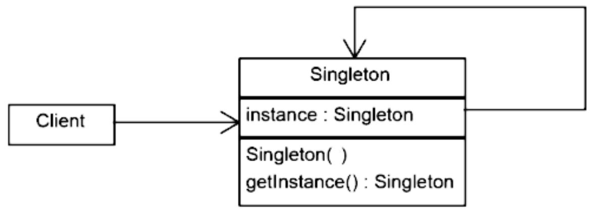

<p align="center">
<h1 style="text-align: center;">Design Patterns</h1>

## [Creazionali](..)

<h1 style="text-align: center;">Singleton</h1>
</p>


[](https://openjdk.org/projects/jdk/25/)
[](https://github.com/GiuCom/Design_Patterns/blob/main/LICENSE)<br/>
<br/>

----

## 🚀 Introduzione
Il **Singleton** è un pattern creazionale che garantisce l'esistenza di una sola istanza, relativa a una classe, durante l'intero ciclo di vita di un'applicazione e fornendo un punto di accesso globale a tale istanza.<br> 
Utilizzando l’invocazione a un metodo incaricato della produzione degli oggetti, l'eventuali successivi accessi al metodo durante l'esecuzione dell'applicazione, comportano la restituzione di un riferimento allo stesso oggetto.
<br>Viene utilizzato per risorse condivise come logger, configurazioni o connessioni a database, evitando duplicazioni e garantendo coerenza.

## 🏭 Caratteristiche
Il pattern si basa su tre elementi chiave:
* un costruttore privato per impedire istanziazioni esterne;
* una variabile statica privata per memorizzare l'istanza unica;
* un metodo statico e pubblico per accedervi.

In UML, è rappresentato:

<p align="center">
  <br/>
</p>


### **Lazy Initialization (Non thread-safe)**
Questa versione "base" del pattern crea l'istanza solo alla prima chiamata del metodo `getInstance` risparmiando risorse, se non utilizzata.

```java
public class Singleton {

    /* Dichiarazione variabile Singleton */
    private static Singleton INSTANCE = null;

    /* Dichiarazione variabile stringa */
    private String info;

    /* Costruttore private */
    private Singleton() {
        info = "Oggetto inizializzato";
    }

    /* Metodo static */
    public static Singleton getInstance() {
        if(INSTANCE == null) {
            INSTANCE = new Singleton();
        }
        return INSTANCE;
    }

    // Setter & Getter
    public void setInfo (String info) {
        this.info = info;
    }

    public String getInfo () {
        return info;
    }
}
```

Test JUnit 5 per verificare che la classe **Singleton** mantenga un'unica istanza e conservi correttamente lo stato.

```java
public class SingletonTest {

    // Singleton
    @Test
    void testSingletonIdentity() {
        // Verifica che due chiamate restituiscano lo stesso riferimento di memoria
        Singleton instance1 = Singleton.getInstance();
        assertNotNull(instance1, "La prima istanza non è null");

        Singleton instance2 = Singleton.getInstance();
        assertNotNull(instance2, "La seconda istanza non è null");

        assertSame(instance1, instance2, "Le due istanze sono identiche (stesso riferimento)");
    }

    @Test
    void testSingletonStateConsistency() {
        Singleton instance1 = Singleton.getInstance();
        assertNotNull(instance1, "La prima istanza non è null");
        String testoPrimaDellaModifica =  instance1.getInfo();
        String nuovoMessaggio = "Modifica testo";
        instance1.setInfo(nuovoMessaggio);
        assertEquals(nuovoMessaggio, instance1.getInfo(), "Testo modificato nella prima istanza");


        Singleton instance2 = Singleton.getInstance();
        assertNotNull(instance2, "La seconda istanza non è null");

        assertEquals(nuovoMessaggio, instance2.getInfo(), "La modifica testo effettuata sulla prima istanza si riflette sulla seconda");
    }
}
```

Questa versione non è adatta a sistemi multithread perché non è **thread-safe**.<br>
In un ambiente con più thread, la mancanza di sincronizzazione può portare alla creazione di più istanze della classe, violando il principio cardine del pattern.<br>
I principali motivi per cui evitare o prestare estrema attenzione alla versione Lazy sono:

- **Race Condition:** Quando due o più thread chiamano contemporaneamente il metodo `getInstance()`, nel momento in cui la variabile **Singleton** `INSTANCE` è ancora `null`, entrambi possono superare il controllo `if(INSTANCE == null){ .. }` di conseguenza, ogni thread procederà a creare la propria istanza separata.
- **Mancanza di atomicità:** L'operazione `if(INSTANCE == null){ .. }` "controlla se è nullo e poi crea" (**check-then-act**) non è atomica. Senza un meccanismo di blocco, i thread possono intercalare le loro operazioni in modo imprevedibile.
- **Overhead di Sincronizzazione:** Senza l'uso di keyword `synchronized` o `volatile`, un thread potrebbe non "vedere" immediatamente l'istanza appena creata da un altro thread, causa ottimizzazioni della memoria da parte della JVM, portandolo a crearne una nuova.
- **Latenza al Primo Utilizzo:** Poiché l'oggetto viene creato solo quando serve, la prima chiamata metodo `getInstance()` subirà un ritardo dovuto al tempo di istanziazione. Se l'oggetto è "pesante" (es. apre una connessione DB complessa), questo può causare picchi di latenza improvvisi durante l'esecuzione.

Per migliorare il codice e renderlo **thread-safe**, si possono utilizzare le seguenti versioni.

----

### **Metodo Synchronized**<br>
Il modificatore `synchronized` viene utilizzato per risolvere il problema della concorrenza.<br>
A livello tecnico, questa versione aggiunge un modificatore di **mutua esclusione** direttamente alla firma del metodo `getInstance()` che restituisce l'istanza.<br>
Passaggi logici:

1. **Chiamata al Metodo:** Un thread invoca il metodo `getInstance()`.
2. **Acquisizione del Monitor:** Il thread tenta di acquisire il _**lock**_ (il monitor) della classe. Se un altro thread lo sta già usando, il nuovo arrivato viene messo in stato di attesa.
3. **Controllo e Creazione:** Una volta ottenuto il _**lock**_, il thread controlla se la variabile `static` `INSTANCE` è `null`. Se lo è, istanzia l'oggetto.
4. **Rilascio del Lock:** Il thread restituisce l'istanza e rilascia il _**lock**_, permettendo ad altri thread di accedere al metodo `getInstance()`.

```java
public class SingletonSynchronized {

    /* Dichiarazione di una variabile SingletonSynchronized */
    private static SingletonSynchronized INSTANCE = null;

    /* Dichiarazione di una variabile stringa */
    private String info;

    /* Costruttore private */
    private SingletonSynchronized() {
        info = "Oggetto inizializzato";
    }

    /* Metodo static e synchronized */
    public static synchronized SingletonSynchronized getInstance() {
        if(INSTANCE == null) {
            INSTANCE = new SingletonSynchronized();
        }
        return INSTANCE;
    }

    // Setter & Getter
    public void setInfo (String info) {
        this.info = info;
    }

    public String getInfo () {
        return info;
    }
}
```

Test JUnit 5 per verificare che la classe mantenga un'unica istanza e conservi correttamente lo stato durante l'esecuzione di diversi thread.

```java
void testSingletonSynchronizedMultithread() throws InterruptedException {

        // Numero di thread
        int threadCount = 1000;

        // Semplifica la gestione dell'esecuzione di task in background
        ExecutorService executor = Executors.newFixedThreadPool(threadCount);

        // Utilizziamo un Set thread-safe per memorizzare le istanze uniche trovate
        Set<Integer> instanceHashCodes = Collections.newSetFromMap(new ConcurrentHashMap<>());

        // Il latch serve a far partire i thread contemporaneamente
        CountDownLatch startLatch = new CountDownLatch(1);
        // Il latch di fine serve ad attendere che tutti i thread abbiano finito
        CountDownLatch finishLatch = new CountDownLatch(threadCount);

        // Ciclo di thread
        for (int i = 0; i < threadCount; i++) {
            executor.submit(() -> {
                try {
                    startLatch.await(); // Attende il segnale di partenza
                    SingletonSynchronized instance = SingletonSynchronized.getInstance();
                    instanceHashCodes.add(System.identityHashCode(instance));
                } catch (InterruptedException e) {
                    Thread.currentThread().interrupt();
                } finally {
                    finishLatch.countDown();
                }
            });
        }

        startLatch.countDown(); // Segnale di partenza per tutti i thread
        finishLatch.await();    // Attende il completamento
        executor.shutdown();

        // Verifica che nel set ci sia esattamente 1 solo hashcode (una sola istanza)
        assertEquals(1, instanceHashCodes.size(),
                "Esiste una sola istanza anche con accesso concorrente");
    }
```

Caratteristiche Principali
- **Lazy Initialization:** L'istanza non viene creata all'avvio dell'applicazione, ma solo la prima volta che viene effettivamente richiesta tramite il metodo `getInstance()`.
- **Thread Safety:** L'uso della keyword `synchronized` nel metodo di accesso garantisce che un solo thread alla volta possa eseguire il blocco di codice, evitando che due thread creino contemporaneamente due istanze diverse (violando il pattern).
- **Overhead di Performance:** Poiché l'intero metodo è sincronizzato, ogni chiamata a `getInstance()` deve acquisire un _lock_, anche dopo che l'istanza è già stata creata. Questo può diventare un colloquio di bottiglia in applicazioni ad alto traffico.

Sebbene questa versione risolva il problema della creazione di istanze multiple (**Race Condition** vista nella versione **Lazy Initialization**), introduce i seguenti colli di bottiglia:
- **Degrado delle Prestazioni:** Il _**lock**_ viene acquisito ogni volta che viene chiamato il metodo `getInstance()`, anche se l'istanza esiste già da tempo e basterebbe leggerla.
- **Contesa (Contention):** In applicazioni ad alto traffico con molti thread, i thread rimarranno in coda inutilmente per un'operazione di sola lettura, riducendo drasticamente il throughput del sistema.

----

### **Double-Checked Locking (DCL)**<br>
È un'evoluzione del **Metodo Synchronized**, progettato per ridurre l'overhead delle prestazioni. Eliminando la sincronizzazione si riduce, l'uso del _**lock**_, solo al momento della creazione effettiva dell'istanza.<br>
La creazione di un nuovo oggetto viene sdoppiata in due fasi:

- **Primo Controllo (Non Sincronizzato):** Si verifica se l'istanza è nulla. Se non è nulla, il metodo `getInstance()` restituisce l'oggetto senza acquisire alcun _**lock**_. Questo risolve il problema delle prestazioni.
- **Sincronizzazione:** Se l'istanza è nulla, il thread acquisisce il _**lock**_ su un blocco di codice protetto.
- **Secondo Controllo (Sincronizzato):** Una volta dentro il blocco protetto, si controlla nuovamente se l'istanza è nulla. Questo è fondamentale perché un altro thread potrebbe aver creato l'istanza nel breve lasso di tempo tra il primo controllo e l'acquisizione del _**lock**_.

```java
public class SingletonDCL {

    /* Dichiarazione di una variabile SingletonDCL */
    private static volatile SingletonDCL INSTANCE = null;

    /* Dichiarazione di una variabile stringa */
    private String info;

    /* Costruttore private */
    private SingletonDCL() {
        info = "Oggetto inizializzato";
    }

    /* Metodo static */
    public static SingletonDCL getInstance() {
        // Primo controllo (senza lock)
        if (INSTANCE == null) {
            synchronized (SingletonDCL.class) {
                // Secondo controllo (con lock)
                if (INSTANCE == null) {
                    INSTANCE = new SingletonDCL();
                }
            }
        }
        return INSTANCE;
    }

    // Setter & Getter
    public void setInfo (String info) {
        this.info = info;
    }

    public String getInfo () {
        return info;
    }
}
```

Test JUnit 5 per verificare che la classe mantenga un'unica istanza e conservi correttamente lo stato durante l'esecuzione di diversi thread.

```java
@Test
public void testSingletonDCLMultithread() throws InterruptedException {
    // Parte iniziale di codice uguale al test del Metodo Synchronized

    // Ciclo di thread
    for (int i = 0; i < threadCount; i++) {
        executor.submit(() -> {
            try {
                startLatch.await(); // Attende il segnale di partenza
                SingletonDCL instance = SingletonDCL.getInstance();
                instanceHashCodes.add(System.identityHashCode(instance));
            } catch (InterruptedException e) {
                Thread.currentThread().interrupt();
            } finally {
                finishLatch.countDown();
            }
        });
    }

    // Parte finale del codice uguale al test del Metodo Synchronized
}
```

La keyword `volatile` è indispensabile in quanto la Java Virtual Machine (JVM) o la CPU potrebbero eseguire un **reordering** delle operazioni durante l'istanziazione.<br>
L'operazione `INSTANCE = new SingletonDCL();` non è atomica e, a livello di bytecode, viene divisa in tre passaggi:

1. **Allocazione memoria:** Viene riservato lo spazio per l'oggetto.
2. **Inizializzazione:** Viene eseguito il costruttore (impostando i campi).
3. **Assegnazione:** Il riferimento _INSTANCE_ punta alla memoria allocata.

Può succedere, con numero alto di utilizzo del metodo `getInstance()`, che la JVM non esegue i passaggi 2 e 3 in modo ordinato. Se il thread A esegue il passaggio 3 (assegnazione) prima del passaggio 2 (costruttore) si ottine:

- L'istanza non è più null, ma i suoi campi interni non sono ancora stati inizializzati.
- Il thread B, esegue il primo controllo `if (instance == null) { .. }` e vede che non è `null` e restituisce l'oggetto.
- Il thread B tenta di usare l'oggetto, ma trova valori incoerenti o nulli, causando crash improvvisi.

La keyword `volatile` inibisce il riordinamento impedendo alla JVM di scambiare l'ordine tra la costruzione dell'oggetto e l'assegnazione del riferimento.
Inoltre, forza la CPU a scrivere il valore direttamente nella memoria principale (RAM), assicurando che ogni thread legga sempre il valore più aggiornato e non una copia "vecchia" salvata nella cache locale del core.

Caratteristiche Principali
- **Riduzione dei Lock:** Invece di sincronizzare l'intero metodo, si sincronizza solo il blocco di creazione dell'istanza. Una volta che l'istanza esiste, i thread non entrano più nel blocco `synchronized`.
- **Doppio Controllo:** Si verifica se l'istanza è nulla due volte: una fuori dal blocco `synchronized` (per velocità) e una dentro (per sicurezza).
- **Parola chiave volatile:** Se non si utilizza la keyword `volatile`, un thread potrebbe vedere un'istanza parzialmente inizializzata, causando crash imprevedibili.

----

### Eager Initialization (inizializzazione anticipata)
L'istanza viene creata nel momento esatto in cui la classe viene caricata in memoria dal runtime, anziché al momento della prima richiesta.<br>
Il funzionamento si basa sulle specifiche del caricamento delle classi:

1. **Istanziazione Statica:** L'istanza viene dichiarata come `static` e inizializzata immediatamente sulla stessa riga.
2. **Caricamento:** Quando il programma fa riferimento alla classe per la prima volta (anche solo per leggere una costante), il **ClassLoader** carica la classe e inizializza tutte le variabili statiche.
3. **Accesso Diretto:** Il metodo `getInstance()` si limita a restituire l'istanza già esistente, senza eseguire alcun controllo di tipo `if (INSTANCE == null) { ... }`.

```java
public class SingletonEager {

    /* Dichiarazione di una variabile SingletonEager */
    private static final SingletonEager INSTANCE = new SingletonEager();

    /* Dichiarazione di una variabile stringa */
    private String info;

    /* Costruttore private */
    private SingletonEager() {
        info = "Oggetto inizializzato";
    }

    /* Metodo static */
    public static SingletonEager getInstance() {
        return INSTANCE;
    }

    // Setter & Getter
    public void setInfo (String info) {
        this.info = info;
    }

    public String getInfo () {
        return info;
    }
}
```

Test JUnit 5 per verificare che la classe mantenga un'unica istanza e conservi correttamente lo stato durante l'esecuzione di diversi thread.

```java
@Test
void testSingletonEagerMultithread() throws InterruptedException {
    // Parte iniziale di codice uguale al test del Metodo Synchronized

    // Ciclo di thread
    for (int i = 0; i < threadCount; i++) {
        executor.submit(() -> {
            try {
                startLatch.await(); // Attende il segnale di partenza
                SingletonEager instance = SingletonEager.getInstance();
                instanceHashCodes.add(System.identityHashCode(instance));
            } catch (InterruptedException e) {
                Thread.currentThread().interrupt();
            } finally {
                finishLatch.countDown();
            }
        });
    }
    
    // Parte finale del codice uguale al test del Metodo Synchronized
}
```

Caratteristiche Principali
- **Istanza Statica Finale:** L'oggetto viene dichiarato come `static final`, assicurando che sia creato una sola volta dal **ClassLoader**.
- **Costruttore Privato:** Impedisce la creazione di nuove istanze dall'esterno tramite l'operatore `new`.
- **Thread-Safety Nativa:** È intrinsecamente sicuro per il multithreading senza bisogno di blocchi `synchronized` o `native`, poiché la JVM gestisce l'inizializzazione statica in modo atomico.
- **Velocità di Accesso:** Il metodo `getInstance()` è estremamente rapido, poiché non contiene logica condizionale né _**lock**_.

Un possibile svantaggio è nella mancata gestione delle eccezioni infatti, se l'inizializzazione statica fallisce (es. errore di connessione), l'intera classe diventa inutilizzabile e l'errore può essere difficile da catturare correttamente.

----

### **Bill Pugh Singleton**<br>
Noto anche come **Initialization-on-demand holder idiom**, è considerato da molti esperti la soluzione ottimale per implementare il pattern **Singleton** in Java.<br>
Sfrutta una particolarità del meccanismo di caricamento delle classi della JVM per ottenere i vantaggi di entrambe le versioni precedenti: è **Lazy Initialization** (efficiente) e **Thread-Safe** (sicuro) senza l'uso di `synchronized`.<br>
La magia di questo pattern risiede nell'utilizzo di una classe privata statica interna **SingletonHelper**. Ecco come funziona a livello di memoria e runtime:

1. **Caricamento Differito:** Quando la classe principale **SingletonBillPugh** viene caricata in memoria, la classe interna **SingletonHelper** non viene caricata. Di conseguenza, l'istanza non viene ancora creata.
2. **Trigger di Inizializzazione:** L'istanza viene creata solo nel momento in cui viene chiamato per la prima volta il metodo `getInstance()`. Questo metodo fa riferimento a `SingletonHelper.INSTANCE`.
3. **Garanzia della JVM:** Solo in quel momento la JVM carica la classe **SingletonHelper**. Poiché il caricamento delle classi è un'operazione sequenziale e thread-safe garantita dalle specifiche della JVM, l'istanza statica viene creata una sola volta, anche se più thread chiamano `getInstance()` contemporaneamente.

```java
public class SingletonBillPugh {

    /* Dichiarazione di una variabile stringa */
    private String info;

    /* Costruttore privato o comunque non pubblico */
    private SingletonBillPugh() {
        info = "Oggetto inizializzato";
    }

    // Classe statica interna (Holder)
    // Non viene caricata finché non viene richiamata esplicitamente
    private static class SingletonHelper {
        private static final SingletonBillPugh INSTANCE = new SingletonBillPugh();
    }

    /* Metodo static */
    public static SingletonBillPugh getInstance() {
        return SingletonHelper.INSTANCE;
    }

    // Setter & Getter
    public void setInfo (String info) {
        this.info = info;
    }

    public String getInfo () {
        return info;
    }
}
```

Test JUnit 5 per verificare che la classe mantenga un'unica istanza e conservi correttamente lo stato durante l'esecuzione di diversi thread.

```java
@Test
void testSingletonBillPughMultithread() throws InterruptedException {
    // Parte iniziale di codice uguale al test del Metodo Synchronized

    // Ciclo di thread
    for (int i = 0; i < threadCount; i++) {
        executor.submit(() -> {
            try {
                startLatch.await(); // Attende il segnale di partenza
                SingletonBillPugh instance = SingletonBillPugh.getInstance();
                instanceHashCodes.add(System.identityHashCode(instance));
            } catch (InterruptedException e) {
                Thread.currentThread().interrupt();
            } finally {
                finishLatch.countDown();
            }
        });
    }

    // Parte finale del codice uguale al test del Metodo Synchronized
}
```

Caratteristiche Principali
- **Lazy Initialization:** L'istanza non viene creata quando viene caricata la classe principale **SingletonBillPugh**, ma solo al primo richiamo del metodo `getInstance()`.
- **Thread Safety Nativa:** La JVM garantisce che il caricamento di una classe sia un'operazione thread-safe. Poiché l'istanza è una costante `static` della classe interna, la sua creazione è atomica e protetta dalla JVM stessa. 
- **Performance Massime:** Non essendoci blocchi con keyword `synchronized` o `volatile`, l'accesso all'istanza è veloce quanto un normale accesso a una variabile `static`.
- **Resistenza ai riordinamenti:** Risolve intrinsecamente il problema degli oggetti parzialmente costruiti senza bisogno di configurazioni extra.

L'unica vera vulnerabilità (comune a quasi tutte le versione del pattern **Singleton**) è l'uso della **Reflection**, che potrebbe forzare l'accesso al costruttore privato. Per blindarlo completamente, bisognerebbe lanciare un'eccezione nel costruttore se l'istanza esiste già.

----

### **Singleton Enum**<br>
È l'approccio definitivo, raccomandato da **Joshua Bloch** (autore di _Effective Java_), per garantire l'unicità dell'istanza in ogni scenario possibile, anche i più estremi.
A differenza delle versioni precedenti, non si basa su un trucco di logica (come i lock o le classi interne), ma sfrutta direttamente la natura intrinseca degli `Enum` nel linguaggio Java.<br>
L' `enum` è una classe speciale che estende `java.lang.Enum`. La JVM garantisce proprietà uniche per le istanze di un enum:

1. **Istanziazione Unica:** La JVM garantisce che ogni costante definita in un `enum` venga istanziata una sola volta durante il caricamento della classe. È, di fatto, un'inizializzazione **Eager** gestita dal runtime.
2. **Thread-Safety Nativa:** Il processo di inizializzazione degli `enum` è protetto dal meccanismo di class-loading della JVM, rendendolo thread-safe senza bisogno di `synchronized` o `volatile`.
3. **Protezione contro la Reflection:** Se si prova a istanziare un `enum` tramite `Reflection` (usando `Constructor.newInstance()`), la JVM lancia una `IllegalArgumentException`. È l'unico modo per impedire tecnicamente la creazione di una seconda istanza.
4. **Serializzazione Automatica:** Nelle altre versione del pattern **Singleton**, la **deserializzazione** crea un nuovo oggetto, rompendo il pattern (a meno di non implementare `readResolve()`). Gli `Enum` hanno un meccanismo di serializzazione speciale che garantisce che l'oggetto deserializzato sia esattamente lo stesso dell'originale.

```java
public enum SingletonEnum {
    
    INSTANCE;

    /* Dichiarazione di una variabile stringa */
    private String info;

    public void setInfo (String info) {
        this.info = info;
    }

    public String getInfo () {
        return info;
    }
    
    public static void main(String[] args) {
        SingletonEnum singleton = SingletonEnum.INSTANCE;
        System.out.println(singleton.getInfo());
        singleton.setInfo("Giuseppe");
        System.out.println(singleton.getInfo());
    }
}
```

Test JUnit 5 per verificare che la classe mantenga un'unica istanza e conservi correttamente lo stato durante l'esecuzione di diversi thread.

```java
@Test
void testSingletonEnumMultithread() throws InterruptedException {
    // Parte iniziale di codice uguale al test del Metodo Synchronized

    // Ciclo di thread
    for (int i = 0; i < threadCount; i++) {
        executor.submit(() -> {
            try {
                startLatch.await(); // Attende il segnale di partenza
                SingletonEnum instance = SingletonEnum.INSTANCE;
                instanceHashCodes.add(System.identityHashCode(instance));
            } catch (InterruptedException e) {
                Thread.currentThread().interrupt();
            } finally {
                finishLatch.countDown();
            }
        });
    }

    // Parte finale del codice uguale al test del Metodo Synchronized
}
```

Caratteristiche Principali
- **Thread-Safety Nativa:** La JVM garantisce che le istanze degli `enum` siano create una sola volta in modo thread-safe durante il caricamento della classe.
- **Protezione dalla Reflection:** A differenza delle varianti viste precedentemente, gli `enum` impediscono l'istanziazione tramite `Reflection` (che lancerebbe un'eccezione `IllegalArgumentException`).
- **Serializzazione Automatica:** La serializzazione standard di Java garantisce che l'oggetto restituito sia sempre lo stesso (prevenendo la creazione di duplicati).
- **Semplicità:** È il codice più compatto e meno incline a errori umani.

Nonostante sia la soluzione perfetta, ha due piccoli svantaggi:

- **Nessuna Lazy Initialization (flessibilità):** Essendo un `enum`, l'istanza viene creata appena la classe viene toccata.
- **Nessuna Ereditarietà (tecnico):** Un `enum` non può estendere un'altra classe (perché estende già implicitamente `java.lang.Enum`), sebbene possa implementare interfacce.
