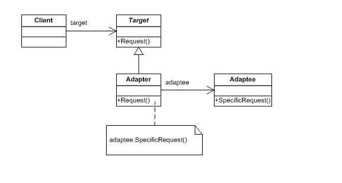

## [Design Patterns](../..)
### [Strutturali](..)
# Adapter

----

[](https://openjdk.org/projects/jdk/25/)
[](https://github.com/GiuCom/Design_Patterns/blob/main/LICENSE)<br>
<br>

## 🚀 Introduzione
Il pattern **Adapter** è un design pattern strutturale che permette a due interfacce incompatibili di lavorare insieme. Agisce come un "traduttore" o un ponte, avvolgendo un oggetto esistente (**Adaptee**) per esporre l'interfaccia attesa dal client (**Target**).
Esso viene spesso paragonato a un adattatore di presa elettrica internazionale: se hai un caricabatterie con spina italiana (**Client**) e una presa americana (**Adaptee**), l'adattatore (**Adapter**) si inserisce nel muro e ti offre la presa corretta, trasformando la forma ma mantenendo la funzione (erogare energia).

## 🏭 Caratteristiche
La struttura del pattern è composta dalle seguenti classi e interfacce:

- **Target:** L'interfaccia specifica che il client utilizza.
- **Adaptee:** La classe esistente che ha un'interfaccia incompatibile e deve essere adattata.
- **Adapter:** La classe che implementa l'interfaccia **Target** e delega le chiamate alla classe **Adaptee**.
- **Client:** Collabora con gli oggetti conformi all'interfaccia **Target**.

In UML, è rappresentato:

<p align="center">
  <br/>
</p>

-----

### ESEMPIO
Realizziamo un applicazione che integra, in un vecchio sistema di misurazione della temperature in gradi Fahrenheit, un nuovo sistema di monitoraggio che utilizza i gradi Celsius.
<br>Vediamo le classi e interfacce da implementare:

**SensoreMeteo.java** (Target)<br>
Rappresenta lo standard che il nostro nuovo software si aspetta di usare.

```java
/**
 * Interfaccia che definisce il nuovo standard di lettura.
 * Il sistema in gradi Celsius.
 */
public interface SensoreMeteo {
    double getTemperaturaCelsius();
}
```

**VecchioTermometroFahrenheit.java** (Adaptee)<br>
È la classe esistente, magari di una libreria esterna o di un vecchio macchinario, che fornisce i dati in un formato Fahrenheit.

```java
/**
 * Classe legacy che non possiamo modificare.
 * Fornisce la temperatura in gradi Fahrenheit.
 */
public class VecchioTermometroFahrenheit {

    public double letturaInFahrenheit() {
        // Simula una lettura da un vecchio hardware
        return 86.0;
    }
}
```

**AdattatoreTermometro.java** (Adapter)<br>
Questa è la classe chiave. Implementa l'interfaccia moderna e "incapsula" il vecchio termometro, convertendo i dati al volo.

```java
/**
 * L'Adattatore implementa l'interfaccia moderna 'SensoreMeteo'.
 * All'interno contiene un riferimento al vecchio termometro.
 */
public class AdattatoreTermometro implements SensoreMeteo {
    private final VecchioTermometroFahrenheit vecchioTermometro;

    public AdattatoreTermometro(VecchioTermometroFahrenheit vecchioTermometro) {
        this.vecchioTermometro = vecchioTermometro;
    }

    @Override
    public double getTemperaturaCelsius() {
        // 1. Ottiene il dato nel vecchio formato
        double fahrenheit = vecchioTermometro.letturaInFahrenheit();

        // 2. Esegue la logica di conversione (Formula: (F - 32) * 5/9)
        double celsius = (fahrenheit - 32) * 5 / 9;

        // 3. Restituisce il dato convertito al sistema moderno
        return celsius;
    }
}
```

**AdapterMain.java** (Client)<br>
La classe **AdapterMain** (Client) mette in funzione tutto il sistema. Essa dimostra come il codice moderno possa interagire con un vecchio hardware senza nemmeno sapere che quest'ultimo esiste.

```java
public class AdapterMain {
    static void main() {
        System.out.println("=== AVVIO SISTEMA MONITORAGGIO METEO ===");

        // 1. Abbiamo il componente legacy (che non parla Celsius)
        VecchioTermometroFahrenheit vecchioHardware = new VecchioTermometroFahrenheit();

        // 2. Creiamo l'Adattatore passandogli il vecchio hardware
        // Nota: Il tipo della variabile è l'interfaccia MODERNA (SensoreMeteo)
        SensoreMeteo sensoreModerno = new AdattatoreTermometro(vecchioHardware);

        // 3. Utilizziamo il sensore come se fosse nativamente Celsius
        // Il Client chiama 'getTemperaturaCelsius()' e non sa nulla di Fahrenheit
        double temperaturaCelsius = sensoreModerno.getTemperaturaCelsius();

        // 4. Visualizzazione del risultato
        System.out.println("Lettura dal vecchio termometro (Fahrenheit): 86.0 F");
        System.out.println("Conversione tramite Adattatore (Celsius): " + temperaturaCelsius + " C");

        // 5. Verifica logica
        if (temperaturaCelsius == 30.0) {
            System.out.println("RISULTATO: Il pattern Adapter ha funzionato correttamente!");
        } else {
            System.out.println("RISULTATO: Errore nella conversione.");
        }
    }
}
```

Il `main` simula il comportamento di un'applicazione reale che deve far convivere tecnologie di epoche diverse:

- **Istanziazione del Legacy (vecchioHardware):** Iniziamo creando l'oggetto che "parla la lingua sbagliata". Questo rappresenta, ad esempio, una libreria esterna o un database che non possiamo modificare.
- **Creazione del Ponte (AdattatoreTermometro):** Qui avviene il cuore del pattern. "Impacchettiamo" il vecchio hardware dentro l'adattatore. L'adattatore agisce come uno scudo o un traduttore.
- **Utilizzo del Polimorfismo:** Si noterà che la variabile `sensoreModerno` è dichiarata di tipo **SensoreMeteo** (l'interfaccia target). Questo è fondamentale, il resto dell'applicazione vedrà solo metodi in Celsius. Se domani cambiassimo il termometro con uno nativo Celsius, il codice del `main` (dopo la creazione) non cambierebbe di una virgola.
- **Esecuzione Invisibile:** Quando chiamiamo `getTemperaturaCelsius()`, il `main` non vede la formula matematica né la chiamata a `letturaInFahrenheit()`. L'adattatore intercetta la richiesta, interroga il vecchio hardware, fa il calcolo **(°F-32)*5/9** e restituisce il numero pulito.
- **Output:** Il risultato finale mostra come dati incompatibili siano stati armonizzati perfettamente.

Riepilogo dei vantaggi:

- **Pulizia:** Il `main` non contiene formule matematiche di conversione.
- **Trasparenza:** Il client usa l'interfaccia che preferisce.
- **Sostituibilità:** Se il vecchio termometro venisse rimosso, basterebbe cambiare una riga di codice nel setup del `main`.

----

## Test
Il test verifica che, interrogando l'interfaccia moderna, l'adattatore faccia correttamente il calcolo matematico delegando la lettura al vecchio sensore.

```java
public class AdapterTest {
    @Test
    public void testConversioneTemperatura() {
        // PASSAGGIO 1: Creazione del componente incompatibile (Adaptee)
        // Immaginiamo che il vecchio termometro segni 86°F
        VecchioTermometroFahrenheit vecchioTermometro = new VecchioTermometroFahrenheit();

        // PASSAGGIO 2: Creazione dell'Adattatore (Adapter)
        // Passiamo il vecchio termometro all'adattatore
        SensoreMeteo adattatore = new AdattatoreTermometro(vecchioTermometro);

        // PASSAGGIO 3: Esecuzione del test (Il Client usa il Target)
        // Chiediamo la temperatura in Celsius. 86°F corrispondono a 30°C.
        double temperaturaOttenuta = adattatore.getTemperaturaCelsius();
        double temperaturaAttesa = 30.0;

        // PASSAGGIO 4: Verifica (Assertion)
        // Verifichiamo che il calcolo sia corretto (con una tolleranza minima)
        assertEquals(temperaturaAttesa, temperaturaOttenuta, 0.001,
                "L'adattatore dovrebbe convertire correttamente 86°F in 30°C");
    }
}
```

Il test è progettato seguendo il pattern AAA (Arrange, Act, Assert), che è lo standard per scrivere test unitari chiari e manutenibili.

- **A. Arrange (Preparazione)** In questa fase configuriamo l'ambiente di test.
  - **Creazione dell'Adaptee:** Istanziamo **VecchioTermometroFahrenheit**. In un test reale, questo oggetto rappresenta la sorgente dati "problematica" (il vecchio hardware). Sappiamo che questo oggetto restituisce 86.0 gradi Fahrenheit.
  - **Creazione dell'Adapter:** Istanziamo **AdattatoreTermometro** passando al suo costruttore l'oggetto legacy. In questo momento stiamo creando il "ponte".
  - **Definizione del Target:** Assegniamo l'adapter a una variabile di tipo **SensoreMeteo**. Questo simula esattamente ciò che farebbe il sistema moderno: interagire solo tramite l'interfaccia corretta.
  
- **B. Act (Azione)** Questa è la fase in cui eseguiamo l'operazione da testare.
  - **Viene chiamato** il metodo `getTemperaturaCelsius()`.
  - **Succede** che l'esecuzione entra nella classe **Adapter**, il quale chiama il metodo `letturaInFahrenheit()` del vecchio termometro, riceve 86.0, applica la formula matematica (86 - 32) * 5 / 9 e ottiene 30.0.

- **C. Assert (Verifica)** È la fase finale dove controlliamo se il risultato ottenuto coincide con quello atteso.
  - **Confronto:** Usiamo `assertEquals(30.0, valoreOttenuto, 0.001)`.
  - **Il Delta (0.001):** Poiché utilizziamo numeri decimali (double), nei test si usa sempre un piccolo margine di tolleranza (**delta**) per evitare che errori infinitesimali di arrotondamento del processore facciano fallire il test.

Il test conferma tre punti fondamentali del pattern:

- **Compatibilità di Firma:** Conferma che la classe **Adapter** implementa correttamente l'interfaccia **SensoreMeteo** (il compilatore non darebbe errore, ma il test assicura che il metodo sia invocabile).
- **Correttezza della Delega:** Verifica che la classe **Adapter** stia effettivamente chiamando l'oggetto interno (se **Adapter** non chiamasse il vecchio termometro, non otterrebbe mai il valore base).
- **Accuratezza della Trasformazione:** È il punto più importante. Il test valida che la logica di conversione (la formula matematica) sia stata implementata correttamente. Se avessimo sbagliato la formula nella classe **Adapter**, il test fallirebbe anche se il codice è scritto bene formalmente.

Senza un test unitario, se qualcuno modificasse la formula di conversione nella claase **Adapter** (magari arrotondando male o invertendo i numeri), il sistema moderno continuerebbe a ricevere dati senza generare errori, ricevendo dati sbagliati.
<br>Il test garantisce che l'integrità del dato sia preservata durante il passaggio tra il vecchio e il nuovo mondo.