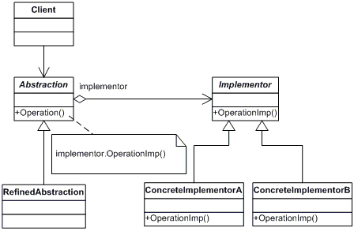

## [Design Patterns](../..)
### [Strutturali](..)
# Bridge

----

[](https://openjdk.org/projects/jdk/25/)
[](https://github.com/GiuCom/Design_Patterns/blob/main/LICENSE)<br>
<br>

## 🚀 Introduzione
Il **Bridge** è un design pattern strutturale che mira a separare un'astrazione dalla sua implementazione, in modo che entrambe possano variare in modo indipendente.
Invece di usare l'ereditarietà (che lega l'astrazione all'implementazione in modo rigido), il pattern **Bridge** utilizza la composizione. Si crea un "ponte" (un riferimento nel codice) tra una gerarchia di classi astratte e una gerarchia di classi concrete.

## 🏭 Caratteristiche
La struttura del pattern è composta dalle seguenti classi e interfacce:

- **Abstraction (Astrazione):** Definisce l'interfaccia di controllo ad alto livello e mantiene un riferimento a un oggetto **Implementor**.
- **Refined Abstraction (Astrazione Estesa):** Estende l'interfaccia definita da **Abstraction** implementando la logica specifica.
- **Implementor (Implementatore):** Dichiara l'interfaccia per le classi di implementazione (non deve necessariamente corrispondere all'interfaccia di **Abstraction**).
- **Concrete Implementor (Implementatore Concreto):** Implementa l'interfaccia **Implementor** e definisce i dettagli concreti.

In UML, è rappresentato:

<p align="center">
  <br/>
</p>

-----

### ESEMPIO
Realizziamo un sistema di produzione di Veicoli. L'idea è separare il Tipo di Veicolo (Astrazione) dal Processo di Produzione (Implementazione). In questo modo, si possono aggiungere nuovi veicoli (es. Camion) o nuovi processi (es. Produzione in Serie) senza modificare le classi esistenti.
<br>Vediamo le classi e interfacce da implementare:

**Officina.java** (Implementor)<br>
Questa interfaccia definisce le operazioni di base che tutte le implementazioni concrete devono fornire.

```java
// Interfaccia Workshop: definisce l'operazione di produzione
public interface Officina {
    void lavora();
}
```

**Assemblaggio.java** e **Verniciatura.java** (Concrete Implementor)<br>
Queste classi implementano l'interfaccia Officina. Rappresentano il "come" viene fatto il lavoro.

```java
// Implementazione per l'assemblaggio
public class Assemblaggio implements Officina {
    @Override
    public void lavora() {
        System.out.print(" (assemblato)");
    }
}
```

```java
// Implementazione per la verniciatura
public class Verniciatura implements Officina {
    @Override
    public void lavora() {
        System.out.print(" (verniciato)");
    }
}
```

**Veicolo.java** (Abstraction)<br>
Questa è la classe base della gerarchia dei veicoli. Contiene un riferimento (il ponte) all'interfaccia **Officina**.

```java
public abstract class Veicolo {
    // Il "Ponte": il veicolo non sa come viene lavorato, delega all'officina
    protected Officina officina1;
    protected Officina officina2;

    protected Veicolo(Officina off1, Officina off2) {
        this.officina1 = off1;
        this.officina2 = off2;
    }

    abstract public void produci();
}
```

**Automobile.java** e **Moto.java** (Refined Abstraction)<br>
Estendono il concetto base. Qui definiamo i tipi di veicoli specifici.

```java
public class Automobile extends Veicolo {
    public Automobile(Officina off1, Officina off2) {
        super(off1, off2);
    }

    @Override
    public void produci() {
        System.out.print("Automobile:");
        officina1.lavora();
        officina2.lavora();
    }
}
```

```java
public class Moto extends Veicolo {
    public Moto(Officina off1, Officina off2) {
        super(off1, off2);
    }

    @Override
    public void produci() {
        System.out.print("Moto:");
        officina1.lavora();
        officina2.lavora();
    }
}
```

**BridgeMain.java** (Client)<br>
Questa classe funge da "Client". Il suo compito è configurare le implementazioni concrete (le officine) e collegarle alle astrazioni (i veicoli) attraverso il costruttore.

```java
public class BridgeMain {
    static void main() {
        // 1. Creiamo le implementazioni (il "come" lavorare)
        Officina officinaAssemblaggio = new Assemblaggio();
        Officina officinaVerniciatura = new Verniciatura();

        // 2. Creiamo l'astrazione "Automobile" e iniettiamo le officine (il Ponte)
        // L'automobile non sa COSA fanno le officine, sa solo che può chiamarle.
        Veicolo miaAuto = new Automobile(officinaAssemblaggio, officinaVerniciatura);

        // 3. Eseguiamo il processo
        System.out.println("Inizio produzione auto:");
        miaAuto.produci();
        // Output: Automobile: (assemblato) (verniciato)

        System.out.println("\n---------------------------");

        // 4. Possiamo riutilizzare le STESSE officine per un'astrazione diversa (Moto)
        Veicolo miaMoto = new Moto(officinaAssemblaggio, officinaVerniciatura);

        System.out.println("Inizio produzione moto:");
        miaMoto.produci();
        // Output: Moto: (assemblato) (verniciato)
    }
}
```

Il pattern **Bridge**, in questo esempio, lavora seguendo questi passaggi logici:

1. **Iniezione delle Dipendenze (Il Ponte):** Quando scriviamo `new Automobile(off1, off2)`, stiamo costruendo il "ponte". L'oggetto **Automobile** riceve dei riferimenti a oggetti che implementano l'interfaccia **Officina**.
2. **Delega del Lavoro:** Nella classe **Automobile**, il metodo `produci()` non contiene la logica di assemblaggio o verniciatura. Chiama il metodo `officina1.lavora()`.
3. **Indipendenza Totale:**
   - Se si decide di cambiare il modo in cui avviene la verniciatura (creando una classe **VerniciaturaRobotizzata**), ti basta passare il nuovo oggetto al costruttore del veicolo. Non è necessario modificare la classe **Automobile**, né la classe **Veicolo**.
   - Se si decide di creare un nuovo veicolo (es. **Camion**), ti basta estendere **Veicolo**. Le classi **Assemblaggio** e **Verniciatura** rimarranno identiche e potranno essere usate immediatamente dal nuovo camion.

Quindi, il `main` decide la combinazione, l'astrazione definisce l'entità e l'implementazione esegue l'operazione tecnica.


----

## Test
Il test ha lo scopo di verificare che il ponte tra l'astrazione (il **Veicolo**) e l'implementazione (l'**Officina**) funzioni correttamente, assicurandoci che le classi collaborino senza conoscersi nei dettagli.

```java
public class BridgeTest {

    @Test
    void testProduzioneAutomobile() {
        // Prepariamo la cattura dell'output per il test
        ByteArrayOutputStream outContent = new ByteArrayOutputStream();
        System.setOut(new PrintStream(outContent));

        // Creiamo un'automobile con due officine specifiche
        Veicolo auto = new Automobile(new Assemblaggio(), new Verniciatura());
        auto.produci();

        // Verifichiamo che il "ponte" abbia collegato correttamente le classi
        assertEquals("Automobile: (assemblato) (verniciato)", outContent.toString());
    }

    @Test
    void testProduzioneMoto() {
        ByteArrayOutputStream outContent = new ByteArrayOutputStream();
        System.setOut(new PrintStream(outContent));

        // Creiamo una moto con le stesse officine
        Veicolo moto = new Moto(new Assemblaggio(), new Verniciatura());
        moto.produci();

        assertEquals("Moto: (assemblato) (verniciato)", outContent.toString());
    }
}
```
Analizziamo nel dettaglio come funziona il test:

1. **L'Iniezione del Comportamento:** Il test verifica che, passando le officine al costruttore di **Automobile**, quest'ultima sia in grado di utilizzarle correttamente nel suo metodo `produci()`.
2. **L'Indipendenza delle Parti:** Se il test passa, significa che l'astrazione **Veicolo** sta delegando il lavoro alle classi **Officina** tramite l'interfaccia, senza aver bisogno di sapere come queste classi siano scritte internamente.
3. **La Corretta Sequenzialità:** Il test conferma che il metodo `produci()` segua l'ordine logico: prima identifica il veicolo ("Automobile:"), poi chiama la prima officina ("assemblato") e infine la seconda ("verniciato").

In un sistema reale, questo test garantisce che se domani un altro sviluppatore creasse una nuova officina (es. **OfficinaElettrica**), questa potrebbe essere passata all'auto senza rompere il funzionamento esistente. Il test unitario serve a blindare questo contratto tra le due gerarchie.

