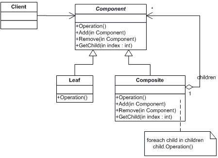

## [Design Patterns](../..)
### [Strutturali](..)
# Composite

----

[](https://openjdk.org/projects/jdk/25/)
[](https://github.com/GiuCom/Design_Patterns/blob/main/LICENSE)<br>
<br>

## 🚀 Introduzione
Il **Composite** è un design pattern strutturale che consente di modellare gerarchie **parte-tutto** tramite strutture ad albero. L'obiettivo è trattare in modo uniforme sia gli oggetti elementari (**foglie**) sia le aggregazioni di oggetti (**compositi**).
Questo approccio riduce l'accoppiamento nel codice client, perché tutte le entità della gerarchia condividono lo stesso contratto astratto.
<br>Il pattern è utile quando il dominio contiene strutture gerarchiche naturali, ad esempio:

- file e cartelle;
- menu e sottomenu;
- dipartimenti e sottodipartimenti;
- componenti UI annidati.

Senza il pattern **Composite**, il client tende a distinguere in modo esplicito oggetti semplici e oggetti composti. Con **Composite**, invece, le stesse operazioni possono essere invocate su singoli nodi o su interi sottoalberi.


## 🏭 Caratteristiche
La struttura del pattern è composta dalle seguenti classi e interfacce:

- **Component**: definisce l'interfaccia comune;
- **Leaf**: rappresenta un elemento indivisibile;
- **Composite**: contiene altri componenti e aggrega il comportamento;
- **Client**: utilizza l'astrazione comune senza dipendere dai dettagli concreti.

In UML, è rappresentato:

<p align="center">
  <br/>
</p>

-----

### ESEMPIO
L'esempio modella un archivio documentale.
<br>Vediamo le classi e interfacce da implementare:

**ComponenteDocumento.java** (Component)<br>
Definisce il contratto comune della gerarchia:

- `getNome()`;
- `getDimensioneInKB()`;
- `descrivi(String indentazione)`.

In questa implementazione, `aggiungi(...)` e `rimuovi(...)` sono esposti come metodi di default. I compositi li supportano, mentre le foglie li rifiutano con `UnsupportedOperationException`.

```java
public interface ComponenteDocumento {
    String getNome();
    int getDimensioneInKB();
    String descrivi(String indentazione);

    default void aggiungi(ComponenteDocumento componente) {
        throw new UnsupportedOperationException("Operazione non supportata per una foglia");
    }

    default void rimuovi(ComponenteDocumento componente) {
        throw new UnsupportedOperationException("Operazione non supportata per una foglia");
    }
}
```

**FileDocumento.java** (Leaf)<br>
Rappresenta l'unità elementare della gerarchia. Ha due attributi immutabili: **nome** e **dimensione**. Non possiede figli e restituisce direttamente la propria dimensione.

```java
public class FileDocumento implements ComponenteDocumento {
    private final String nome;
    private final int dimensioneInKB;

    public FileDocumento(String nome, int dimensioneInKB) {
        this.nome = nome;
        this.dimensioneInKB = dimensioneInKB;
    }

    @Override
    public String getNome() {
        return nome;
    }

    @Override
    public int getDimensioneInKB() {
        return dimensioneInKB;
    }

    @Override
    public String descrivi(String indentazione) {
        return indentazione + "- File: " + nome + " (" + dimensioneInKB + " KB)";
    }
}
```

**CartellaDocumento.java** (Composite)<br>
Implementa **ComponenteDocumento** e riscrive i metodi `getDimensioneInKB()` e `descrivi(String indentazione)`.

```java
/**
 * Composite: rappresenta un nodo composto che può contenere sia foglie
 * sia altri compositi. Implementa lo stesso contratto del componente base.
 */
public class CartellaDocumento implements ComponenteDocumento {

    private final String nome;
    private final List<ComponenteDocumento> figli = new ArrayList<>();

    public CartellaDocumento(String nome) {
        this.nome = nome;
    }

    @Override
    public String getNome() {
        return nome;
    }

    @Override
    public int getDimensioneInKB() {
        int totale = 0;
        for (ComponenteDocumento figlio : figli) {
            totale += figlio.getDimensioneInKB();
        }
        return totale;
    }

    @Override
    public String descrivi(String indentazione) {
        StringBuilder builder = new StringBuilder();
        builder.append(indentazione)
                .append("+ Cartella: ")
                .append(nome)
                .append(" (")
                .append(getDimensioneInKB())
                .append(" KB)");

        for (ComponenteDocumento figlio : figli) {
            builder.append(System.lineSeparator())
                    .append(figlio.descrivi(indentazione + "  "));
        }
        return builder.toString();
    }

    @Override
    public void aggiungi(ComponenteDocumento componente) {
        figli.add(componente);
    }

    @Override
    public void rimuovi(ComponenteDocumento componente) {
        figli.remove(componente);
    }

    public List<ComponenteDocumento> getFigli() {
        return Collections.unmodifiableList(figli);
    }
}
```

**CompositeMain.java** (Client)<br>
Il client costruisce una piccola gerarchia e interagisce con essa tramite l'interfaccia comune.

```java
public class CompositeMain {
    static void main() {
        CartellaDocumento radice = new CartellaDocumento("Progetto Architettura");
        CartellaDocumento capitolo1 = new CartellaDocumento("Capitolo 1");
        CartellaDocumento allegati = new CartellaDocumento("Allegati");

        ComponenteDocumento introduzione = new FileDocumento("introduzione.txt", 12);
        ComponenteDocumento analisi = new FileDocumento("analisi.pdf", 80);
        ComponenteDocumento diagramma = new FileDocumento("diagramma.png", 150);
        ComponenteDocumento verbale = new FileDocumento("verbale.docx", 25);

        capitolo1.aggiungi(introduzione);
        capitolo1.aggiungi(analisi);
        allegati.aggiungi(diagramma);
        allegati.aggiungi(verbale);

        radice.aggiungi(capitolo1);
        radice.aggiungi(allegati);

        System.out.println(radice.descrivi(""));
        System.out.println("Dimensione totale: " + radice.getDimensioneInKB() + " KB");
    }
}
```

Il pattern **Composite**, in questo esempio, esegue i seguenti passi:

1. Il sistema crea oggetti foglia (**FileDocumento**).
2. Crea oggetti compositi (`**CartellaDocumento**).
3. I compositi aggregano foglie e altri compositi.
4. Il client invoca operazioni uniformi sulla radice.
5. Il comportamento viene propagato ricorsivamente lungo l'albero.


i vantaggi nell'uso del pattern **Composite** sono:

- uniformità d'uso;
- riduzione delle logiche condizionali nel client;
- facilità di estensione della gerarchia;
- supporto naturale alla ricorsione.

con dei limiti:

- minore rigidità nel controllo dei vincoli di composizione;
- possibile perdita di immediatezza semantica tra foglie e compositi;
- rischio di eccessiva generalizzazione del modello.

È consigliabile utilizzare il pattern **Composite** quando:

1. il dominio è naturalmente gerarchico;
2. si vuole trattare oggetti singoli e collezioni in modo uniforme;
3. eseguire operazioni ricorsive su un albero di oggetti.

----

## Test
La suite di test verifica:

1. il calcolo ricorsivo della dimensione totale;
2. il vincolo che impedisce a una foglia di ricevere figli;
3. la correttezza della rappresentazione gerarchica.

```java
/**
 * Test JUnit 5 del pattern Composite.
 */
public class CompositeTest {

    @Test
    @DisplayName("Una cartella calcola ricorsivamente la somma delle dimensioni dei figli")
    void deveCalcolareLaDimensioneTotaleRicorsivamente() {
        CartellaDocumento radice = new CartellaDocumento("Radice");
        CartellaDocumento sottoCartella = new CartellaDocumento("SottoCartella");
        FileDocumento file1 = new FileDocumento("a.txt", 10);
        FileDocumento file2 = new FileDocumento("b.txt", 20);
        FileDocumento file3 = new FileDocumento("c.txt", 30);

        sottoCartella.aggiungi(file2);
        sottoCartella.aggiungi(file3);
        radice.aggiungi(file1);
        radice.aggiungi(sottoCartella);

        assertEquals(60, radice.getDimensioneInKB(),
                "La dimensione totale deve essere la somma del file foglia e della sottocartella");
    }

    @Test
    @DisplayName("Una foglia non può ricevere figli")
    void unaFogliaNonPuoRicevereFigli() {
        FileDocumento file = new FileDocumento("solitario.txt", 5);
        FileDocumento altro = new FileDocumento("altro.txt", 3);

        assertThrows(UnsupportedOperationException.class,
                () -> file.aggiungi(altro),
                "Una foglia deve rifiutare l'operazione di aggiunta");
    }

    @Test
    @DisplayName("La rappresentazione testuale mantiene la gerarchia e l'indentazione")
    void deveProdurreUnaDescrizioneGerarchica() {
        CartellaDocumento radice = new CartellaDocumento("Radice");
        CartellaDocumento immagini = new CartellaDocumento("Immagini");
        FileDocumento logo = new FileDocumento("logo.png", 12);

        immagini.aggiungi(logo);
        radice.aggiungi(immagini);

        String atteso = String.join(System.lineSeparator(),
                "+ Cartella: Radice (12 KB)",
                "  + Cartella: Immagini (12 KB)",
                "    - File: logo.png (12 KB)");

        assertEquals(atteso, radice.descrivi(""));
    }
}
```


