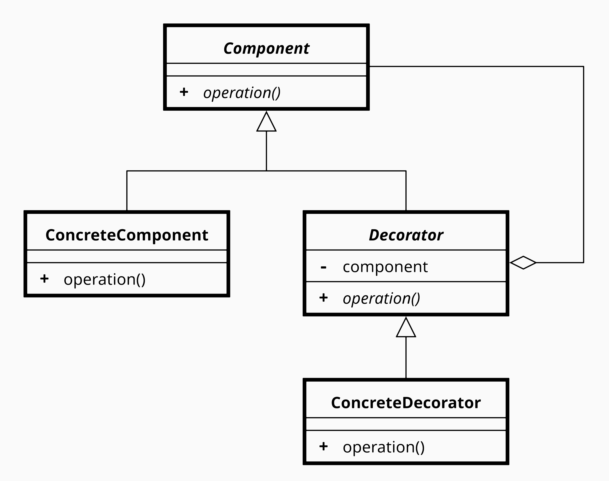

## [Design Patterns](../..)
### [Strutturali](..)
# Decorator

----

[](https://openjdk.org/projects/jdk/25/)
[](https://github.com/GiuCom/Design_Patterns/blob/main/LICENSE)<br>
<br>

## 🚀 Introduzione
L'obiettivo del pattern **Decorator** è evitare l'esplosione del numero di sottoclassi. In assenza del pattern, ogni combinazione di funzionalità richiederebbe una nuova classe derivata. Con il **Decorator**, invece, i comportamenti vengono composti a runtime in maniera modulare.


## 🏭 Caratteristiche
Il pattern Decorator si basa su una struttura a quattro componenti principali:

- **Component (Interfaccia o Classe Astratta):** Definisce l'interfaccia comune sia per gli oggetti originali che per i decoratori. Serve a rendere i due tipi intercambiabili.
- **Concrete Component:** La classe base che implementa l'interfaccia Component. È l'oggetto "semplice" a cui vogliamo aggiungere funzionalità.
- **Decorator (Classe Astratta):** Implementa l'interfaccia Component e contiene un riferimento (composizione) a un oggetto di tipo Component. Delega a quest'ultimo tutte le operazioni standard.
- **Concrete Decorator:** Le classi che estendono il Decorator astratto. Aggiungono effettivamente i nuovi comportamenti o stati, eseguendo la propria logica prima o dopo la chiamata all'oggetto originale.

In UML, è rappresentato:

<p align="center">
  <br/>
</p>

-----

### ESEMPIO
In questo progetto il pattern viene illustrato tramite un sistema di gestione dei messaggi. Un messaggio semplice può essere arricchito da decoratori che aggiungono:

1. una marcatura di **alta priorità**;
2. una **firma**;
3. una **cifratura Base64**.

<br>Vediamo le classi e interfacce da implementare:

**Messaggio.java** (Component)<br>
Definisce il contratto comune per tutti i componenti decorabili. Contiene il metodo `getContenuto()`.

```java
/**
 * Interfaccia Component del pattern Decorator.
 * Definisce il contratto comune dei messaggi decorabili.
 */
public interface Messaggio {
    String getContenuto();
}
```

**MessaggioSemplice.java** (ConcreteComponent)<br>
Rappresenta il messaggio base e restituisce il contenuto senza trasformazioni.

```java
/**
 * ConcreteComponent: rappresenta il messaggio di base,
 * privo di responsabilità aggiuntive.
 */
public class MessaggioSemplice implements Messaggio {
    private final String contenuto;

    public MessaggioSemplice(String contenuto) {
        this.contenuto = contenuto;
    }

    @Override
    public String getContenuto() {
        return contenuto;
    }
}
```

**MessaggioDecorator.java** (Decorator)<br>
Implementa la stessa interfaccia del componente e mantiene un riferimento all'oggetto decorato. Serve come base comune per tutti i decoratori concreti.

```java
/**
 * Decoratore astratto: incapsula un oggetto Messaggio
 * e consente ai decoratori concreti di delegare e arricchire il comportamento.
 */
public abstract class MessaggioDecorator implements Messaggio {
    protected final Messaggio messaggioDecorato;

    protected MessaggioDecorator(Messaggio messaggioDecorato) {
        this.messaggioDecorato = messaggioDecorato;
    }
}
```

**PrioritaAltaDecorator.java** (Concrete Decorator)<br>
Aggiunge il prefisso **[ALTA PRIORITÀ]** al messaggio. Il suo comportamento consiste nel delegare la richiesta al componente interno e anteporre la marcatura di urgenza.

```java
/**
 * Decoratore concreto che aggiunge una marcatura di alta priorità.
 */
public class PrioritaAltaDecorator extends MessaggioDecorator {

    public PrioritaAltaDecorator(Messaggio messaggioDecorato) {
        super(messaggioDecorato);
    }

    @Override
    public String getContenuto() {
        return "[ALTA PRIORITÀ] " + messaggioDecorato.getContenuto();
    }
}
```

**FirmaDecorator.java** (Concrete Decorator)<br>
Aggiunge una firma in fondo al messaggio, preceduta da `--`. È un decoratore utile per separare la responsabilità di firma dalla logica di base del componente.

```java
/**
 * Decoratore concreto che aggiunge una firma finale al messaggio.
 */
public class FirmaDecorator extends MessaggioDecorator {
    private final String firma;

    public FirmaDecorator(Messaggio messaggioDecorato, String firma) {
        super(messaggioDecorato);
        this.firma = firma;
    }

    @Override
    public String getContenuto() {
        return messaggioDecorato.getContenuto() + "\n-- " + firma;
    }
}
```

**CifraturaBase64Decorator.java** (Concrete Decorator)<br>
Trasforma l'intero contenuto del messaggio in Base64. Questo dimostra come un decoratore possa operare sul risultato già prodotto da altri decoratori.

```java
/**
 * Decoratore concreto che codifica il contenuto in Base64.
 */
public class CifraturaBase64Decorator extends MessaggioDecorator {

    public CifraturaBase64Decorator(Messaggio messaggioDecorato) {
        super(messaggioDecorato);
    }

    @Override
    public String getContenuto() {
        String testoOriginale = messaggioDecorato.getContenuto();
        return Base64.getEncoder().encodeToString(testoOriginale.getBytes(StandardCharsets.UTF_8));
    }
}
```

**DecoratorMain.java** (Client)<br>
Classe dimostrativa con un metodo `main` che costruisce una catena di decorazione completa e stampa il risultato finale.

```java
public class DecoratorMain {
    static void main() {
        Messaggio messaggio = new CifraturaBase64Decorator(
                new FirmaDecorator(
                        new PrioritaAltaDecorator(
                                new MessaggioSemplice("Intervento completato")
                        ),
                        "Giuseppe Compagno"
                )
        );

        System.out.println(messaggio.getContenuto());
    }
}
```

Pro (Vantaggi)
- **Flessibilità Dinamica:** Permette di aggiungere o rimuovere responsabilità a un oggetto durante l'esecuzione (runtime), offrendo molta più libertà rispetto all'ereditarietà, che è statica.
- **Rispetto del Principio Single Responsibility:** È possibile suddividere una classe complessa, che implementa molte varianti di un comportamento, in diverse classi più piccole e focalizzate su un'unica responsabilità.
- **Composizione vs Ereditarietà:** Evita l'esplosione del numero di sottoclassi. Invece di creare una sottoclasse per ogni combinazione possibile di funzionalità, si combinano diversi decoratori tra loro.
- **Trasparenza:** Poiché il decoratore implementa la stessa interfaccia dell'oggetto che decora, il codice che utilizza l'oggetto originale non ha bisogno di essere modificato.

Contro (Svantaggi)
- **Complessità del Codice:** L'uso eccessivo di piccoli oggetti (i decoratori) può rendere il sistema difficile da leggere e da sottoporre a debug per chi non ha familiarità con il pattern.
- **Ordine delle Decorazioni:** Se il comportamento del sistema dipende dall'ordine in cui i decoratori sono applicati, la gestione della sequenza può diventare complessa e soggetta a errori.
- **Identità dell'Oggetto:** Un oggetto decorato non è identico all'oggetto originale. Se il codice fa affidamento su test di identità (come `instaceof` o confronti diretti tra riferimenti), il pattern potrebbe introdurre problemi.
- **Configurazione Iniziale:** Configurare gli oggetti può essere verboso, poiché è necessario istanziare l'oggetto base e poi "incapsularlo" in una serie di decoratori (problema spesso risolto usando i pattern **Factory** o **Builder**).

----

## Test
Sviluppiamo tre casi di test che seguono la classica struttura **Arrange - Act - Assert**.

```java
public class DecoratorTest {

    @Test
    void deveRestituireIlContenutoOriginaleSenzaDecorator() {
        // Arrange
        Messaggio messaggio = new MessaggioSemplice("Intervento completato");

        // Act
        String risultato = messaggio.getContenuto();

        // Assert
        assertEquals("Intervento completato", risultato);
    }

    @Test
    void deveAggiungerePrioritaEFirma() {
        // Arrange
        Messaggio messaggio = new FirmaDecorator(
                new PrioritaAltaDecorator(
                        new MessaggioSemplice("Intervento completato")
                ),
                "Giuseppe Compagno"
        );

        // Act
        String risultato = messaggio.getContenuto();

        // Assert
        assertEquals("[ALTA PRIORITÀ] Intervento completato\n-- Giuseppe Compagno", risultato);
    }

    @Test
    void deveApplicareLaCifraturaSulContenutoGiaDecorato() {
        // Arrange
        Messaggio messaggio = new CifraturaBase64Decorator(
                new FirmaDecorator(
                        new MessaggioSemplice("Ticket chiuso"),
                        "Help Desk"
                )
        );

        String atteso = Base64.getEncoder()
                .encodeToString("Ticket chiuso\n-- Help Desk".getBytes(StandardCharsets.UTF_8));

        // Act
        String risultato = messaggio.getContenuto();

        // Assert
        assertEquals(atteso, risultato);
    }
}
```

### Test 1: `deveRestituireIlContenutoOriginaleSenzaDecorator`
- **Arrange**: viene creato un oggetto `MessaggioSemplice` con il testo `Intervento completato`.
- **Act**: si invoca `getContenuto()`.
- **Assert**: si verifica che il valore restituito coincida esattamente con il contenuto originale.

Questo test dimostra che il componente base è corretto anche in assenza di decoratori.

### Test 2: `deveAggiungerePrioritaEFirma`
- **Arrange**: si costruisce una catena composta da `MessaggioSemplice`, `PrioritaAltaDecorator` e `FirmaDecorator`.
- **Act**: si invoca `getContenuto()` sull'oggetto esterno.
- **Assert**: si verifica che il risultato sia `[ALTA PRIORITÀ] Intervento completato
-- Giuseppe Compagno`.

Questo test prova che i decoratori possono essere composti e che l'ordine di composizione produce il comportamento atteso.

### Test 3: `deveApplicareLaCifraturaSulContenutoGiaDecorato`
- **Arrange**: si crea un messaggio semplice, lo si firma e successivamente si applica il decoratore di cifratura Base64.
- **Act**: si invoca `getContenuto()`.
- **Assert**: si confronta il risultato con la codifica Base64 attesa calcolata nel test stesso.

Questo test dimostra che un decoratore trasformativo può essere applicato al risultato di una catena precedente senza modificare le classi originali.
