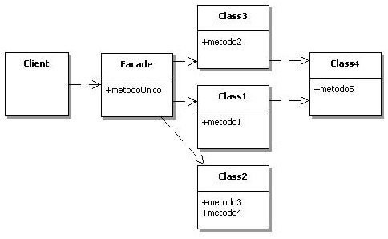

## [Design Patterns](../..)
### [Strutturali](..)
# Facade

----

[](https://openjdk.org/projects/jdk/25/)
[](https://github.com/GiuCom/Design_Patterns/blob/main/LICENSE)<br>
<br>

## 🚀 Introduzione
Il pattern **Facade** (Facciata) è un design pattern strutturale che fornisce un'interfaccia semplificata a un sistema complesso di classi, a una libreria o a un framework.
<br>Invece di interagire direttamente con decine di oggetti diversi, il client comunica con un'unica classe "facciata" che coordina le interazioni del sottosistema.

## 🏭 Caratteristiche
Semplifica l'utilizzo di un sistema complesso nascondendone la logica interna e riducendo le dipendenze tra il codice client e i sottosistemi.
<br>Gli obiettivo del pattern sono:

- **Semplificazione:** Ridurre la complessità percepita di un sistema.
- **Disaccoppiamento:** Isolare il codice client dalle complicazioni interne del sottosistema.
- **Punto di Ingresso:** Creare un punto d'accesso unico e chiaro.


In UML, è rappresentato:

<p align="center">
  <br/>
</p>

-----

### ESEMPIO
Immaginiamo un sistema di Home Theater complesso. 
<br>Per guardare un film, si deve:

- Accendere le luci e abbassarle.
- Accendere il proiettore.
- Abbassare lo schermo.
- Accendere l'amplificatore e impostare il volume.
- Far partire lo streaming.

La **HomeTheaterFacade** permetterà di fare tutto questo con un unico metodo `watchMovie()`.

**Lights.java** (Class)<br>
Rappresenta l'hardware delle luci domotiche. È responsabile dello stato fisico dell'ambiente.

- **Responsabilità:** Accensione, spegnimento e regolazione dell'intensità (dimmer).
- **Logica Interna:** Gestisce valori interi (0-100) per la luminosità.

```java
// Sottosistema Luci
public class Lights {
    public void dim(int level) { System.out.printf("💡 Luci: Regolate al %d%%%n", level); }
    public void on() { System.out.println("💡 Luci: Accese (Piena intensità)"); }
}
```

**Projector.java** (Class)<br>
Rappresenta il dispositivo di output visivo.

- **Responsabilità:** Gestire l'alimentazione e la selezione della sorgente video (es. HDMI1, Netflix App, Console).
- **Metodi chiave:** `setInput(String input)` e `wideScreenMode()`.
- **Relazione:** Il proiettore dipende da una sorgente dati, ma non sa chi gliela fornisce (la Facciata si occuperà di collegarlo allo Streaming).

```java
// Sottosistema Proiettore
public class Projector {
    public void powerOn() { System.out.println("🎥 Proiettore: Avvio sistema..."); }
    public void setInput(String source) { System.out.println("🎥 Proiettore: Input -> " + source); }
    public void off() { System.out.println("🎥 Proiettore: Spegnimento."); }
}
```

**SoundSystem.java** (Class)<br>
È il modulo che controlla l'amplificatore e le casse.

- **Responsabilità:** Controllo del volume, attivazione del Surround e configurazione dell'equalizzatore.
- **Dettaglio Tecnico:** Spesso richiede una configurazione sequenziale (Accendi -> Imposta Input -> Imposta Volume) per evitare sbalzi di tensione o rumori improvvisi nelle casse.

```java
// Sottosistema Audio
public class SoundSystem {
    public void start() { System.out.println("🔊 Audio: Amplificatore pronto."); }
    public void setVolume(int level) { System.out.println("🔊 Audio: Volume fissato a " + level); }
}
```

**StreamingService.java** (Class)<br>
Rappresenta il software o il dispositivo che fornisce il flusso dati (es. un lettore Blu-ray o un'app di streaming).

- Responsabilità: Ricerca del titolo, buffering e riproduzione.

Questa classe restituisca un **MovieStatus** (un record) per monitorare il progresso.

```java
// Sottosistema Streaming con Pattern Matching
public class StreamingService {
    public void startStream(Object content) {
        // Java 25 Pattern Matching per switch con gestione null-safe
        switch (content) {
            case Movie m -> System.out.println("""
                    🎬 Streaming: Riproduzione in corso...
                       Film:    %s (%d)
                       Qualità: %s
                    """.formatted(m.title(), m.year(), m.quality()));
            case String s -> System.out.println("🎬 Streaming: Avvio rapido titolo: " + s);
            case null -> throw new IllegalArgumentException("Contenuto nullo!");
            default -> System.out.println("⚠️ Formato non supportato.");
        }
    }
}
```

**Movie.java** (Class)<br>
Il record Movie è uno degli elementi più moderni ed eleganti introdotti in Java (standardizzato nella versione 16 e ulteriormente rifinito fino alla 25) per eliminare il cosiddetto "codice boilerplate" (codice ripetitivo).
<br>Nel pattern Facade, il record funge da Data Transfer Object (DTO).
<br>Il record crea tre campi **private final**: `title`, `year` e `quality`. Essendo `final`, l'oggetto è immutabile per design. Una volta creato un oggetto **Movie**, i suoi dati non possono più essere modificati, garantendo **thread-safety** e coerenza dei dati in tutto il sistema Home Theater.
<br>A differenza dei classici JavaBean che usano `getTitle()`, i record usano il nome del campo come metodo:

- `movie.title()`
- `movie.year()`
- `movie.quality()`

Il compilatore implementa automaticamente i metodi (`equals`, `hashCode`, `toString`) basandosi sui componenti del record. Questo è fondamentale per i test unitari: due record **Movie** con gli stessi dati saranno considerati uguali (`equals() == true`), facilitando enormemente le asserzioni.


```java
// Record per i dati del film - Immutabilità garantita
public record Movie(String title, int year, String quality) {}
```

**HomeTheater.java** (Facade)<br>
La classe **HomeTheaterFacade** orchestra i componenti precedenti.
<br>Punto unico di accesso che incapsula la complessità dell'ordine di accensione dei dispositivi.

```java
public class HomeTheater {
    private final Lights lights;
    private final Projector projector;
    private final SoundSystem sound;
    private final StreamingService streaming;

    public HomeTheaterFacade(Lights l, Projector p, SoundSystem s, StreamingService st) {
        this.lights = l;
        this.projector = p;
        this.sound = s;
        this.streaming = st;
    }

    /**
     * Semplifica un processo di 6 step in un'unica chiamata.
     */
    public void watchMovie(String title) {
        System.out.println("\n🍿 Preparazione serata cinema...");

        lights.dim(15);
        projector.powerOn();
        projector.setInput("Ultra-HD Stream");
        sound.start();
        sound.setVolume(20);

        // Creazione record immediata
        var movie = new Movie(title, 2026, "4K Dolby Vision");
        streaming.startStream(movie);

        System.out.println("✅ Tutto pronto. Buona visione!\n");
    }

    public void stopMovie() {
        System.out.println("\nCleaning up...");
        projector.off();
        lights.on();
    }
}
```

Il pattern Facade è uno dei più amati per la sua capacità di portare ordine nel caos di un sistema complesso. Tuttavia, come ogni strumento di design, non è una "bacchetta magica" e presenta dei compromessi.

Pro (Vantaggi)
- **Isolamento dalla Complessità:** Il vantaggio principale è la semplicificazione. Il client non deve conoscere le decine di metodi di **Projector**, **SoundSystem** o **StreamingService**. Deve solo sapere che esiste un metodo `watchMovie()`. L'uso dei **Records** all'interno del pattern rende lo scambio di dati ancora più pulito e meno propenso a errori.
- **Disaccoppiamento (Low Coupling):** Se si sostituisce il sottosistema di Streaming con una nuova tecnologia (es. passare da un server locale a una API cloud), si deve modificare solo la classe **HomeTheater** (Facade). Il codice del `main` (Client) rimane intatto.
- **Sicurezza e Controllo:** La classe **HomeTheater** (Facade) funge da "guardiano". Impedisce ai programmatori meno esperti di chiamare i metodi del sottosistema di classi nell'ordine sbagliato (ad esempio, far partire l'audio prima di aver acceso l'amplificatore), evitando bug difficili da tracciare.
- **Punto di Ingresso Unico:** In architetture a microservizi o moduli (JPMS), il pattern **Facade** definisce chiaramente qual è l'interfaccia pubblica del modulo, nascondendo tutto ciò che è implementazione interna.

Contro (Svantaggi)
- **Rischio "God Object" (Classe Onnipotente):** Il rischio maggiore è che la classe **HomeTheater** (Facade) diventi una classe troppo grande che conosce troppe cose e fa troppo. Se non viene gestita bene, finisce per essere accoppiata con ogni singola classe del sistema, diventando difficile da mantenere.
In questo caso una soluzione applicabile è dividere la classe in più "Facciate" specializzate (es. **HomeTheaterVideo**, **HomeTheaterAudio**).
- **Limitazione della Flessibilità per utenti esperti:** Un utente "Power User" potrebbe aver bisogno di una configurazione specifica che la classe **HomeTheater** (Facade) non espone (es. cambiare solo l'equalizzazione dell'audio senza spegnere le luci).
Il pattern non impedisce di accedere direttamente ai sottosistemi (Class), ma se lo si fa troppo spesso, l'utilità della classe **HomeTheater** (Facade) svanisce.
- **Manutenzione Duplicata:** Ogni volta che si aggiunge una funzionalità fondamentale a un sottosistema (Class), si deve aggiornare anche la classe **HomeTheater** (Facade) per esporre quella nuova funzione, aggiungendo un passaggio in più nello sviluppo.

Quando usarlo?
- Quando vuoi fornire un'interfaccia semplice a un sistema complesso.
- Quando ci sono molte dipendenze tra i client e le classi che implementano un'astrazione.
- Quando si vuole stratificare i sottosistemi (usando la classe **HomeTheater** (Facade) come punto di ingresso per ogni livello).

----

## Test
I test verificano che la classe **HomeTheater** (Facade) non fallisca durante l'orchestrazione.

```java
@DisplayName("Test del Pattern Facade")
class FacadeTest {

    private HomeTheaterFacade facade;

    @BeforeEach
    void init() {
        facade = new HomeTheaterFacade(
                new Lights(),
                new Projector(),
                new SoundSystem(),
                new StreamingService()
        );
    }

    @Test
    @DisplayName("Il processo watchMovie deve completarsi senza eccezioni")
    void testWatchMovieSuccess() {
        assertDoesNotThrow(() -> facade.watchMovie("Interstellar"),
                "La facciata dovrebbe coordinare i sottosistemi senza errori.");
    }

    @Test
    @DisplayName("Verifica gestione dei tipi tramite Facade")
    void testStreamingTypeHandling() {
        StreamingService service = new StreamingService();
        // Test del pattern matching interno al sottosistema
        assertDoesNotThrow(() -> service.startStream("Titolo Stringa"));
        assertThrows(IllegalArgumentException.class, () -> service.startStream(null));
    }
}
```

- **Il Ciclo di Vita (@BeforeEach):** Ogni test deve partire da uno stato "pulito". Inizializziamo la Facade iniettando le dipendenze. In un ambiente professionale, qui useresti una libreria come Mockito per creare dei "finti" (Mock) sottosistemi e verificare che projector.powerOn() venga effettivamente chiamato quando l'utente preme watchMovie().
- **L'Asserzione di Flusso (assertDoesNotThrow):** Poiché la Facade è un orchestratore, il test più semplice ma vitale è assicurarsi che la "catena di montaggio" dei metodi non si rompa. Se un sottosistema cambia firma o lancia un'eccezione, questo test fallirà immediatamente.
- **Validazione dei Dati (assertAll):** Testiamo il record Movie. Essendo immutabile per definizione (caratteristica core di Java 25), verifichiamo che i dati passati alla Facade arrivino integri al sottosistema di streaming. assertAll è utile perché esegue tutte le verifiche anche se la prima fallisce, dandoci un report completo.
- **Test del Pattern Matching:** Il test testStreamingNullContent è cruciale per la versione Java 25. Verifica che la clausola case null all'interno dello switch dello StreamingService funzioni correttamente, lanciando l'eccezione prevista invece di un generico e pericoloso NullPointerException.

Senza test, la classe **HomeTheater** (Facade) può risultare fragile. Se qualcuno modifica il SoundSystem cambiando il volume massimo da 100 a 10, e la classe **HomeTheater** (Facade) continua a impostare 20, il sistema potrebbe comportarsi in modo anomalo. I test unitari garantiscono che il contratto semplificato offerto dalla classe **HomeTheater** (Facade) sia sempre rispettato, indipendentemente da quanto diventino complessi i sottosistemi "sotto il cofano".