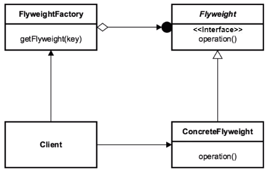

## [Design Patterns](../..)
### [Strutturali](..)
# Flyweight

----

[](https://openjdk.org/projects/jdk/25/)
[](https://github.com/GiuCom/Design_Patterns/blob/main/LICENSE)<br>
<br>

## 🚀 Introduzione
Il **Flyweight** (Peso Leggero) è un design pattern strutturale il cui obiettivo primario è la minimizzazione dell'utilizzo di memoria mediante la condivisione del maggior numero possibile di dati con oggetti simili.
<br>In contesti applicativi dove è necessaria la creazione di un numero elevato di oggetti (nell'ordine delle migliaia o milioni), il consumo di RAM può diventare proibitivo. Il pattern **Flyweight** risolve il problema scindendo lo stato di un oggetto in due categorie:

- **Intrinsic state (Stato Intrinseco):** Informazioni costanti, indipendenti dal contesto e condivisibili tra contesti diversi (es. il codice di un carattere, il colore di una texture).
- **Extrinsic state (Stato Estrinseco):** Informazioni variabili che dipendono dal contesto e non possono essere condivise (es. le coordinate x,y di un oggetto sullo schermo).

## 🏭 Caratteristiche
L'architettura si basa su tre componenti fondamentali:

- **Flyweight Interface (Interfaccia):** Definisce i metodi che accettano lo stato estrinseco.
- **Concrete Flyweight:** Implementa l'interfaccia e memorizza lo stato intrinseco.
- **Flyweight Factory:** Gestisce il pool di oggetti condivisi, garantendo che ogni stato intrinseco univoco corrisponda a una sola istanza.
- **UnsharedFlyweight (facoltativo):** Rappresenta oggetti **flyweight** che non condividono lo stato con altri. Non è strettamente necessario, ma è utile per chiarire differenze tra oggetti condivisi e non.
- **Client (Forest/Client):** Utilizza la classe **Flyweight Factory** per creare e gestire oggetti, associando a ognuno i propri dati.

In UML, è rappresentato:

<p align="center">
  <br/>
</p>

-----

### ESEMPIO
Si simula una foresta con migliaia di alberi. Ogni albero ha un tipo condiviso (intrinseco): specie, colore, texture (TreeType).
Ha anche uno stato estrinseco: coordinate (x, y) e potenzialmente altezza o dimensioni specifiche per quel posizionamento.
Un oggetto della classe **Flyweight Factory** gestisce il pool di TreeType, restituendo sempre lo stesso oggetto per una combinazione intrinseca identica.
<br>Questo approccio permette di creare foreste molto più grandi senza esaurire la memoria, perché i TreeType (intrinseci) vengono riutilizzati anziché duplicati per ogni albero.

**Flyweight.java** (Interfaccia)<br>
- **Responsabilità:** definire l’operazione condivisa tra gli oggetti **flyweight**. In questo esempio, un metodo `disegna` che accetta coordinate estrinseche.
- **Stato:** nessuno, è un contratto che gli oggetti **flyweight** concreti devono implementare.
- **Metodi principali:** `void disegna(int x, int y)`

```java
public interface Flyweight {
  void disegna(int x, int y);
}
```

**AlberoDefinizione.java** (ConcreteFlyweight)<br>
- **Responsabilità:** rappresentare lo stato intrinseco condiviso tra oggetti **Flyweight**. Contiene nome/specie, colore e texture.
- **Stato intrinseco:** `nome` (es. "Quercia"), `colore` (es. "Verde"), `texture` (es. "Ruvida")
- **Metodi principali:** 
  - `AlberoDefinizione(String nome, String colore, String texture)` 
  - `void disegna(int x, int y)`
- **Metodi di accesso:** 
  - getters per `nome`, `colore`, `texture` (se necessario)

```java
/**
 * ConcreteFlyweight che contiene lo stato intrinseco condiviso tra alberi.
 */
public class AlberoDefinizione implements Flyweight {
  private final String nome;
  private final String colore;
  private final String texture;

  public AlberoDefinizione(String nome, String colore, String texture) {
    this.nome = nome;
    this.colore = colore;
    this.texture = texture;
  }

  @Override
  public void disegna(int x, int y) {
    System.out.println("Disegno albero di tipo " + nome +
            " in posizione [" + x + ", " + y + "] colore=" + colore +
            " texture=" + texture);
  }

  public String getNome() {
    return nome;
  }

  public String getColore() {
    return colore;
  }

  public String getTexture() {
    return texture;
  }
}
```

**FlyweightFactory.java** (Flyweight Factory)<br>
- Responsabilità: fornire oggetti **Albero** condivisi in base a chiavi che rappresentano lo stato intrinseco. Gestisce un pool (mappa) ed evita duplicati.
- Stato: variabile `Map<String, AlberoDefinizione> pool`
- Metodi principali: 
    - `AlberoDefinizione getAlberoDefinizione(String nome, String colore, String texture)`
    - `int getPoolSize()`

```java
public class FlyweightFactory {
  private final Map<String, AlberoDefinizione> pool = new HashMap<>();

  public AlberoDefinizione getAlberoDefinizione(String nome, String colore, String texture) {
    String key = nome + "|" + colore + "|" + texture;
    AlberoDefinizione type = pool.get(key);
    if (type == null) {
      type = new AlberoDefinizione(nome, colore, texture);
      pool.put(key, type);
    }
    return type;
  }

  public int getPoolSize() {
    return pool.size();
  }
}
```

**Albero.java**<br>
Utilizziamo i Record
- **Responsabilità:** rappresenta un singolo albero con stato estrinseco (x, y) associato a un AlberoDefinizione (flyweight).
- **Stato:** 
  - `x`, `y` (estrinseco), 
  - `tipoDiAlbero` (AlberoDefinizione)
- **Metodi principali:** 
  - `Albero(int x, int y, AlberoDefinizione tipoDiAlbero)`, 
  - `void disegna()`, 
  - i getters creati in automatico dal Record


```java
public record Albero(int x, int y, AlberoDefinizione tipoDiAlbero) {

  public void disegna() {
    tipoDiAlbero.disegna(x, y);
  }
}
```

**Foresta.java** (Client)<br>
- **Responsabilità:** esempio di client che utilizza FlyweightFactory per creare e gestire una collezione di Tree, dimostrando la condivisione.
- **Stato:** factory: FlyweightFactory, trees: List
- **Metodi principali:** Foresta(FlyweightFactory factory), void plantTree(int x, int y, String name, String color, String texture), void draw(), List getTrees()

```java
public class Foresta {
  private final FlyweightFactory factory;
  private final List<Albero> alberi = new ArrayList<>();

  public Foresta(FlyweightFactory factory) {
    this.factory = factory;
  }

  public void inserisciAlbero(int x, int y, String nome, String colore, String texture) {
    AlberoDefinizione tipoDiAlbero = factory.getAlberoDefinizione(nome, colore, texture);
    alberi.add(new Albero(x, y, tipoDiAlbero));
  }

  public void disegna() {
    for (Albero a : alberi) {
      a.disegna();
    }
  }

  public List<Albero> getAlberi() {
    return alberi;
  }
}
```

**FlyweightMain.java** (Main)<br>
L’output di esecuzione sarà qualcosa tipo:
- Disegno albero di tipo Quercia in posizione [0, 0] colore=Verde texture=Ruvida
- Disegno albero di tipo Quercia in posizione [5, 10] colore=Verde texture=Ruvida
- Disegno albero di tipo Acero in posizione [3, 12] colore=Rosso texture=Liscia

```java
public class FlyweightMain {
  static void main() {
    FlyweightFactory factory = new FlyweightFactory();

    Foresta foresta = new Foresta(factory);
    // Pianta alberi con testo in italiano
    foresta.inserisciAlbero(0, 0, "Quercia", "Verde", "Ruvida");
    foresta.inserisciAlbero(5, 10, "Quercia", "Verde", "Ruvida"); // condiviso
    foresta.inserisciAlbero(3, 12, "Acero", "Rosso", "Liscia");

    foresta.disegna();
  }
}
```

Il pattern **Flyweight** è una soluzione chirurgica per l’ottimizzazione della memoria. Si basa sulla separazione tra lo stato intrinseco (dati costanti e condivisibili, come il colore o il nome di una specie di albero) e lo stato estrinseco (dati variabili e unici, come le coordinate X e Y di ogni singolo albero).

**Pro (Vantaggi)**
- **Risparmio drastico di memoria:** È il vantaggio principale. Riducendo il numero di oggetti fisici in RAM, permette di gestire migliaia (o milioni) di elementi che altrimenti causerebbero un `OutOfMemoryError`.
- **Centralizzazione dei dati comuni:** Se devi cambiare una proprietà "intrinseca" (es. cambiare il colore di tutte le "Querce" da Verde a Marrone), puoi farlo in un unico oggetto condiviso.
- **Migliori performance di caching:** Poiché gli oggetti condivisi sono pochi, è più probabile che rimangano nella cache del processore, migliorando la velocità di accesso ai dati comuni.

**Contro (Svantaggi)**
- **Complessità del codice:** Introduce una struttura più articolata (**Factory**, gestione degli stati, `pool` di oggetti), rendendo il sistema più difficile da leggere e manutenere per chi non conosce il pattern.
- **Overhead di CPU:** Calcolare lo stato estrinseco o passarlo come parametro ogni volta che si chiama un metodo (es. `disegna(x, y)`) può consumare cicli di CPU extra rispetto ad avere tutto pronto dentro l'oggetto.
- **Problemi con il Multi-threading:** Se gli oggetti **Flyweight** non sono rigorosamente immutabili, la condivisione tra thread diversi può causare gravi bug di concorrenza.

**Quando usarlo**
<br>Il pattern **Flyweight** non va usato "per default", ma solo quando si verificano contemporaneamente queste condizioni:
- **Quantità massiccia di oggetti:** L'applicazione deve creare un numero di oggetti talmente elevato da saturare la memoria RAM.
- **Stati ripetitivi:** Gran parte dello stato di questi oggetti può essere estratto e condiviso.
- **L'identità dell'oggetto non è cruciale:** Se il software non ha bisogno di distinguere tra due istanze "identiche" tramite il loro indirizzo di memoria (puntatore), ma solo tramite il loro contenuto.

----

## Test
Dimostra che il sistema è in grado di gestire migliaia di alberi (potenzialmente) salvando in memoria solo poche definizioni di specie, mantenendo però l'individualità della posizione di ogni albero.

```java
public class FlyweightTest {

    // ---------------------------------------
    // Test della classe FlyweightFactory.java
    // ---------------------------------------
    @Test
    void testCondivisioneTipiIntrinseci() {
        FlyweightFactory factory = new FlyweightFactory();
        Foresta foresta = new Foresta(factory);

        // Pianta alberi con tipi identici (stato intrinseco identico)
        foresta.inserisciAlbero(0, 0, "Quercia", "Verde", "Ruvida");
        foresta.inserisciAlbero(5, 10, "Quercia", "Verde", "Ruvida");
        // Pianta un albero con tipo differente
        foresta.inserisciAlbero(3, 12, "Acero", "Rosso", "Liscia");

        // Ci si aspetta due tipi intrinseci condivisi
        assertEquals(2, factory.getPoolSize(), "Il numero di TreeType creati nel pool dovrebbe essere 2");

        // Verifica che i primi due alberi condividano lo stesso TreeType
        Albero a1 = foresta.getAlberi().get(0);
        Albero a2 = foresta.getAlberi().get(1);
        assertSame(a1.tipoDiAlbero(), a2.tipoDiAlbero(), "I due alberi con lo stesso stato intrinseco dovrebbero condividere lo stesso TreeType");
    }

    // -----------------------------
    // Test della classe Albero.java
    // -----------------------------
    @Test
    void disegnoRiceveInformazioniIntrinseche() {
        AlberoDefinizione alberoDefinizione = new AlberoDefinizione("Quercia", "Verde", "Ruvida");
        Albero albero = new Albero(7, 9, alberoDefinizione);

        // Reindirizza l'output standard per catturare la stampa
        ByteArrayOutputStream out = new ByteArrayOutputStream();
        PrintStream originalOut = System.out;
        System.setOut(new PrintStream(out));

        albero.disegna();

        // Ripristina l'output originale
        System.setOut(originalOut);

        String printed = out.toString();
        assertTrue(printed.contains("Quercia"));
        assertTrue(printed.contains("Verde"));
        assertTrue(printed.contains("Ruvida"));
        // Controlla che la posizione sia presente
        assertTrue(printed.contains("[7, 9]"));
    }

    // ------------------------------
    // Test della classe Foresta.java
    // ------------------------------
    @Test
    void forestaCondivisioneEOutput() {
        FlyweightFactory factory = new FlyweightFactory();
        Foresta foresta = new Foresta(factory);

        foresta.inserisciAlbero(0, 0, "Quercia", "Verde", "Ruvida");
        foresta.inserisciAlbero(5, 10, "Quercia", "Verde", "Ruvida");
        foresta.inserisciAlbero(3, 12, "Acero", "Rosso", "Liscia");

        // Cattura output
        ByteArrayOutputStream out = new ByteArrayOutputStream();
        PrintStream originalOut = System.out;
        System.setOut(new PrintStream(out));

        foresta.disegna();

        System.setOut(originalOut);

        String printed = out.toString();
        assertTrue(printed.contains("Disegno albero di tipo Quercia"));
        assertTrue(printed.contains("Disegno albero di tipo Acero"));
        // Verifica pool
        assertEquals(2, factory.getPoolSize(), "Il pool dovrebbe contenere esattamente 2 TreeType");
    }
}
```

Ecco una descrizione accurata dei tre test principali:
1. **Verifica della Condivisione (FlyweightFactory)**
   <br>Il test `testCondivisioneTipiIntrinseci` si concentra sul cuore del pattern, **la gestione della memoria**.
   - **Cosa fa:** Inserisce tre alberi nella foresta. Due hanno caratteristiche identiche (Quercia, Verde, Ruvida), il terzo è diverso (Acero).
   - **Obiettivo:** Dimostrare che la classe **FlyweightFactory** non crea duplicati inutili.
   - **Risultato atteso:** Il pool deve contenere solo 2 oggetti (uno per la Quercia e uno per l'Acero). Il test usa `assertSame` per confermare che i primi due alberi puntino esattamente alla stessa istanza di memoria per il loro "tipo".

2. **Verifica dello Stato Estrinseco (Albero)**
   Il test `disegnoRiceveInformazioniIntrinseche` analizza come l'oggetto "leggero" (l'albero) combina i suoi dati.
   - **Cosa fa:** Crea un singolo albero in una posizione specifica (7, 9) e cattura l'output della console durante l'esecuzione del metodo `disegna()`.
   - **Obiettivo:** Verificare che l'albero sia in grado di unire correttamente lo stato intrinseco (condiviso: nome, colore, texture) con lo stato estrinseco (unico: le coordinate x, y).
   - **Risultato atteso:** La stampa a video deve contenere sia i dettagli della specie che le coordinate spaziali corrette.

3. **Test d'Integrazione (Foresta)**
   Il test `forestaCondivisioneEOutput` valida il sistema nel suo complesso.
   - **Cosa fa:** Popola una foresta e invoca il metodo di rendering collettivo `disegna()`.
   - **Obiettivo:** Assicurarsi che la classe **Foresta** coordini correttamente la factory e gli oggetti albero, garantendo sia l'efficienza del `pool` che la correttezza del comportamento finale (output visivo).
   - **Risultato atteso:** Conferma finale che il `pool` resti di dimensioni ridotte e che tutti i tipi di alberi vengano effettivamente "disegnati".