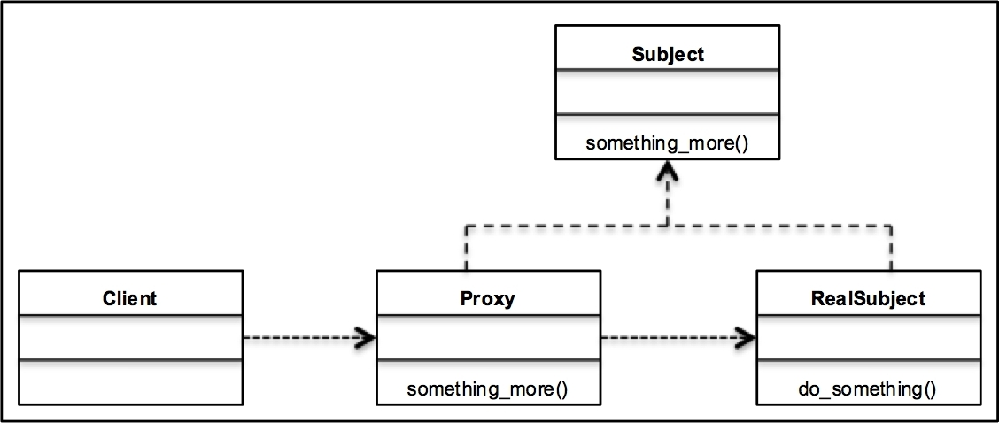

## [Design Patterns](../..)
### [Strutturali](..)
# Proxy

----

[](https://openjdk.org/projects/jdk/25/)
[](https://github.com/GiuCom/Design_Patterns/blob/main/LICENSE)<br>
<br>

## 🚀 Introduzione
Il pattern **Proxy** (Delegato) è un design pattern strutturale il cui obiettivo primario è fornire un surrogato o un segnaposto per un altro oggetto, al fine di controllarne l'accesso. Il pattern agisce come un intermediario, permettendo di eseguire operazioni aggiuntive (come il controllo dei permessi, il caricamento pigro o la registrazione di log) prima o dopo che la richiesta raggiunga l'oggetto reale.

## 🏭 Caratteristiche
La caratteristica fondamentale del pattern **Proxy** è **l'interposizione**. Esso agisce come un intermediario (o "surrogato") che si posiziona tra il client e l'oggetto reale, mantenendo la stessa interfaccia di quest'ultimo.
A differenza di altri pattern, la sua particolarità risiede nel controllo dell'accesso, che si manifesta in tre modi principali:
- **Controllo del Ciclo di Vita (Lazy Initialization):** L'oggetto reale ("pesante") viene creato solo nel momento in cui è effettivamente necessario (Virtual Proxy).
- **Controllo dei Permessi (Access Control):** Verifica se il mittente della richiesta ha le autorizzazioni necessarie per interagire con l'oggetto reale (Protection Proxy).
- **Trasparenza:** Il client non si accorge di parlare con un Proxy anziché con l'oggetto reale, poiché entrambi implementano la stessa interfaccia.
- **Remote Proxy (conosciuto anche come Ambassador)**: Ha come caratteristica distintiva la gestione della comunicazione tra oggetti situati in spazi di indirizzamento differenti (ad esempio, un client sul tuo PC e un oggetto su un server remoto).

In sintesi, la caratteristica distintiva è che il **Proxy** non aggiunge nuove funzionalità (come farebbe un **Decorator**), ma gestisce come e quando si accede a quelle esistenti.

Il pattern **Proxy** si rappresenta in UML attraverso un diagramma delle classi che evidenzia l'identità di interfaccia tra il **Proxy** e l'Oggetto Reale.
Ecco i componenti chiave del diagramma:

- **Subject (Soggetto) [Interfaccia]:** Definisce l'interfaccia comune. Sia la classe **Proxy** che **RealSubject** la implementano. Questo permette al client di usare l'oggeto **Proxy** al posto dell'oggetto reale.
- **RealSubject (Soggetto Reale):** La classe che contiene la logica di business reale (l'oggetto "pesante" o "remoto").
- **Proxy:** La classe intermediaria. Implementa l'interfaccia **Subject** e mantiene un riferimento (associazione) verso il **RealSubject**.
- **Client:** Interagisce con la classe **Subject** (senza sapere se sia una classe **Proxy** o **RealSubject**).

Relazioni UML
- **Realizzazione (Linea tratteggiata con freccia vuota):** Sia la classe **Proxy** che **RealSubject** puntano alla classe **Subject**.
- **Associazione (Linea continua con freccia semplice):** La classe **Proxy** ha un attributo di tipo **RealSubject**. Questa è la relazione fondamentale che permette alla classe **Proxy** di delegare le chiamate.
- **Dipendenza (Linea tratteggiata con freccia semplice):** Il **Client** punta a **Subject**.

In UML, è rappresentato:

<p align="center">
  <br/>
</p>

-----

### ESEMPIO
L'esempio seguente illustra un Virtual Proxy applicato a un sistema di caricamento di immagini ad alta risoluzione. In Java 25, sfruttiamo i moduli e la gestione avanzata della memoria per ottimizzare l'esecuzione.

**Immagine.java** (Subject) [Interfaccia]<br>
È il contratto formale che definisce le operazioni disponibili.
- **Ruolo:** Garantisce il polimorfismo. Permette alla classe **Proxy** e all'Oggetto Reale di essere intercambiabili agli occhi del Client.
- **Dettaglio Tecnico:** Definiamo questa interfaccia per astrarre il comportamento del metodo `visualizza()`. Senza questa interfaccia, il Client dovrebbe conoscere la classe concreta, rompendo il principio di disaccoppiamento.

```java
public interface Immagine {
    void visualizza();
}
```

**ImmagineReale.java** (Real Subject)<br>
È la classe che contiene la logica di business costosa o critica.
- **Ruolo:** Rappresenta l'oggetto "pesante" (es. un file 4K da caricare in RAM o una connessione a un database).
- **Dettaglio Tecnico:**
  - Possiede un attributo `nomeFile`.
  - Il suo costruttore esegue l'operazione critica (`caricaDaDisco()`). Questo è il motivo per cui vogliamo evitarne l'istanziazione non necessaria.
  - Implementa `visualizza()` eseguendo l'azione reale richiesta dal Client.

```java
public class ImmagineReale implements Immagine {
    private final String nomeFile;

    public ImmagineReale(String nomeFile) {
        this.nomeFile = nomeFile;
        caricaDaDisco();
    }

    private void caricaDaDisco() {
        System.out.println("Operazione pesante: Caricamento di " + nomeFile + " dal disco...");
    }

    @Override
    public void visualizza() {
        System.out.println("Visualizzazione dell'immagine: " + nomeFile);
    }
}
```

**ProxyImmagine.java** (Proxy)<br>
È l'intermediario "intelligente" che controlla l'accesso all'oggetto reale.
- **Ruolo:** Implementa la **Lazy Initialization** (Inizializzazione Pigra).
- **Dettaglio Tecnico:**
  - **Riferimento Interno:** Mantiene una variabile di istanza di tipo ImmagineReale, inizialmente impostata a null.
  - **Logica di Controllo:** Nel metodo `visualizza()`, il Proxy esegue un controllo: *"L'oggetto reale esiste già?"*.
    - Se no, lo istanzia in quel momento (pagando il costo del caricamento solo se serve).
    - Se sì, riutilizza l'istanza esistente.
  - **Delega:** Dopo il controllo, chiama il metodo `visualizza()` sull'oggetto reale.

```java
public class ProxyImmagine implements Immagine {
    private final String nomeFile;
    private ImmagineReale immagineReale; // Riferimento all'oggetto reale

    public ProxyImmagine(String nomeFile) {
        this.nomeFile = nomeFile;
    }

    @Override
    public void visualizza() {
        // Lazy Initialization: l'oggetto reale viene creato solo qui
        if (immagineReale == null) {
            immagineReale = new ImmagineReale(nomeFile);
        }
        immagineReale.visualizza();
    }
}
```

**ProxyMain.java** (Client)<br>
È il punto di ingresso dell'applicazione che utilizza il pattern.
- **Ruolo:** Configura il sistema e richiede l'esecuzione dei servizi.
- **Dettaglio Tecnico:**
  - Dichiara una variabile di tipo interfaccia (Immagine) ma le assegna un'istanza di **ProxyImmagine**.
  - Innesca la catena di chiamate. Grazie al Proxy, il Main non causa il caricamento del file finché non invoca esplicitamente `visualizza()`.

```java
public class ProxyMain {
    static void main() {
        // Creiamo il Proxy invece dell'oggetto reale.
        // In questo momento, l'immagine "pesante" NON è ancora caricata in memoria.
        Immagine immagine = new ProxyImmagine("progetto_architettonico_4K.png");

        System.out.println("--- Stato: Proxy creato, oggetto reale non ancora istanziato ---");

        // Prima chiamata: il Proxy si accorge che l'oggetto reale manca,
        // lo crea (caricamento pesante) e poi delega la visualizzazione.
        System.out.println("\n[Esecuzione] Richiesta di visualizzazione n. 1:");
        immagine.visualizza();

        // Seconda chiamata: il Proxy ha già il riferimento all'oggetto reale,
        // quindi non esegue più il caricamento ma delega direttamente.
        System.out.println("\n[Esecuzione] Richiesta di visualizzazione n. 2:");
        immagine.visualizza();

        System.out.println("\n--- Operazione completata ---");
    }
}
```

Il pattern **Proxy** è uno strumento potente per gestire il controllo e l'ottimizzazione degli accessi, ma introduce un livello di astrazione che va valutato con attenzione.

**Pro (Vantaggi)**
- Controllo dell'Accesso (Sicurezza): Permette di gestire i permessi (chi può fare cosa) senza modificare la logica dell'oggetto reale.
- Ottimizzazione delle Risorse (Lazy Loading): Consente di ritardare l'inizializzazione di oggetti pesanti o costosi solo al momento del bisogno, risparmiando memoria e CPU all'avvio dell'app.
- Gestione Remota: Nasconde la complessità della rete (marshalling, protocolli, latenza), facendo sembrare un oggetto remoto come se fosse locale.
- Trasparenza (Open/Closed Principle): È possibile introdurre nuovi proxy (per log, cache o monitoraggio) senza dover modificare il codice del client o dell'oggetto reale.
- Lifecycle Management: Il proxy può gestire il ciclo di vita dell'oggetto reale (creazione, distruzione, pulizia risorse) in modo autonomo.

**Contro (Svantaggi)**
- Latenza: L'introduzione di un intermediario aggiunge un passaggio in più nella catena di chiamate, il che può causare un leggero ritardo (specialmente critico in sistemi real-time).
- Complessità del Codice: Aumenta il numero di classi e interfacce nel sistema, rendendo il design più articolato da navigare per nuovi sviluppatori.
- Risposta Ritardata: Nel caso del Virtual Proxy, la prima chiamata potrebbe apparire molto lenta all'utente finale (perché l'oggetto viene creato in quel momento), causando un'esperienza d'uso non fluida se non gestita con feedback visivi.

**Quando usarlo**
Dovresti considerare l'uso del Proxy nelle seguenti situazioni:
- Virtual Proxy (Lazy Loading): Quando hai oggetti che consumano molta memoria (immagini 4K, grandi dataset, connessioni DB pesanti) e che non vengono usati sempre o immediatamente dal client.
- Protection Proxy (Access Control): Quando diverse parti del sistema hanno livelli di autorizzazione differenti e vuoi centralizzare il controllo di sicurezza prima di toccare i dati sensibili.
- Remote Proxy: Quando devi interagire con servizi esterni (API REST, microservizi, server RPC) e vuoi che il resto del codice rimanga pulito e ignaro dei dettagli di rete.
- Logging/Auditing Proxy: Quando hai bisogno di tracciare ogni singola chiamata effettuata a un oggetto specifico per scopi di debug o conformità legale, senza "sporcare" la logica di business.
- Caching Proxy: Quando l'oggetto reale esegue calcoli complessi o query lente e vuoi memorizzare i risultati per restituirli istantaneamente alle chiamate successive identiche.

----

## Test
Il test verifica che il Proxy non istanzi l'oggetto reale finché non è strettamente necessario.


```java
@DisplayName("Validazione Pattern Proxy")
public class ProxyTest {
    @Test
    @DisplayName("Verifica caricamento pigro (Lazy Loading)")
    void testVirtualProxyLazyLoading() {
        String file = "foto_alta_risoluzione.png";

        // Creazione del proxy: non dovrebbe ancora caricare l'immagine reale
        ProxyImmagine proxy = new ProxyImmagine(file);

        // In un test reale potremmo usare un mock per verificare il costruttore.
        // Qui verifichiamo la coerenza dell'interfaccia.
        assertNotNull(proxy, "Il proxy deve essere istanziato.");

        // Prima chiamata: scatena il caricamento
        System.out.println("--- Prima chiamata ---");
        assertDoesNotThrow(() -> proxy.visualizza());

        // Seconda chiamata: l'oggetto è già in memoria
        System.out.println("--- Seconda chiamata ---");
        assertDoesNotThrow(() -> proxy.visualizza());
    }
}
```
